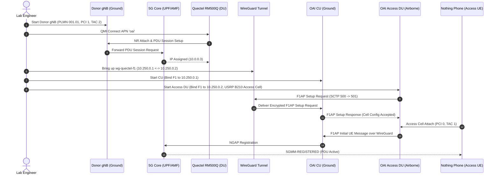
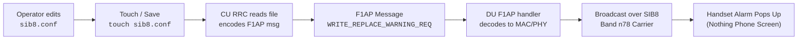
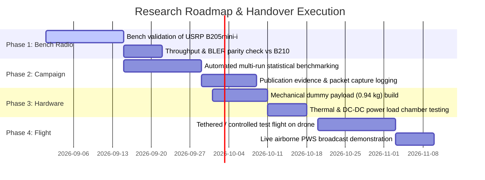

# Master Lab Handover & Onboarding Guide
## Airborne OpenAirInterface 5G Standalone Disaggregated Testbed

**Author:** Marc Duboc (Research Lead) & Lab Team  
**Institution:** KAUST & Partner Labs  
**Project:** Airborne 5G CU/DU Disaggregated Relay & Public Warning System (PWS) Testbed  
**Companion Operational Repository:** [`promaaa/oai-cu-du-lab`](https://github.com/promaaa/oai-cu-du-lab)  
**Last Updated:** August 2026

---

## Table of Contents

1. [Executive Overview & Research Mission](#1-executive-overview--research-mission)
2. [Testbed Hardware & Network Inventory](#2-testbed-hardware--network-inventory)
3. [Architecture & Functional Split (3GPP Option 2)](#3-architecture--functional-split-3gpp-option-2)
4. [Step-by-Step Practical Runbooks](#4-step-by-step-practical-runbooks)
   - [4.1 Runbook: Monolithic 5G Baseline Bring-Up](#41-runbook-monolithic-5g-baseline-bring-up)
   - [4.2 Runbook: Direct Ethernet CU/DU Split Bring-Up](#42-runbook-direct-ethernet-cudu-split-bring-up)
   - [4.3 Runbook: Wireless 5G Backhaul Split (Quectel + WireGuard)](#43-runbook-wireless-5g-backhaul-split-quectel--wireguard)
   - [4.4 Runbook: NVIDIA Jetson Orin Nano Embedded DU](#44-runbook-nvidia-jetson-orin-nano-embedded-du)
   - [4.5 Runbook: Raspberry Pi 5 Embedded DU](#45-runbook-raspberry-pi-5-embedded-du)
   - [4.6 Runbook: Emergency Public Warning Broadcast (PWS / SIB8)](#46-runbook-emergency-public-warning-broadcast-pws--sib8)
   - [4.7 Runbook: Commercial Phone (Nothing Phone) Registration & Speedtest](#47-runbook-commercial-phone-nothing-phone-registration--speedtest)
5. [Hard-Won Technical Breakthroughs & Critical Gotchas](#5-hard-won-technical-breakthroughs--critical-gotchas)
   - [5.1 The 23 Mbps Split Ceiling & TCP MSS Clamping](#51-the-23-mbps-split-ceiling--tcp-mss-clamping)
   - [5.2 OAI MAC Scheduler & BLER Threshold Tuning](#52-oai-mac-scheduler--bler-threshold-tuning)
   - [5.3 Radio Circular Dependency & Donor Cell Isolation](#53-radio-circular-dependency--donor-cell-isolation)
   - [5.4 Jetson Orin Nano Kernel, USB-C, and Clocks Tuning](#54-jetson-orin-nano-kernel-usb-c-and-clocks-tuning)
   - [5.5 USRP X310 Transport Bandwidth Limit (1 GbE vs 10 GbE)](#55-usrp-x310-transport-bandwidth-limit-1-gbe-vs-10-gbe)
6. [Mathematical Dimensioning Models for Drone & Battery](#6-mathematical-dimensioning-models-for-drone--battery)
   - [6.1 Dimensioning Formulas (Energy, Power, C-Rating, Payload Margin)](#61-dimensioning-formulas-energy-power-c-rating-payload-margin)
   - [6.2 Comparative Payload & Drone Tier Analysis](#62-comparative-payload--drone-tier-analysis)
7. [Research Roadmap for Incoming Researchers](#7-research-roadmap-for-incoming-researchers)
8. [Troubleshooting & Diagnostics Playbook](#8-troubleshooting--diagnostics-playbook)
9. [Repository Mapping & Ecosystem Links](#9-repository-mapping--ecosystem-links)

---

## 1. Executive Overview & Research Mission

### The Core Problem
Deploying a full 5G gNodeB (Base Station) and 5G Core Network directly on an Unmanned Aerial Vehicle (UAV / drone) is impractical for rapid-response disaster and emergency communications due to severe **mass, power consumption, thermal dissipation, and payload limits**.

### The Solution: 3GPP CU/DU Disaggregation Over Wireless Backhaul
Instead of lifting the entire network:
- **Ground Station (`serber-firecell`):** Hosts the 5G Core Network (5GC) and the OAI Central Unit (CU: RRC and PDCP layers).
- **Airborne Drone Payload (`serber-jetson` or `serber-pi`):** Carries only a lightweight Distributed Unit (DU: RLC, MAC, PHY layers), a Software-Defined Radio (SDR), and a cellular backhaul modem.
- **F1 Transport Link:** Connects CU and DU wirelessly over an encrypted WireGuard tunnel riding on a 5G donor backhaul or Wi-Fi link.
- **Mission Capabilities:** Broadcasts real-time emergency alerts via Public Warning System (PWS / SIB8) to commercial off-the-shelf (COTS) smartphones and provides high-speed broadband data to first responders.

```
┌────────────────────────────────────────────────────────────────────────┐
│                        GROUND STATION (serber-firecell)               │
│  ┌───────────────────────┐          ┌───────────────────────────────┐  │
│  │     OAI 5G Core       │◄──NGAP──►│         OAI 5G CU             │  │
│  │ (AMF, SMF, UPF, NRF)  │          │ (RRC + PDCP + SIB8 Generator) │  │
│  └───────────────────────┘          └───────────────┬───────────────┘  │
│                                                     │ F1-C (SCTP/501)  │
│                                                     │ F1-U (GTP-U/2152)│
└─────────────────────────────────────────────────────┼──────────────────┘
                                                      │
                       WIRELESS F1 BACKHAUL           │
        (WireGuard Overlay `wg-quectel-f1` over 5G/Wi-Fi Transport)
                                                      │
┌─────────────────────────────────────────────────────┼──────────────────┐
│                   AIRBORNE PAYLOAD / DRONE RELAY    │                  │
│                                                     ▼                  │
│  ┌──────────────────────────────────────────────────────────────────┐  │
│  │              OAI 5G DU (serber-jetson / serber-pi)               │  │
│  │               (RLC + MAC Scheduler + High-PHY)                   │  │
│  └──────────────────────────────┬───────────────────────────────────┘  │
│                                 │ UHD / USB 3.0                        │
│                                 ▼                                      │
│  ┌──────────────────────────────────────────────────────────────────┐  │
│  │               SDR Access Radio (USRP B210 / B205mini)            │  │
│  └──────────────────────────────┬───────────────────────────────────┘  │
└─────────────────────────────────┼──────────────────────────────────────┘
                                  │ 5G NR Band n78 (3.6 GHz, 106 PRB)
                                  ▼
                     ┌─────────────────────────┐
                     │ Commercial Phone (UE)   │
                     │  - PWS Alert Received   │
                     │  - High-Speed Internet  │
                     └─────────────────────────┘
```

---

## 2. Testbed Hardware & Network Inventory

### 2.1 Compute Nodes & Hostnames

| Host Identifier | Hardware Platform | Operating System | Default Role | Management IP |
| :--- | :--- | :--- | :--- | :--- |
| **`serber-firecell`** | Intel x86-64 Core i7/Xeon Workstation | Ubuntu 22.04 LTS (Kernel 5.15/6.x) | 5G Core Network + OAI CU + Donor gNB | `10.76.170.38` / `10.76.170.45` |
| **`serber-minipc`** | Intel x86-64 Mini-PC | Ubuntu 22.04 LTS | Access DU (Heavy x86 Baseline) | Dynamically discovered / `10.85.168.144` |
| **`serber-jetson`** | NVIDIA Jetson Orin Nano (8GB) | L4T R36.4.4 / JetPack 6.2 (Custom SCTP Kernel) | Primary Airborne DU Candidate | Dynamically discovered / Ethernet IP |
| **`serber-pi`** | Raspberry Pi 5 (4GB/8GB ARM64) | Debian Bookworm / Ubuntu ARM64 | Lightweight Airborne DU Candidate | `10.76.170.18` |

### 2.2 Software-Defined Radios (SDR)

| Device | Serial Number | Interface | Typical Sample Rate | Role & Usage Notes |
| :--- | :--- | :--- | :--- | :--- |
| **Ettus USRP B210** | `35F8ABA` / `8002816` | USB 3.0 (SuperSpeed `5000M`) | 30.72 MSps / 46.08 MSps (106 PRB) | Access Radio (Band n78, 3.6 GHz). **Requires external DC power jack** to prevent USB power drops. |
| **Ettus USRP B205mini-i**| Lab Stock | USB 3.0 (Micro-B) | 30.72 MSps (50 PRB / 106 PRB) | Target Lightweight Airborne Radio (24 g). Ideal for budget drone sizing. |
| **Ettus USRP X310** | Lab Stock | Dual 10 GbE SFP+ / 1 GbE | 46.08 MSps | High-performance SDR. **Requires 10 GbE SFP+**; overflows on 1 GbE. |

### 2.3 Modems, UEs & SIM Cards

| Component | Model / Spec | Interface / Drivers | Network Identity / Parameters |
| :--- | :--- | :--- | :--- |
| **Backhaul Modem** | Quectel RM500Q-GL / RM520N 5G M.2 Module | USB 3.0 via M.2 carrier (`qmi_wwan`, `/dev/cdc-wdm0`, `wwan0`) | Private PLMN `001.01`, APN `oai`, IP `10.0.0.3` |
| **Commercial Handset** | Nothing Phone (1 / 2) | 5G NR SA Band n78 | IMSI `001010000059453`, Key/OPc provisioned in MySQL UDR |
| **Test SIMs** | Sysmocom programmable USIMs | UICC / USIM | Provisioned for PLMN `001.01` (MCC 001, MNC 01) and `208.95` |

### 2.4 IP Addressing & Port Allocation Schema

```
WireGuard Tunnel Subnet:     10.250.0.0/30
  ├─ CU Endpoint (firecell): 10.250.0.1  (Listen Port: UDP 51821)
  └─ DU Endpoint (minipc/jet):10.250.0.2

5G Core Network Docker Subnet: 192.168.70.0/24 or 192.168.71.0/24
  ├─ oai-nrf:                192.168.70.130
  ├─ oai-amf:                192.168.70.132  (NGAP Port: SCTP 38412)
  ├─ oai-smf:                192.168.70.133
  ├─ oai-upf:                192.168.70.134  (GTP-U Port: UDP 2152)
  └─ mysql:                  192.168.70.131

F1 Protocol Ports:
  ├─ F1-C (Control Plane):   SCTP Port 500 (DU) <---> SCTP Port 501 (CU)
  └─ F1-U (User Plane):      UDP Port 2152 (standard) or UDP Port 2153 (custom backhaul)
```

---

## 3. Architecture & Functional Split (3GPP Option 2)

The 3GPP Option 2 functional split divides the protocol stack at the PDCP/RLC boundary:

```
+-------------------------------------------------------------+
|                      CENTRAL UNIT (CU)                      |
|                                                             |
|   +-----------------------------------------------------+   |
|   |         Radio Resource Control (RRC)                |   |
|   |   - Connection Management & Mobility                |   |
|   |   - SIB Broadcast Generation (SIB1, SIB8/PWS)       |   |
|   +--------------------------┬--------------------------+   |
|                              │                              |
|   +--------------------------▼--------------------------+   |
|   |   Packet Data Convergence Protocol (PDCP)           |   |
|   |   - Header Compression (RoHC)                       |   |
|   |   - Integrity Protection & Ciphering                |   |
|   +-----------------------------------------------------+   |
+------------------------------┬------------------------------+
                               │
               F1 INTERFACE    │ F1-C: F1AP over SCTP
                               │ F1-U: GTP-U over UDP/IP
+------------------------------▼------------------------------+
|                   DISTRIBUTED UNIT (DU)                     |
|                                                             |
|   +-----------------------------------------------------+   |
|   |         Radio Link Control (RLC)                    |   |
|   |   - Segmentation, Reassembly, ARQ                   |   |
|   +--------------------------┬--------------------------+   |
|                              │                              |
|   +--------------------------▼--------------------------+   |
|   |         Medium Access Control (MAC)                 |   |
|   |   - Dynamic Scheduling & HARQ Management            |   |
|   |   - BLER Filtering & MCS Adaptation                 |   |
|   +--------------------------┬--------------------------+   |
|                              │                              |
|   +--------------------------▼--------------------------+   |
|   |         Physical Layer (High/Low PHY)               |   |
|   |   - Modulation, FFT/IFFT, Resource Mapping          |   |
|   +-----------------------------------------------------+   |
+-------------------------------------------------------------+
```

---

## 4. Step-by-Step Practical Runbooks

### 4.1 Runbook: Monolithic 5G Baseline Bring-Up

Use this runbook on `serber-firecell` to establish a known-good single-host 5G SA reference.

#### Step 1: Verify USRP B210 Connection
```bash
uhd_find_devices
uhd_usrp_probe --args "serial=35F8ABA"
```
*Expected:* Probe succeeds and reports Subdevs, FX3 firmware loaded, USB 3.0 connection.

#### Step 2: Start 5G Core Network Containers
```bash
cd ~/oai-cn5g
sudo docker compose up -d
sudo docker compose ps
```
*Expected:* `oai-amf`, `oai-smf`, `oai-upf`, `oai-nrf`, `oai-udm`, `oai-udr`, `oai-ausf`, and `mysql` containers show `(healthy)` or `Up`.

#### Step 3: Launch Monolithic gNodeB
```bash
cd ~/openairinterface5g/cmake_targets/ran_build/build
sudo ./nr-softmodem \
  -O ~/openairinterface5g/targets/PROJECTS/GENERIC-NR-5GC/CONF/gnb.sa.band78.fr1.106PRB.usrpb210.conf \
  --continuous-tx \
  -E \
  > /tmp/gnb-monolithic.log 2>&1 &
```

#### Step 4: Verify AMF Connection & Radio Sync
```bash
# Check AMF logs for gNB registration:
sudo docker logs oai-amf --tail 20 | grep -E 'gNB|Connected'

# Check gNodeB log for frame/slot transmission:
tail -f /tmp/gnb-monolithic.log | grep -E 'Frame|MAC'
```

---

### 4.2 Runbook: Direct Ethernet CU/DU Split Bring-Up

Use this runbook to bring up the disaggregated baseline over direct Ethernet between `serber-firecell` (CU) and `serber-minipc` (DU).

#### Step 1: Network & Interface Preparation
- `serber-firecell` (CU): Ethernet IP `10.0.0.1/24` on dedicated interface.
- `serber-minipc` (DU): Ethernet IP `10.0.0.2/24` on dedicated interface.

Test connectivity:
```bash
ping -c 3 10.0.0.1   # From minipc
ping -c 3 10.0.0.2   # From firecell
```

#### Step 2: Apply TCP MSS Clamping on UPF (Ground Host)
```bash
sudo docker exec -it oai-upf iptables -t mangle -A FORWARD -p tcp --tcp-flags SYN,RST SYN -j TCPMSS --set-mss 1360
```

#### Step 3: Launch CU on `serber-firecell`
```bash
cd ~/openairinterface5g/cmake_targets/ran_build/build
sudo ./nr-softmodem \
  -O ~/openairinterface5g/targets/PROJECTS/GENERIC-NR-5GC/CONF/gnb-cu.sa.band78.106prb.conf \
  > /tmp/gnb-cu.log 2>&1 &
```

#### Step 4: Launch DU on `serber-minipc`
```bash
cd ~/openairinterface5g/cmake_targets/ran_build/build
sudo ./nr-softmodem \
  -O ~/openairinterface5g/targets/PROJECTS/GENERIC-NR-5GC/CONF/gnb-du.sa.band78.106prb.conf \
  --rfsim 0 \
  -E \
  > /tmp/gnb-du.log 2>&1 &
```

#### Step 5: Verify SCTP Handshake & F1AP Setup
```bash
cat /proc/net/sctp/assocs
# Verify F1 Setup Request / Response in logs:
tail -30 /tmp/gnb-cu.log | grep -E 'F1AP|F1 Setup Response'
tail -30 /tmp/gnb-du.log | grep -E 'F1AP|F1 Setup Response'
```

---

### 4.3 Runbook: Wireless 5G Backhaul Split (Quectel + WireGuard)

This is the primary operational configuration for an airborne DU communicating over a 5G cellular donor link.



#### Step 1: Verify Donor Cell on Ground
Start the separate donor gNB on `serber-firecell` configured with `PCI=1`, `TAC=2`, ARFCN `641280`.

#### Step 2: Lock Quectel Modem to Donor Cell
On the DU host (`serber-minipc` or `serber-jetson`):
```bash
# Verify modem USB presence:
ls -l /dev/cdc-wdm* /dev/ttyUSB*

# Send AT commands via minicom or socat to lock NR frequency:
# AT+QNWPREFCFG="nr5g_band",78
# AT+QNWLOCK="common/5g",1,641280,1

# Start QMI network connection:
sudo qmicli -d /dev/cdc-wdm0 --wda-get-data-format
sudo qmicli -d /dev/cdc-wdm0 --wds-start-network="apn='oai',ip-type=4" --client-no-release-cid
sudo udhcpc -i wwan0
```
Verify `wwan0` has IP `10.0.0.3`.

#### Step 3: Start WireGuard Overlay
On Ground (`serber-firecell`):
```bash
sudo wg-quick up wg-quectel-f1
# Endpoint listener on UDP 51821, Tunnel IP 10.250.0.1/30
```

On DU host:
```bash
sudo wg-quick up wg-quectel-f1
# Endpoint connects to 192.168.71.129:51821 via wwan0, Tunnel IP 10.250.0.2/30
ping -c 3 10.250.0.1
```

#### Step 4: Launch CU and DU over WireGuard Tunnel
- Ground CU binds to `10.250.0.1` (`f1_port: 2153`).
- Airborne DU binds to `10.250.0.2` pointing to CU `10.250.0.1`.

---

### 4.4 Runbook: NVIDIA Jetson Orin Nano Embedded DU

The Jetson Orin Nano is the primary embedded candidate for drone flight. Follow these strict hardware and OS guidelines:

#### Step 1: Set Power Mode & Clock Maximums
```bash
# Enable maximum performance power profile (MAXN_SUPER):
sudo nvpmodel -m 0

# Lock all CPU, GPU, and EMC memory clocks to maximum:
sudo jetson_clocks
```

#### Step 2: Configure USB Subsystem for B210 SuperSpeed
```bash
# Allocate 1000MB USBFS memory to prevent streaming buffer drops:
sudo sh -c 'echo 1000 > /sys/module/usbcore/parameters/usbfs_memory_mb'

# Disable USB autosuspend on all USB hubs:
for f in /sys/bus/usb/devices/*/power/autosuspend; do sudo sh -c "echo -1 > $f"; done
```
> [!IMPORTANT]
> The USRP B210 **must be plugged into the USB-C port** via a compliant USB 3.0 hub.
> Verify SuperSpeed enumeration (`5000M`) with:
> `lsusb -t` (Look for `Class=Vendor Specific Class, Driver=, 5000M`).

#### Step 3: Isolate Worker Threads & Interrupts (CPU Affinity)
```bash
# Pin USB interrupts to CPU 0:
sudo systemctl stop irqbalance
USB_IRQ=$(cat /proc/interrupts | grep -i xhci | awk -F: '{print $1}' | tr -d ' ')
sudo sh -c "echo 1 > /proc/irq/$USB_IRQ/smp_affinity"

# Launch OAI DU pinned to CPU cores 1-5:
taskset -c 1-5 sudo ./nr-softmodem \
  -O ~/openairinterface5g/targets/PROJECTS/GENERIC-NR-5GC/CONF/gnb-du-jetson.conf \
  -E \
  --thread-pool 1 -g 2
```

---

### 4.5 Runbook: Raspberry Pi 5 Embedded DU

The Raspberry Pi 5 provides a 46 g featherweight compute platform.

#### Step 1: Optimize Linux Kernel Parameters
Edit `/boot/firmware/cmdline.txt` to add:
```
isolcpus=2,3 nohz_full=2,3 rcu_nocbs=2,3 usbcore.usbfs_memory_mb=512
```

#### Step 2: Launch DU in RFsim or USRP Mode
```bash
cd ~/openairinterface5g/cmake_targets/ran_build/build
export LD_LIBRARY_PATH=$LD_LIBRARY_PATH:$(pwd)

# For RF simulator:
sudo taskset -c 2,3 ./nr-softmodem \
  -O ~/oai-du/gnb-sa.band78.rfsim.conf \
  --rfsim \
  --thread-pool 1 \
  -g 2

# For physical B205mini / B210:
sudo taskset -c 2,3 ./nr-softmodem \
  -O ~/oai-du/gnb-sa.band78.b205mini.conf \
  -E \
  --thread-pool 1 \
  -g 2
```

---

### 4.6 Runbook: Emergency Public Warning Broadcast (PWS / SIB8)

This procedure tests the life-safety emergency alert delivery system.



#### Step 1: Configure Warning Text in `sib8.conf`
```bash
nano ~/openairinterface5g/sib8.conf
```
Set the parameters:
```ini
messageIdentifier=1112;
serialNumber=0000;
dataCodingScheme=48;
text=EMERGENCY DISASTER ALERT.|Drone 5G Relay Active.|Evacuate to Sector 4.;
mode=0;
```
*(Note: Use the `|` character to designate line breaks on the handset alert screen).*

#### Step 2: Trigger Alert Transmission
```bash
# Touch the config file to notify the gNodeB daemon:
touch ~/openairinterface5g/sib8.conf
```

#### Step 3: Monitor DU and Phone Alert Delivery
```bash
tail -30 /tmp/gnb-du.log | grep -E 'SIB8|Write Replace Warning|warning'
```
*Expected Output:*
`[MAC] received Write Replace Warning Request (Procedure Code 20)`  
`[RRC] SIB8 scheduled in BCCH SIBs: messageIdentifier 1112, serialNumber 0`  
Within 3–5 seconds, all attached smartphones in range will trigger an audible emergency siren and pop up the full-screen alert message.

---

### 4.7 Runbook: Commercial Phone (Nothing Phone) Registration & Speedtest

#### Step 1: Configure Phone APN & Radio
1. Insert programmed test SIM (MCC: `001`, MNC: `01`).
2. Go to **Settings → Network & Internet → SIMs → Access Point Names**.
3. Add APN: Name: `OAI`, APN: `oai`, APN Type: `default,supl`, APN Protocol: `IPv4`.
4. Ensure **Preferred Network Type** is set to **5G (recommended)**.

#### Step 2: Verify Registration in AMF
```bash
sudo docker logs oai-amf --tail 15 | grep -E 'UE|5GMM'
```
*Expected:* Shows IMSI `001010000059453`, state `5GMM-REGISTERED`, 1 PDU Session active with IP `10.0.0.x`.

#### Step 3: Run Throughput Test
Run Ookla Speedtest or iperf3 client from phone:
```bash
# On Ground Server (UPF):
iperf3 -s -p 5201

# Run iperf3 from Android Termux app:
iperf3 -c 192.168.70.134 -p 5201 -R -t 15 -P 4
```

---

## 5. Hard-Won Technical Breakthroughs & Critical Gotchas

This section records the hard-won insights from 16 weeks of experimental research. **Read this carefully before modifying network configurations.**

```
+----------------------------------------------------------------------------------------------------+
|                                    KEY EXPERIMENTAL LESSONS                                        |
+------------------------------+------------------------------------+--------------------------------+
| Problem Observed             | Root Cause                         | Proven Solution                |
+------------------------------+------------------------------------+--------------------------------+
| Split throughput capped at   | GTP-U header overhead caused IP    | Apply TCP MSS Clamping to 1360 |
| ~23 Mbps (vs 190 Mbps mono)  | fragmentation; large transport     | bytes on UPF container & raise |
|                              | blocks inflated DL BLER (25-35%)   | scheduler BLER target thresholds|
+------------------------------+------------------------------------+--------------------------------+
| Quectel modem disconnects    | DU restarted on same radio modem   | Deploy separate donor gNB on   |
| when DU restarts             | used for its own backhaul          | dedicated PCI/TAC on ground    |
+------------------------------+------------------------------------+--------------------------------+
| Jetson DU overflows          | B210 negotiated USB 2.0 (480M)     | Connect via USB-C port hub     |
| (ERROR_CODE_OVERFLOW)        | instead of USB 3.0 SuperSpeed      | and set usbfs_memory_mb=1000   |
+------------------------------+------------------------------------+--------------------------------+
| USRP X310 stream failure     | 106 PRB requires ~1.47 Gbps raw IQ | Must use 10 GbE SFP+ NIC;      |
|                              | bandwidth; saturated 1 GbE link    | 1 GbE is physically inadequate |
+------------------------------+------------------------------------+--------------------------------+
```

### 5.1 The 23 Mbps Split Ceiling & TCP MSS Clamping
- **The Mystery:** Monolithic gNB easily achieved 190 Mbps, but introducing an Ethernet CU/DU split collapsed throughput to 12–23 Mbps.
- **Root Cause:** GTP-U encapsulation adds 40–50 bytes of overhead. On standard 1500-byte MTU links, this causes IP packet fragmentation. When MTU was raised to 9000 (jumbo frames), the TCP stack negotiated huge MSS values. The OAI MAC scheduler packed these into massive Transport Blocks (up to 14 KB at MCS 5). In wireless transmission, large blocks drastically increase packet error rates, inflating Downlink BLER to 22%–35%.
- **The Fix:** Clamp TCP MSS to **1360 bytes** inside the UPF container:
  ```bash
  sudo docker exec oai-upf iptables -t mangle -A FORWARD -p tcp --tcp-flags SYN,RST SYN -j TCPMSS --set-mss 1360
  ```

### 5.2 OAI MAC Scheduler & BLER Threshold Tuning
- **The Mystery:** Even with clean RF, the OAI scheduler remained trapped at `MCS 0` or `MCS 5`.
- **Root Cause:** In `openair2/LAYER2/NR_MAC_gNB/gNB_scheduler_primitives.c`, the scheduler requires filtered BLER to drop below `bler_options->lower` (default 5%) before it increments MCS. Because real-world split BLER hovered around 20–25%, MCS never scaled up.
- **The Fix:** Update DU MAC configuration with realistic operational thresholds:
  ```yaml
  MACRLCs:
    dl_bler_target_upper: 0.35
    dl_bler_target_lower: 0.25
    ul_bler_target_upper: 0.35
    ul_bler_target_lower: 0.15
    dl_max_mcs: 28
  ```
  This immediately unlocked high-order modulation (`MCS 24–27`), driving tuned Ethernet split throughput to **100 Mbps peak** and Quectel WireGuard backhaul to **78 Mbps**.

### 5.3 Radio Circular Dependency & Donor Cell Isolation
- **The Trap:** Attempting to use a single USRP B210 on the DU to serve both the commercial access phone and the backhaul link.
- **Why It Fails:** When the access DU restarts or reconfigures, the RF carrier drops, instantly killing the backhaul link that the DU depends on to talk to the CU.
- **The Architecture Rule:** You **must maintain two distinct RF cells**:
  1. *Donor Cell (Ground):* Ground gNB + USRP B210 (PCI 1, TAC 2) serving Quectel modem.
  2. *Access Cell (Airborne DU):* Airborne DU + USRP B210 (PCI 0, TAC 1) serving commercial phones.

### 5.4 Jetson Orin Nano Kernel, USB-C, and Clocks Tuning
- **Kernel Compilation:** Stock JetPack kernels lack native SCTP protocol support. A custom L4T kernel (JetPack 6.2 / BSP R36.4.4) must be compiled natively with `CONFIG_IP_SCTP=m` using swap space and `-j4`.
- **USB 3.0 Negotiation:** Connecting the B210 to standard USB-A ports frequently enumerated as USB 2.0 (`480M`). Always use the **USB-C port** with an approved USB 3.0 hub and verify `5000M` speed with `lsusb -t`.

### 5.5 USRP X310 Transport Bandwidth Limit (1 GbE vs 10 GbE)
- At 106 PRB (30 kHz SCS, 46.08 MSps complex 16-bit IQ samples), the raw streaming rate is:
  $$\text{Bitrate} = 46.08 \times 10^6 \times 32\text{ bits} = 1.474\text{ Gbps}$$
- Attempting to run X310 over 1 GbE causes immediate `ERROR_CODE_OVERFLOW` and RFNoC timeouts. A **10 GbE SFP+ interface** is mandatory for X310 106 PRB operation.

---

## 6. Mathematical Dimensioning Models for Drone & Battery

To plan real flight missions, use the following first-order mathematical dimensioning model.

### 6.1 Dimensioning Formulas

#### 1. Payload Battery Energy Requirement ($E_{nom}$)
The nominal battery energy (in Watt-hours) required to power the electronics payload for mission duration $t_{mission}$ with safety margin is:

$$E_{\mathrm{nom}} = \frac{P_{\mathrm{payload}} \cdot t_{\mathrm{mission}} \cdot r_{\mathrm{reserve}}}{\eta_{\mathrm{dc}} \cdot u_{\mathrm{battery}}}$$

Where:
- $P_{\mathrm{payload}}$ = Total electrical power consumed by electronics (Watts)
- $t_{\mathrm{mission}}$ = Desired flight time in hours (e.g., $20\text{ min} = 0.333\text{ h}$)
- $r_{\mathrm{reserve}}$ = Electrical reserve factor (standard: $1.30$, i.e. 30% reserve)
- $\eta_{\mathrm{dc}}$ = DC-DC voltage conversion efficiency (standard: $0.88$, i.e. 88%)
- $u_{\mathrm{battery}}$ = Usable depth of discharge for LiPo/Li-Ion (standard: $0.80$, i.e. 80%)

#### 2. Battery Discharge Current ($I_{\mathrm{batt}}$)
The continuous current draw from the battery at nominal voltage $V_{\mathrm{nom}}$ is:

$$I_{\mathrm{batt}} = \frac{P_{\mathrm{payload}}}{V_{\mathrm{nom}}}$$

#### 3. Required Drone Payload Rating ($C_{\mathrm{required}}$)
To ensure flight stability, wind rejection, and safety margin, the airborne payload must not exceed **70%** of the drone's advertised maximum payload capacity ($\gamma_{\mathrm{payload}} = 0.70$):

$$C_{\mathrm{required}} = \frac{m_{\mathrm{payload}}}{\gamma_{\mathrm{payload}}} = \frac{m_{\mathrm{payload}}}{0.70}$$

---

### 6.2 Comparative Payload & Drone Tier Analysis

```
                                  PAYLOAD COMPARISON & DRONE SIZING
+-------------------------------------------------------------------------------------------------------------+
| Tier 1: Featherweight (Budget)       | Tier 2: Jetson Validation (Balanced)  | Tier 3: Full x86 Mini-PC (Lab)        |
+--------------------------------------+---------------------------------------+---------------------------------------+
| • Host: Raspberry Pi 5 (46 g)        | • Host: Jetson Orin Nano (130 g)      | • Host: Intel Mini-PC (650 g)         |
| • SDR: USRP B205mini-i (24 g)        | • SDR: USRP B210 (350 g)              | • SDR: USRP B210 (350 g)              |
| • Modem: Quectel Kit (180 g)         | • Modem: Quectel Kit (180 g)          | • Modem: Quectel Kit (180 g)          |
| • RF/Cooling/Cables: (180 g)         | • RF/Cooling/Cables: (250 g)          | • RF/Cooling/Cables: (350 g)          |
| • Mount/Enclosure: (300 g)           | • Mount/Enclosure: (350 g)            | • Mount/Enclosure: (450 g)            |
| • Battery: 4S 3000mAh (208 g)        | • Battery: 6S 4500mAh (330 g)         | • Battery: 6S 6000mAh (380 g)         |
+--------------------------------------+---------------------------------------+---------------------------------------+
| Total Mass:  0.94 kg                 | Total Mass:  1.59 kg                  | Total Mass:  2.36 kg                  |
| Total Power: 50 W                    | Total Power: 75 W                     | Total Power: 110 W                    |
| Drone Req.:  >= 1.34 kg rating       | Drone Req.:  >= 2.27 kg rating        | Drone Req.:  >= 3.37 kg rating        |
+--------------------------------------+---------------------------------------+---------------------------------------+
| Target UAV:  Tarot X8 / Custom Build | Target UAV:  DJI Matrice 350 RTK      | Target UAV:  DJI Matrice 400 (6 kg)   |
| Budget:      ~$1,500 (DIY Platform)  | Budget:      ~$14,000 (Combo)         | Budget:      ~$18,000 - $22,000       |
+--------------------------------------+---------------------------------------+---------------------------------------+
```

---

## 7. Research Roadmap for Incoming Researchers

Here is the exact prioritized task list for incoming graduate researchers and interns to continue this work:



### Priority 1: Bench Validation of USRP B205mini-i
- Test the 24 g USRP B205mini-i with OAI DU on both Raspberry Pi 5 and Jetson Orin Nano.
- Confirm commercial phone attach, PWS/SIB8 reception, and throughput parity at 106 PRB.

### Priority 2: Automated Multi-Run Statistical Benchmark Suite
- Upgrade the test runner to execute 20 consecutive 60-second throughput trials per profile.
- Collect synchronized CDF (Cumulative Distribution Function) plots of throughput, RTT latency, and BLER.

### Priority 3: Mechanical Dummy Payload & Power Integration
- Fabricate a 0.94 kg physical dummy payload with matching mass, dimensions, and Center of Gravity (CoG).
- Bench-test the 4S LiPo battery with DC-DC 5V/12V step-down converters under full 50W thermal load for 25 minutes.

### Priority 4: Drone Flight Integration & Fail-Safe Testing
- Integrate the lightweight payload onto a Tarot X8 or DJI Matrice platform.
- Implement an automated RF watchdog fail-safe: if F1 heartbeat fails for >5 seconds, the airborne DU gracefully terminates RF transmission to prevent interference.

---

## 8. Troubleshooting & Diagnostics Playbook

### 8.1 Diagnostic Command Cheatsheet

```bash
# 1. Check all SDR hardware attached:
uhd_find_devices && uhd_usrp_probe --args "serial=8002816"

# 2. Check SCTP associations (F1-C control plane):
cat /proc/net/sctp/assocs

# 3. Check live WireGuard handshake & transfer:
sudo wg show

# 4. Check 5G Core Network container health:
sudo docker ps --format "table {{.Names}}\t{{.Status}}\t{{.Ports}}"

# 5. Check AMF registration status:
sudo docker logs oai-amf --tail 25 2>&1 | grep -E 'gNB|UE|5GMM|Connected'

# 6. Capture live F1 traffic on WireGuard interface:
sudo tcpdump -nn -i wg-quectel-f1 -s 0 -w /tmp/f1_wireguard.pcap
```

### 8.2 Troubleshooting Matrix

| Symptom / Error | Probable Root Cause | Immediate Diagnostic & Fix |
| :--- | :--- | :--- |
| **`No USRP Device Found`** | USB cable disconnected, loose power jack, or USB 2.0 enumeration | Run `uhd_find_devices`. Re-plug USB-C cable. Ensure external 12V DC power jack is plugged into B210. Check `lsusb -t` shows `5000M`. |
| **`F1 Setup Request: Connection Refused`** | CU process not running or firewall blocking SCTP port | Check `ps aux \| grep nr-softmodem` on CU host. Check `sudo ufw status`. Verify SCTP ports 500/501 are open. |
| **`Continuous 'U' or 'O' in DU log`** | Underrun (host too slow) or Overrun (USB bus / CPU saturated) | On Jetson: run `sudo jetson_clocks` and check CPU affinity. Ensure USBFS memory is 1000 MB. On Pi: check CPU temperature `vcgencmd measure_temp`. |
| **Phone connects to 5G but no Internet** | UPF packet forwarding or NAT missing on ground host | Run `sudo iptables -t nat -A POSTROUTING -o enp6s0 -j MASQUERADE` on `serber-firecell`. Check UPF container logs: `sudo docker logs oai-upf`. |
| **Split throughput stuck at <20 Mbps** | Missing TCP MSS clamping or default BLER targets | Apply MSS clamping on UPF: `iptables -t mangle -A FORWARD -p tcp --tcp-flags SYN,RST SYN -j TCPMSS --set-mss 1360`. Verify `dl_bler_target_lower: 0.25` in DU config. |
| **Quectel modem stuck in `LIMSRV`** | Modem camped on public commercial network instead of private cell | Send AT lock: `AT+QNWLOCK="common/5g",1,641280,1` and restart QMI network via `qmicli`. |
| **`OpTimeout` / Overflow on USRP X310** | Saturated 1 GbE Ethernet connection | X310 106 PRB requires ~1.47 Gbps. Switch to a 10 GbE SFP+ optical connection. |

---

## 9. Repository Mapping & Ecosystem Links

| Repository / Resource | URL / Location | Purpose |
| :--- | :--- | :--- |
| **Research Notebook & Documentation** (This Repo) | [`promaaa/kaust-5G-research`](https://github.com/promaaa/kaust-5G-research) | Archival research record, 22 chronological reports, visual slide deck, math sizing models, handover guide. |
| **Operational & Deployment Automation** | [`promaaa/oai-cu-du-lab`](https://github.com/promaaa/oai-cu-du-lab) | Canonical source for production OAI configs, patches, deployment scripts, and the Operator TUI console. |
| **Interactive Visual Project Recap** | [`visual-project-recap/`](visual-project-recap/) | Self-contained HTML presentation. Run with `python3 -m http.server --directory visual-project-recap 8000`. |
| **Google Slides Master Presentation** | [Présentation Charlotte V2](https://docs.google.com/presentation/d/1PTyXXZYdgLUkJzEHDRDvrb-UP5atUvs2Kw81VID5y84/edit) | Lab slide deck prepared for academic and sponsor presentations. |

---
*For any urgent questions or historical inquiries, contact the repository maintainers or check the detailed logs in [`reports/`](reports/).*
