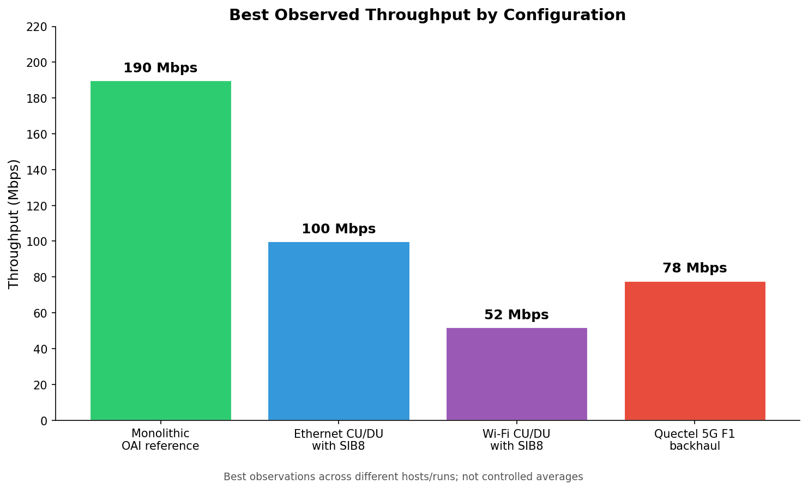

# Airborne OpenAirInterface 5G CU/DU Research Testbed

[](#)
[-blue)](#)
[-purple)](#)
[-orange)](#)
[](HANDOVER.md)

This repository documents an experimental **OpenAirInterface (OAI) 5G Standalone (SA)** testbed built to study a disaggregated gNodeB (gNB), heterogeneous F1 transport links, emergency public warning delivery (PWS / SIB8), and embedded distributed-unit (DU) candidates for an airborne drone relay.

The central research question is practical: **how do compute constraints, radio conditions, and non-ideal F1 transport interact in an OAI CU/DU split?**

> **Important Operational Context:**  
> This repository is the **archival research record and handover knowledge base**. It contains experimental reports, mathematical sizing models, diagrams, and the master handover guide.  
> The deployment automation, configuration templates, patch set, and operator TUI are maintained in the companion operational repository:  
> 👉 [`promaaa/oai-cu-du-lab`](https://github.com/promaaa/oai-cu-du-lab)

---

## ⚡ Quick Navigation for Lab Members

| Document / Section | Description |
| :--- | :--- |
| 📖 **[Master Lab Handover Guide](HANDOVER.md)** | **Start here!** Step-by-step bring-up runbooks, hardware inventory, critical performance gotchas, mathematical drone sizing models, and troubleshooting matrix. |
| 📊 **[Visual Project Recap](visual-project-recap/)** | Self-contained interactive presentation (`index.html`), printable slides (`presentation.pdf`), and architecture diagrams. |
| 📝 **[Research Progress Reports](reports/README.md)** | 22 chronological laboratory reports documenting 16 weeks of experimental progression and pivots. |
| 📚 **[Technical Notes](technical-notes/README.md)** | 5G glossary, F1 parameter mappings, and informal literature review. |
| 📑 **[Curated References](REFERENCES.md)** | Academic papers, DOIs, and original-source links. |

---

## 📊 Summary of Best-Observed Findings

The testbed progressed from a monolithic OAI baseline to Ethernet, Wi-Fi/GRE, and 5G-modem/WireGuard F1 paths; it also validated PWS/SIB8 delivery and several embedded DU candidates.



| Configuration | Best Recorded Throughput | Validation Details & Context | Primary Evidence |
| :--- | :---: | :--- | :--- |
| **Monolithic x86 Reference** | **190 Mbps** | Single-host reference baseline (`serber-firecell`) | [Report 19](reports/report-19.md) |
| **Tuned Ethernet CU/DU Split** | **100 Mbps** | Direct Ethernet, TCP MSS clamping (1360B) + adjusted BLER scheduler | [Report 19](reports/report-19.md) |
| **Quectel 5G / WireGuard Split** | **78 Mbps** | Caged WireGuard tunnel over 5G modem backhaul to access cell | [Report 22](reports/report-22.md) / [Recap](visual-project-recap/presentation.md) |
| **Wi-Fi / GRE CU/DU Split** | **52 Mbps** | Wireless F1 over campus Wi-Fi with symmetric policy routing | [Report 10](reports/report-10.md) |
| **Jetson Orin Nano + Quectel 5G** | **40–44 Mbps** | Custom SCTP kernel, MAXN_SUPER, USB-C SuperSpeed, `DL_MAX_MCS=28` | [Report 22](reports/report-22.md) |
| **Raspberry Pi 5 DU (RFsim/B210)**| **21–23 Mbps** | Featherweight 46 g compute candidate with CPU isolation | [Report 14](reports/report-14.md) |

*Note: Values represent best-observed single-stream and multi-stream runs across different hosts and sessions under lab radio conditions. Reports 18–22 explain why earlier runs exhibited an artificial ~23 Mbps split ceiling (caused by GTP-U MTU fragmentation and default BLER increment thresholds).*

---

## 🏗️ Testbed Architecture

```
┌────────────────────────────────────────────────────────────────────────┐
│                        GROUND STATION (serber-firecell)               │
│  ┌───────────────────────┐          ┌───────────────────────────────┐  │
│  │     OAI 5G Core       │◄──NGAP──►│         OAI 5G CU             │  │
│  │ (AMF, SMF, UPF, NRF)  │          │ (RRC + PDCP + SIB8 Generator) │  │
│  └───────────────────────┘          └───────────────┬───────────────┘  │
│                                                     │ F1-C (SCTP/501)  │
│                                                     │ F1-U (GTP-U/2152)│
└─────────────────────────────────────────────────────┼──────────────────┘
                                                      │
                       WIRELESS F1 BACKHAUL           │
        (WireGuard Overlay `wg-quectel-f1` over 5G/Wi-Fi Transport)
                                                      │
┌─────────────────────────────────────────────────────┼──────────────────┐
│                   AIRBORNE PAYLOAD / DRONE RELAY    │                  │
│                                                     ▼                  │
│  ┌──────────────────────────────────────────────────────────────────┐  │
│  │              OAI 5G DU (serber-jetson / serber-pi)               │  │
│  │               (RLC + MAC Scheduler + High-PHY)                   │  │
│  └──────────────────────────────┬───────────────────────────────────┘  │
│                                 │ UHD / USB 3.0                        │
│                                 ▼                                      │
│  ┌──────────────────────────────────────────────────────────────────┐  │
│  │               SDR Access Radio (USRP B210 / B205mini)            │  │
│  └──────────────────────────────┬───────────────────────────────────┘  │
└─────────────────────────────────┼──────────────────────────────────────┘
                                  │ 5G NR Band n78 (3.6 GHz, 106 PRB)
                                  ▼
                     ┌─────────────────────────┐
                     │ Commercial Phone (UE)   │
                     │  - PWS Alert Received   │
                     │  - High-Speed Internet  │
                     └─────────────────────────┘
```

---

## 🚀 Quick Start: Running the Interactive Recap

To view the self-contained interactive project recap deck locally:

```bash
# Serve the visual project recap
python3 -m http.server --directory visual-project-recap 8000
```
Open your browser at `http://localhost:8000`.

Related Google Slides master presentations:
- [Présentation Charlotte V2](https://docs.google.com/presentation/d/1PTyXXZYdgLUkJzEHDRDvrb-UP5atUvs2Kw81VID5y84/edit)
- [Présentation stage](https://docs.google.com/presentation/d/1-PejsoKiz7iE7Y6ZO_rdnELiBxwlDJI5kkbP2ylJjug/edit)

---

## 📁 Repository Structure

```
.
├── HANDOVER.md                # Master onboarding guide for incoming researchers
├── README.md                  # Main repository overview & findings summary
├── REFERENCES.md              # Academic reference list with DOIs and links
├── requirements.txt           # Python dependencies for visualization scripts
├── reports/                   # Chronological research reports (02 to 22)
│   ├── README.md              # Reports index and synthesis
│   ├── assets/                # Hardware photos, throughput plots, and screenshots
│   └── report-*.md            # Detailed progress logs
├── technical-notes/           # Terminology and literature notes
│   ├── README.md              # Technical notes overview
│   ├── glossary-and-f1-notes.md
│   └── literature-notes.md
└── visual-project-recap/      # Project presentation and visual summary
    ├── index.html             # Interactive browser-based presentation
    ├── presentation.md        # Marp Markdown source
    ├── presentation.pdf       # Exported printable slide deck
    └── assets/                # Diagrams, SVG assets, and chart generator
```

---

## 👥 Authorship & Acknowledgments

- **Lead Researcher:** Marc Duboc (IMT Atlantique / KAUST Research Team)
- **Supervisors & Collaborators:** KAUST Resilient Communications Lab Team
- **Software Stack:** [OpenAirInterface (OAI)](https://gitlab.eurecom.fr/oai/openairinterface5g)
