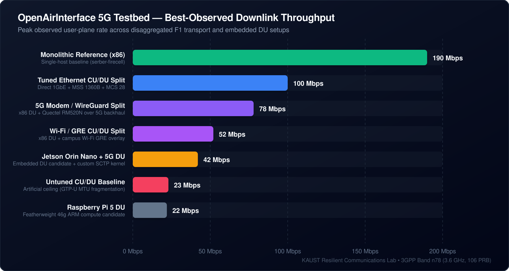
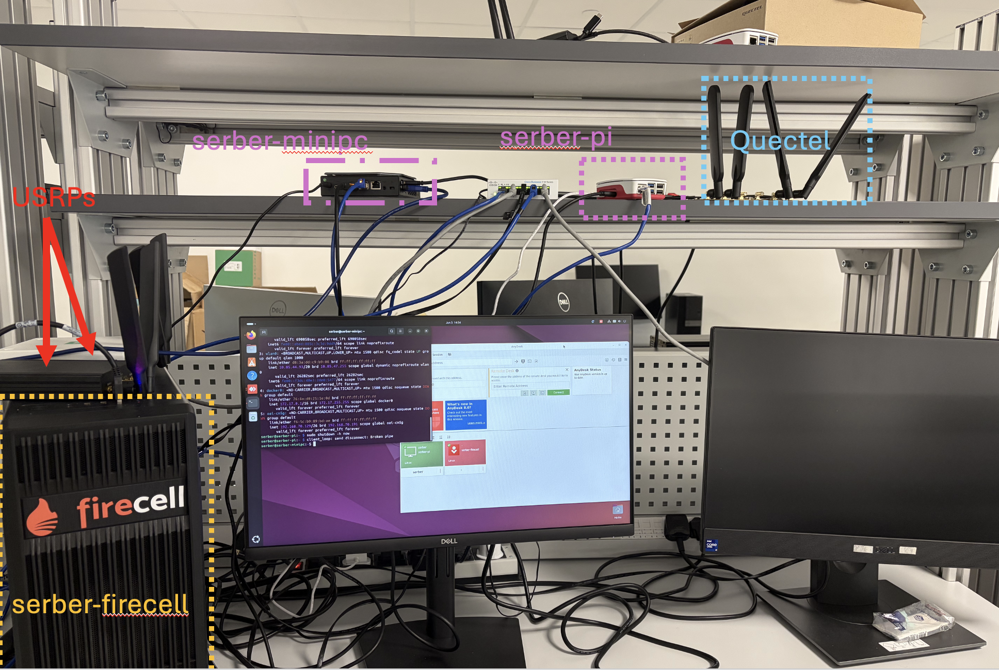
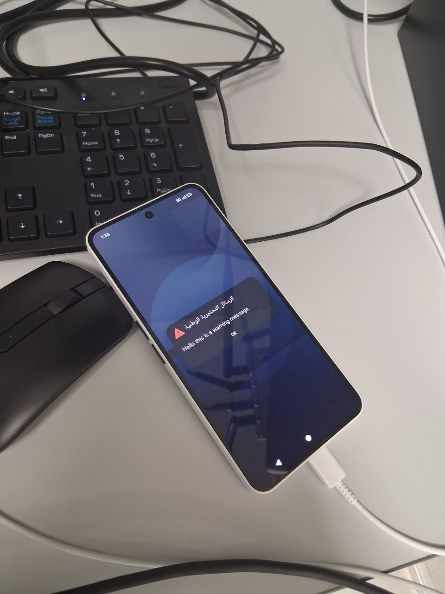
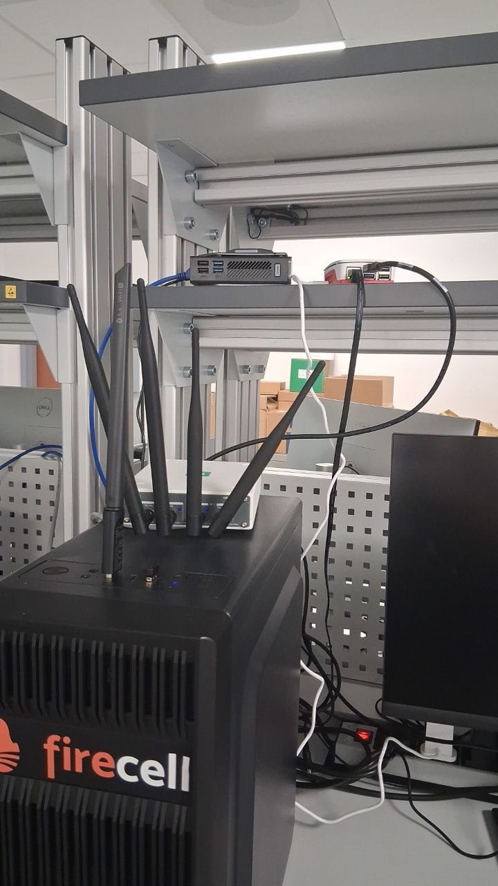
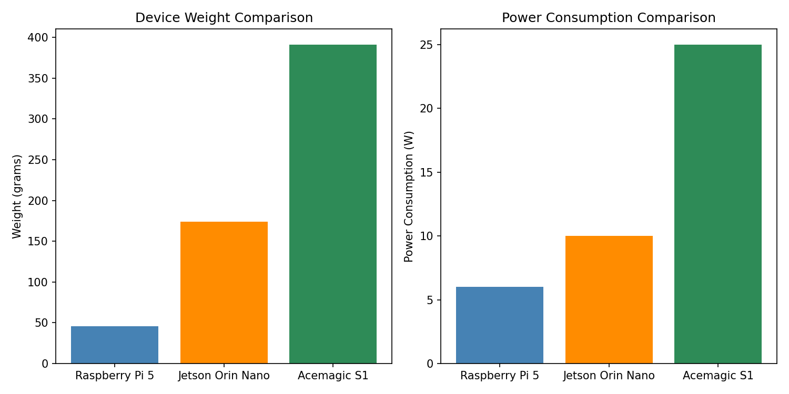

# Airborne OpenAirInterface 5G CU/DU Research

An experimental OpenAirInterface 5G Standalone (SA) testbed investigating 3GPP Option 2 CU/DU disaggregation over heterogeneous wireless F1 transport, emergency Public Warning Systems (PWS), and embedded drone relay payloads.

-blue?style=flat-square)
-orange?style=flat-square)

## Overview

This research repository documents an experimental **OpenAirInterface (OAI) 5G Standalone (SA)** testbed designed to evaluate disaggregated gNodeB deployments for aerial relay systems. Operating over **3GPP Band n78 (3.6 GHz, 106 PRB, 40 MHz)**, the study investigates how compute constraints, physical radio conditions, and non-ideal wireless F1 transport interact across heterogeneous hardware platforms.

Key research dimensions include:
- **Transport Heterogeneity:** Comparing direct Ethernet, campus Wi-Fi (GRE tunnel), and cellular 5G modem (WireGuard overlay) F1 links.
- **Embedded Compute Feasibility:** Evaluating x86 mini-PCs, NVIDIA Jetson Orin Nano, and Raspberry Pi 5 as airborne Distributed Unit (DU) payloads.
- **Emergency Broadcast Services:** Validating commercial handset alerting via 3GPP Public Warning System (PWS / SIB8) over disaggregated gNodeBs.

> **Operational Tooling:**  
> The deployment automation, configuration templates, patch set, and operator TUI are maintained in the companion operational repository:  
> 👉 [`promaaa/oai-cu-du-lab`](https://github.com/promaaa/oai-cu-du-lab)

## Performance Benchmarks

User-plane throughput was benchmarked across disaggregated F1 transport topologies and embedded compute nodes:

| Setup / Configuration | Transport Link | DU Compute Platform | Peak Downlink | Evidence |
| :--- | :--- | :--- | :---: | :--- |
| **Monolithic Reference** | Direct Host Memory / IPC | x86 (`serber-firecell`) | **190 Mbps** | [Report 19](reports/report-19.md) |
| **Tuned Ethernet CU/DU Split** | 1 GbE Direct Ethernet | x86 (`serber-minipc`) | **100 Mbps** | [Report 19](reports/report-19.md) |
| **5G Modem / WireGuard Split** | 5G Cellular + WireGuard | x86 (`serber-minipc`) | **78 Mbps** | [Report 22](reports/report-22.md) |
| **Wi-Fi / GRE CU/DU Split** | Campus Wi-Fi + GRE Tunnel | x86 (`serber-minipc`) | **52 Mbps** | [Report 10](reports/report-10.md) |
| **Jetson Orin Nano DU + 5G** | 5G Cellular + WireGuard | ARM Cortex-A78AE (Orin Nano) | **42 Mbps** | [Report 22](reports/report-22.md) |
| **Untuned Split Baseline** | Ethernet (1500B MTU frag.) | x86 (`serber-minipc`) | **23 Mbps** | [Report 18](reports/report-18.md) |
| **Raspberry Pi 5 DU** | 1 GbE Ethernet | BCM2712 Quad-Core ARM | **22 Mbps** | [Report 14](reports/report-14.md) |

### Key Optimization Takeaways

- **TCP MSS Clamping (1360B):** Resolves GTP-U MTU fragmentation over tunneled F1 transport, preventing transport-block bloat and dropping physical-layer BLER from >80% to <5%.
- **Scheduler Target BLER Tuning:** Raising `dl_bler_target_lower` to `0.25` and unlocking `dl_max_mcs: 28` enables the MAC scheduler to sustain higher modulation schemes (`MCS 24–27`).
- **Jetson Orin Nano Kernel Tuning:** Compiling custom kernel modules for SCTP protocol support, enabling `MAXN_SUPER` power mode, and ensuring USB 3.0 SuperSpeed link rates unlocked stable 42 Mbps performance on embedded ARM.

## Gallery & Testbed Setup

| Preview | Description |
| :--- | :--- |
|  | **Disaggregated Lab Testbed Setup** Ground station (`serber-firecell`), embedded DU (`serber-minipc`), Raspberry Pi 5 (`serber-pi`), and Quectel RM520N 5G backhaul modem. |
|  | **Commercial Handset Emergency Alert (SIB8)** Real-time delivery of bilingual Arabic/English Public Warning System (PWS) alert received on a Nothing Phone (2a). |
|  | **Raspberry Pi 5 Embedded DU Candidate** Featherweight 46 g single-board computer evaluated with isolated CPU cores and USB 3.0 USRP B210 RF interface. |
|  | **Embedded DU Sizing & Tradeoffs** Comparative mass vs power consumption analysis across x86, Jetson Orin Nano, and Raspberry Pi 5 for drone integration. |

## Research Reports

Chronological laboratory reports detailing 16 weeks of experimental progression:

| Report | Date | Focus & Key Milestones |
| :--- | :--- | :--- |
| [**Report 02**](reports/report-02.md) | Apr 15 | OAI core deployment, Docker environment, and Jetson SCTP constraints |
| [**Report 03**](reports/report-03.md) | Apr 22 | CU/DU split bring-up and direct Ethernet baseline planning |
| [**Report 04**](reports/report-04.md) | Apr 29 | USRP B210 hardware validation and Raspberry Pi 5 DU feasibility |
| [**Report 05**](reports/report-05.md) | May 02 | Raspberry Pi 5 benchmarking and softmodem thread pool tuning |
| [**Report 06**](reports/report-06.md) | May 05 | Commercial UE integration and PWS baseline |
| [**Report 07**](reports/report-07.md) | May 08 | CU/DU split deployment and PWS debugging |
| [**Report 08**](reports/report-08.md) | May 12 | Radio failure isolation, RF attenuation, and Pi 5 performance |
| [**Report 09**](reports/report-09.md) | May 15 | User-plane data recovery and Pi 5 runtime tuning |
| [**Report 10**](reports/report-10.md) | May 19 | Wi-Fi/GRE F1 backhaul and PWS/SIB8 handset validation |
| [**Report 11**](reports/report-11.md) | May 29 | Quectel 5G modem / WireGuard F1 bring-up |
| [**Report 12**](reports/report-12.md) | Jun 05 | Bottleneck analysis, wireless backhaul, and Pi DU evaluation |
| [**Report 13**](reports/report-13.md) | Jun 10 | MCS analysis, donor cell topology separation, and RF isolation |
| [**Report 14**](reports/report-14.md) | Jun 16 | Operator TUI deployment tooling and transport baselines |
| [**Report 15**](reports/report-15.md) | Jun 20 | State of the art (SOTA) review and project positioning |
| [**Report 16**](reports/report-16.md) | Jun 22 | State of the art synthesis and experimental value proposition |
| [**Report 17**](reports/report-17.md) | Jun 23 | Dedicated RF backhaul, lab wiki, and MCS recovery |
| [**Report 18**](reports/report-18.md) | Jun 24 | Downlink BLER/MCS root cause (GTP-U fragmentation vs TCP MSS clamping) |
| [**Report 19**](reports/report-19.md) | Jul 02 | Tuned Ethernet baseline (100 Mbps) & Jetson Orin Nano DU integration |
| [**Report 20**](reports/report-20.md) | Jul 08 | USRP X310 bandwidth evaluation and embedded benchmarks |
| [**Report 21**](reports/report-21.md) | Jul 12 | Power, mass, and Jetson validation benchmarks |
| [**Report 22**](reports/report-22.md) | Jul 16 | Jetson 5G backhaul recovery (~40 Mbps) & drone sizing models |

## Presentations

- [Présentation Charlotte V2](https://docs.google.com/presentation/d/1PTyXXZYdgLUkJzEHDRDvrb-UP5atUvs2Kw81VID5y84/edit) (Google Slides)
- [Présentation stage](https://docs.google.com/presentation/d/1-PejsoKiz7iE7Y6ZO_rdnELiBxwlDJI5kkbP2ylJjug/edit) (Google Slides)
- [`french-project-presentation.md`](reports/french-project-presentation.md) (Obsidian Advanced Slides source)

## References

1. R. Mundlamuri et al., *“Integrated Access and Backhaul in 5G with Aerial Distributed Unit using OpenAirInterface,”* 2023. [arXiv:2305.05983](https://arxiv.org/abs/2305.05983)
2. E. Moro et al., *“IABEST: An Integrated Access and Backhaul 5G Testbed for Large-scale Experimentation,”* ACM MobiCom ’22, 2022. [doi:10.1145/3495243.3558750](https://doi.org/10.1145/3495243.3558750)
3. T. Azzino et al., *“5G Edge Vision: Wearable Assistive Technology for People with Blindness and Low Vision,”* IEEE WCNC, 2024. [doi:10.1109/WCNC57260.2024.10570607](https://doi.org/10.1109/WCNC57260.2024.10570607)
4. F. John et al., *“Portable Embedded Deployment of 5G Standalone (SA) System with Software-Defined Radio,”* ITG, 2024. [VDE record](https://www.vde-verlag.de/proceedings-de/456382015.html)
5. R. Gangula et al., *“Flying Rebots: First Results on an Autonomous UAV-Based LTE Relay using OpenAirInterface,”* IEEE SPAWC, 2018. [doi:10.1109/SPAWC.2018.8445947](https://doi.org/10.1109/SPAWC.2018.8445947)
6. A. Chakraborty et al., *“SkyRAN: A Self-Organizing LTE RAN in the Sky,”* ACM CoNEXT, 2018. [doi:10.1145/3281411.3281437](https://doi.org/10.1145/3281411.3281437)

See [`REFERENCES.md`](REFERENCES.md) for full citations.

## Acknowledgements

- **Lead Researcher:** Marc Duboc (IMT Atlantique / KAUST Research Team)
- **Supervisors & Collaborators:** KAUST Resilient Communications Lab Team
- **Software Stack:** [OpenAirInterface (OAI)](https://gitlab.eurecom.fr/oai/openairinterface5g)
