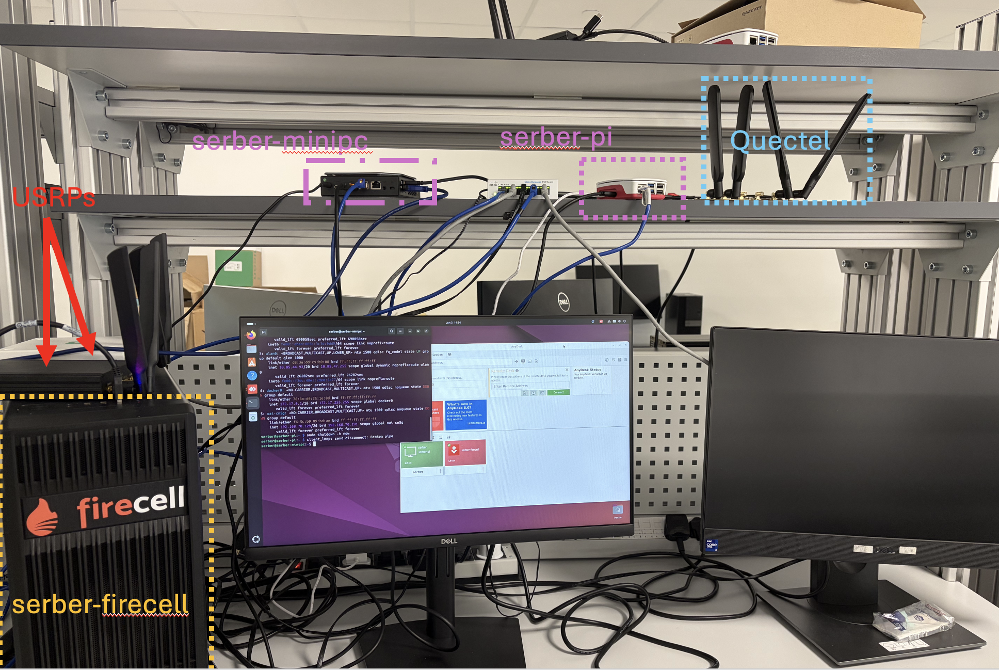
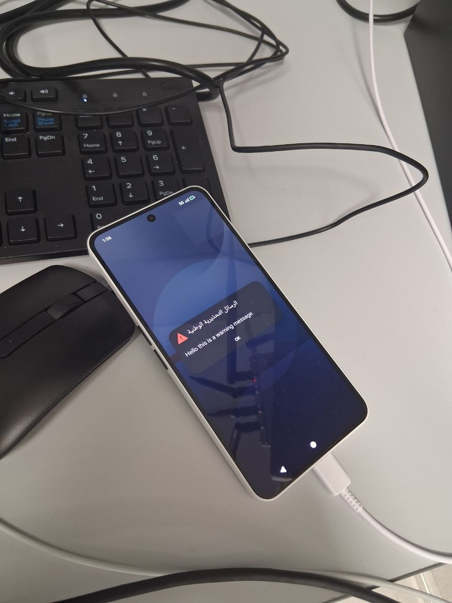
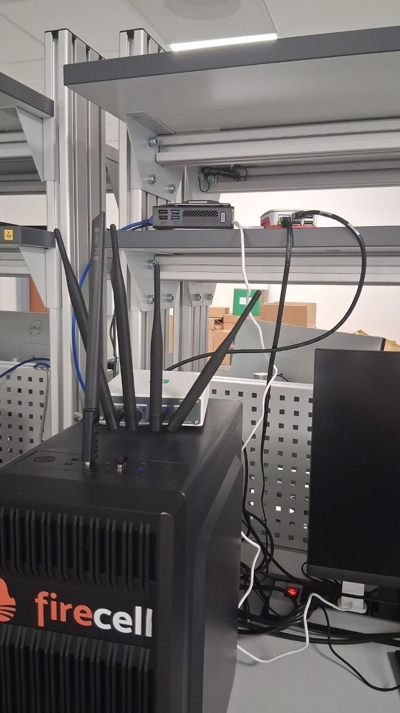
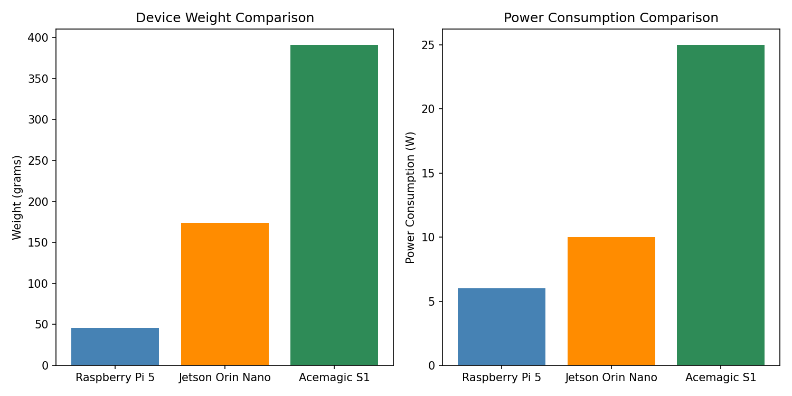

# Toward Lightweight Aerial 5G Cells: A Reproducible Real-Radio OAI Split-DU Testbed on Commodity Arm Platforms

**[Paper (PDF)](paper/lightweight-aerial-5g-cells.pdf)** · **[Operator tooling](https://github.com/promaaa/oai-cu-du-lab)** · **[Jetson SCTP kernel](https://github.com/promaaa/jetson-kernel-sctp)** · **[Lab wiki](https://promaaa.github.io/oai-cu-du-lab/)**

Marc Duboc, Ammar El Falou · SeRBER lab, KAUST · paper submitted, 2026

On a battery-powered UAV cell, every gram and watt spent on radio-access compute comes out of flight time. This testbed keeps the 5G core and the central unit (CU) on the ground and puts only the backhaul endpoint, the distributed unit (DU) and the radio in the air. The question is whether widely available Arm computers can run a real-radio OpenAirInterface 5G DU with useful performance over different F1 links. Raspberry Pi 5 and Jetson Orin Nano DUs drive a USRP B210 in band n78, with a commercial handset. F1 runs over Ethernet, Wi-Fi with GRE, or a Quectel 5G modem with WireGuard.

## Results

Mean handset downlink in Mbps, 20 trials per configuration (400 throughput observations in total, downlink and uplink):

| DU | Ethernet F1 | Wi-Fi/GRE F1 | 5G/WireGuard F1 |
|---|---:|---:|---:|
| x86 mini PC | 99.4 | 51.8 | 76.2 |
| Jetson Orin Nano | 87.9 | 45.3 | 67.8 |
| Raspberry Pi 5 | 61.8 | 40.9 | 47.2 |

Monolithic x86 gNB reference: 189.2 Mbps. Uplink ranges from 9.8 to 22.6 Mbps.

- The Jetson keeps 88.4 % of the x86 DU's Ethernet downlink, and 87.5–89.0 % across all three F1 links.
- 5G/WireGuard backhaul keeps 76.4–77.1 % of each host's wired downlink.
- A controlled link-adaptation change raised split-DU downlink from 23.4 to 99.4 Mbps as the dominant MCS moved from 3 to 26.
- The Jetson, B210 and RM500Q-GL modem weigh 657.4 g and draw about 28 W under sustained traffic (757.4 g with an integration allowance).
- A Raspberry Pi 5 DU uses about 1.8 CPU cores and 1.4 GB RAM at 64.8 °C, with no late-packet or overflow markers after thread pinning.
- Public Warning System alerts reach handsets through the split: the CU sends the warning over F1 and the DU broadcasts it in SIB8. To our knowledge this is the first public OpenAirInterface patch for PWS over F1 ([patch](https://github.com/promaaa/oai-cu-du-lab/tree/main/patches/sib8)).

Two DUs behind one ground CU were checked as a first step. Larger fan-out and flight tests are future work.

## Gallery & Testbed Setup

| Preview | Description |
| :--- | :--- |
|  | **Disaggregated Lab Testbed Setup** Ground station (`serber-firecell`), embedded DU (`serber-minipc`), Raspberry Pi 5 (`serber-pi`), and Quectel RM520N 5G backhaul modem. |
|  | **Commercial Handset Emergency Alert (SIB8)** Real-time delivery of bilingual Arabic/English Public Warning System (PWS) alert received on a Nothing Phone (2a). |
|  | **Raspberry Pi 5 Embedded DU Candidate** Featherweight 46 g single-board computer evaluated with isolated CPU cores and USB 3.0 USRP B210 RF interface. |
|  | **Embedded DU Sizing & Tradeoffs** Comparative mass vs power consumption analysis across x86, Jetson Orin Nano, and Raspberry Pi 5 for drone integration. |

## Research Reports

Chronological laboratory reports detailing 16 weeks of experimental progression:

| Report | Date | Focus & Key Milestones |
| :--- | :--- | :--- |
| [**Report 02**](reports/report-02.md) | Apr 15 | OAI core deployment, Docker environment, and Jetson SCTP constraints |
| [**Report 03**](reports/report-03.md) | Apr 22 | CU/DU split bring-up and direct Ethernet baseline planning |
| [**Report 04**](reports/report-04.md) | Apr 29 | USRP B210 hardware validation and Raspberry Pi 5 DU feasibility |
| [**Report 05**](reports/report-05.md) | May 02 | Raspberry Pi 5 benchmarking and softmodem thread pool tuning |
| [**Report 06**](reports/report-06.md) | May 05 | Commercial UE integration and PWS baseline |
| [**Report 07**](reports/report-07.md) | May 08 | CU/DU split deployment and PWS debugging |
| [**Report 08**](reports/report-08.md) | May 12 | Radio failure isolation, RF attenuation, and Pi 5 performance |
| [**Report 09**](reports/report-09.md) | May 15 | User-plane data recovery and Pi 5 runtime tuning |
| [**Report 10**](reports/report-10.md) | May 19 | Wi-Fi/GRE F1 backhaul and PWS/SIB8 handset validation |
| [**Report 11**](reports/report-11.md) | May 29 | Quectel 5G modem / WireGuard F1 bring-up |
| [**Report 12**](reports/report-12.md) | Jun 05 | Bottleneck analysis, wireless backhaul, and Pi DU evaluation |
| [**Report 13**](reports/report-13.md) | Jun 10 | MCS analysis, donor cell topology separation, and RF isolation |
| [**Report 14**](reports/report-14.md) | Jun 16 | Operator TUI deployment tooling and transport baselines |
| [**Report 15**](reports/report-15.md) | Jun 20 | State of the art (SOTA) review and project positioning |
| [**Report 16**](reports/report-16.md) | Jun 22 | State of the art synthesis and experimental value proposition |
| [**Report 17**](reports/report-17.md) | Jun 23 | Dedicated RF backhaul, lab wiki, and MCS recovery |
| [**Report 18**](reports/report-18.md) | Jun 24 | Downlink BLER/MCS root cause (GTP-U fragmentation vs TCP MSS clamping) |
| [**Report 19**](reports/report-19.md) | Jul 02 | Tuned Ethernet baseline (100 Mbps) & Jetson Orin Nano DU integration |
| [**Report 20**](reports/report-20.md) | Jul 08 | USRP X310 bandwidth evaluation and embedded benchmarks |
| [**Report 21**](reports/report-21.md) | Jul 12 | Power, mass, and Jetson validation benchmarks |
| [**Report 22**](reports/report-22.md) | Jul 16 | Jetson 5G backhaul recovery (~40 Mbps) & drone sizing models |

## Presentations

- [Présentation Charlotte V2](https://docs.google.com/presentation/d/1PTyXXZYdgLUkJzEHDRDvrb-UP5atUvs2Kw81VID5y84/edit) (Google Slides)
- [Présentation stage](https://docs.google.com/presentation/d/1-PejsoKiz7iE7Y6ZO_rdnELiBxwlDJI5kkbP2ylJjug/edit) (Google Slides)
- [`french-project-presentation.md`](reports/french-project-presentation.md) (Obsidian Advanced Slides source)

## References

1. R. Mundlamuri et al., *“Integrated Access and Backhaul in 5G with Aerial Distributed Unit using OpenAirInterface,”* 2023. [arXiv:2305.05983](https://arxiv.org/abs/2305.05983)
2. E. Moro et al., *“IABEST: An Integrated Access and Backhaul 5G Testbed for Large-scale Experimentation,”* ACM MobiCom ’22, 2022. [doi:10.1145/3495243.3558750](https://doi.org/10.1145/3495243.3558750)
3. T. Azzino et al., *“5G Edge Vision: Wearable Assistive Technology for People with Blindness and Low Vision,”* IEEE WCNC, 2024. [doi:10.1109/WCNC57260.2024.10570607](https://doi.org/10.1109/WCNC57260.2024.10570607)
4. F. John et al., *“Portable Embedded Deployment of 5G Standalone (SA) System with Software-Defined Radio,”* ITG, 2024. [VDE record](https://www.vde-verlag.de/proceedings-de/456382015.html)
5. R. Gangula et al., *“Flying Rebots: First Results on an Autonomous UAV-Based LTE Relay using OpenAirInterface,”* IEEE SPAWC, 2018. [doi:10.1109/SPAWC.2018.8445947](https://doi.org/10.1109/SPAWC.2018.8445947)
6. A. Chakraborty et al., *“SkyRAN: A Self-Organizing LTE RAN in the Sky,”* ACM CoNEXT, 2018. [doi:10.1145/3281411.3281437](https://doi.org/10.1145/3281411.3281437)

See [`REFERENCES.md`](REFERENCES.md) for full citations.

## Acknowledgements

- **Lead Researcher:** Marc Duboc (IMT Atlantique / KAUST Research Team)
- **Supervisors & Collaborators:** KAUST Resilient Communications Lab Team
- **Software Stack:** [OpenAirInterface (OAI)](https://gitlab.eurecom.fr/oai/openairinterface5g)
