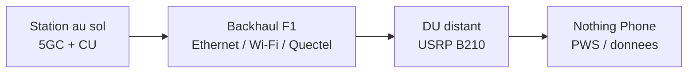
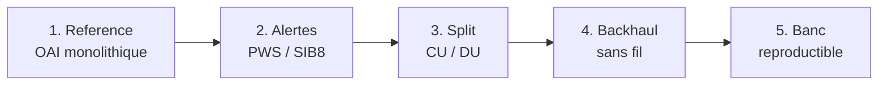
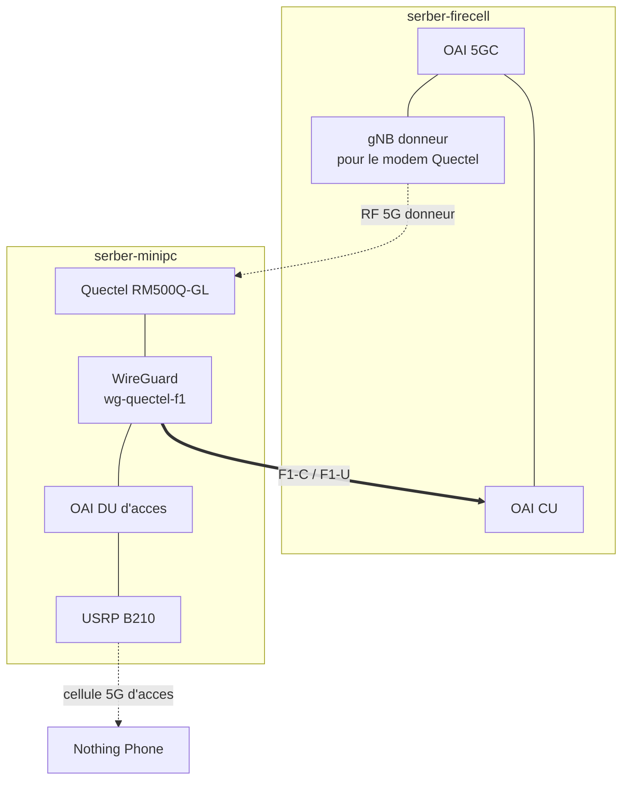
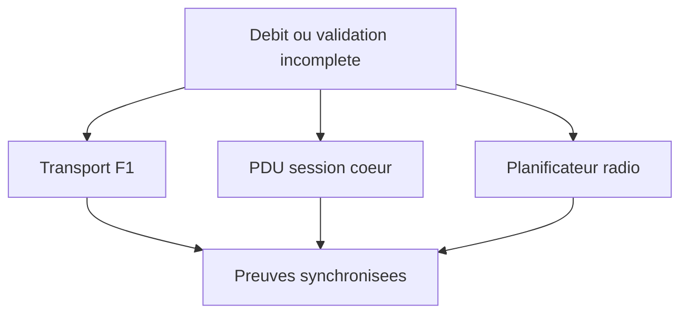

# Presentation Charlotte V2
### Stage 5G OAI CU/DU

**Du banc d'essai radio au backhaul 5G**

Note:
Presentation courte, environ 10 minutes. L'objectif est de donner une vue globale: ce qui etait prevu, ce qui a ete fait, les resultats, le banc d'essai et les prochaines etapes.

---

## Idee generale

Construire un reseau 5G experimental capable de separer:

- le calcul lourd au sol: **5GC + CU**;
- la radio proche de l'utilisateur: **DU + USRP B210**;
- le transport entre les deux: **F1 sur Ethernet, Wi-Fi, puis 5G Quectel**.

Note:
Le fil rouge est un relais 5G deployable: garder le coeur et le CU au sol, et rapprocher seulement la radio des utilisateurs.

---

## Ce qui etait prevu

La logique du stage: avancer par baselines, valider chaque etape, et garder un rollback propre.

Note:
Cette slide explique le plan initial. On ne cherchait pas seulement une demo finale, mais une progression controlee.

---

## Le banc d'essai

---

## Architecture cible

Image future possible: `target-quectel-f1-architecture.png`.

Note:
Point cle: le Quectel doit utiliser une cellule donneuse separee, pas la cellule d'acces qu'il backhaul.

---

## Ce qui a ete realise

- Reference OAI monolithique fonctionnelle.
- Split **CU/DU Ethernet** avec SIB8/PWS.
- Alertes **PWS** observees sur telephone.
- Backhaul **Wi-Fi GRE** valide.
- Plan **Quectel + WireGuard** implemente.
- TUI et scripts pour lancer, valider et rollback.

Note:
Le resultat n'est pas seulement radio: c'est aussi un banc que l'on peut relancer et documenter.

---

## Resultats principaux

| Configuration | Etat | Resultat observe |
|---|---:|---:|
| Monolithique OAI | reference | ~150 Mb/s |
| CU/DU Ethernet + SIB8 | rollback stable | ~19-23 Mb/s |
| CU/DU Wi-Fi GRE | backhaul sans fil valide | ~12 Mb/s |
| Quectel / WireGuard | en validation | F1-C et tunnel prouves, F1-U final ouvert |

Note:
Ne pas survendre Quectel. Les resultats solides sont monolithique, Ethernet split avec SIB8, et Wi-Fi GRE. Quectel est avance, mais la preuve utilisateur finale reste a fermer.

---

## Points difficiles

- Compatibilite **SCTP** selon les machines et noyaux.
- Separation necessaire entre **radio d'acces** et **radio/backhaul**.
- Routes residuelles pouvant casser le transport F1.
- Debit split limite, avec investigation autour de **MCS / CQI / HARQ**.
- Attribution du trafic telephone: besoin de captures synchronisees.

Note:
Cette slide montre les verrous d'ingenierie. Les problemes ont ete transformes en gates de validation.

---

## Ce que le banc permet maintenant

Comparer proprement plusieurs transports F1:

- **Ethernet**: baseline de rollback.
- **Wi-Fi GRE**: backhaul sans fil valide.
- **Quectel 5G**: cible principale en validation.
- **DU portable**: direction suivante.

Image future possible: `validation-workflow-screenshot.png`.

Note:
Le banc devient un outil pour faire des campagnes experimentales, pas seulement une installation ponctuelle.

---

## Suite du travail

1. Fermer la validation Quectel avec F1-U pendant trafic telephone.
2. Instrumenter le MCS split et comparer au monolithique.
3. Produire une matrice de performance Ethernet / Wi-Fi / Quectel.
4. Stabiliser le profil DU portable.

Image future possible: `portable-du-drone-concept.jpg`.

Note:
Terminer sur la trajectoire: du banc de laboratoire vers un relais 5G deployable.

---

# Conclusion

Le stage a transforme une idee de relais 5G en un banc d'essai structure:

- radio reelle;
- split CU/DU;
- alertes PWS/SIB8;
- backhauls compares;
- validation outillee.

**Prochaine marche:** fermer la preuve de bout en bout sur Quectel, puis optimiser le debit et la portabilite.

Note:
Phrase de fin possible: "Le plus important n'est pas seulement d'avoir fait fonctionner une configuration, mais d'avoir construit une methode pour prouver ce qui fonctionne, identifier ce qui bloque, et continuer sans perdre les baselines."
