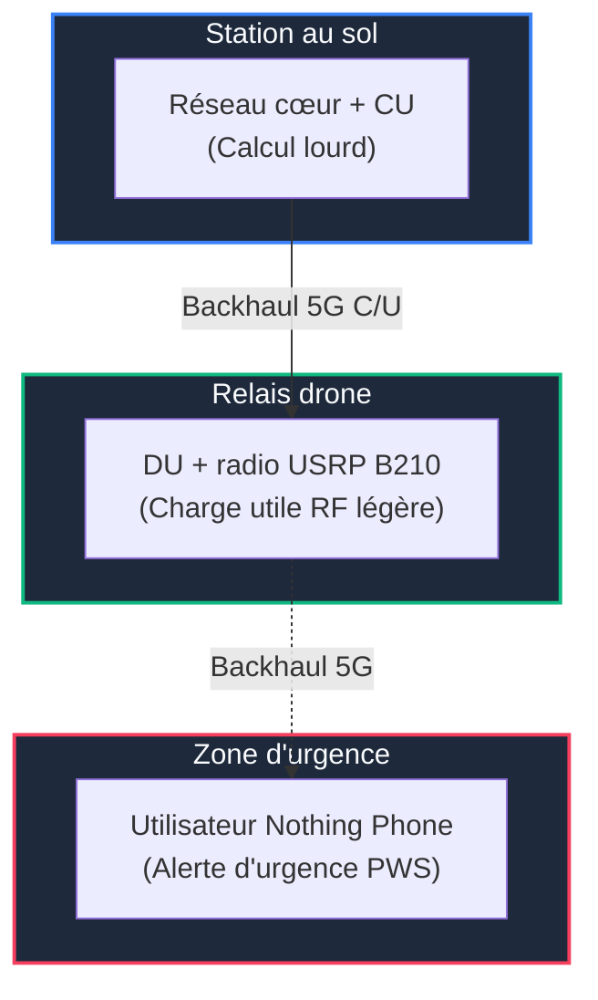
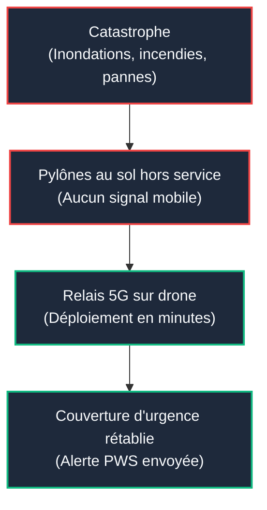
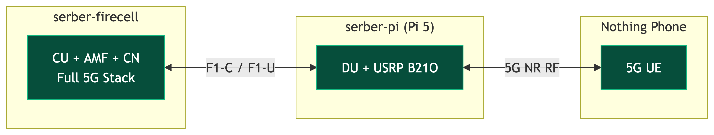
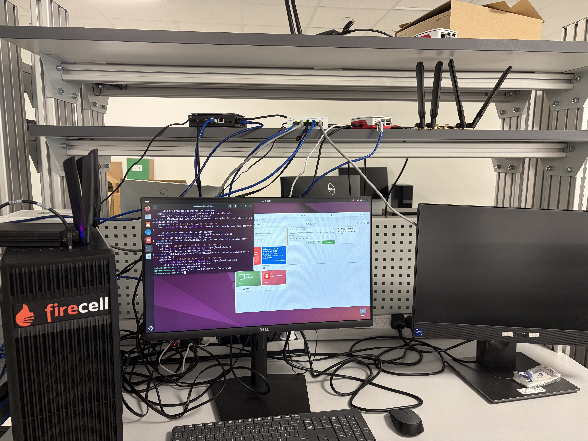
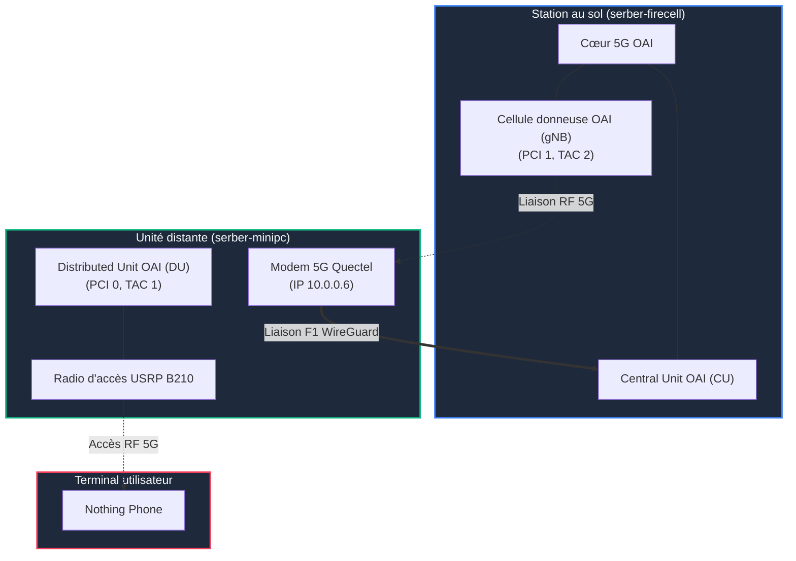

# De la station au sol au relais 5G volant
### Progrès d'un banc d'essai 5G/UAV

Récapitulatif de la recherche

---

## Concept principal

---

## Contexte et intérêt

### Rétablissement d'urgence

---

## Le concept de séparation CU/DU

<grid cols="2" gap="10">

</grid>

---

## Le banc d'essai physique

---

## Chronologie des développements

---

## Choix techniques et pivots d'ingénierie

<grid cols="2" gap="10">

### Résolution des verrous

1. **Jetson (Tegra)** : Noyau SCTP recompilé, puis profil CPU/USB stabilisé.
2. **RF** : Une seule radio sature en accès et transport. Séparation des rôles (USRP et Quectel).
3. **Débit** : Analyse conjointe MTU/MSS, BLER et planificateur OAI.

  <strong style="color: #f8fafc;">Noyau SCTP</strong> 
  Un noyau SCTP adapté et un profil CPU/USB ont rendu le DU Jetson opérationnel.

  <strong style="color: #f8fafc;">Ressources RF</strong> 
  L'USRP B210 gère l'accès du téléphone, et le modem Quectel gère la liaison de transport.

  <strong style="color: #f8fafc;">Planificateur</strong> 
  Le réglage MTU/MSS et l'adaptation des seuils BLER ont permis au MCS de remonter.

</grid>

---

## Résultats validés à ce jour

<grid cols="2" gap="10">

### État de validation

* Connexions et alertes PWS stabilisées.
* Ethernet séparé réglé jusqu'à 100 Mbps en pointe.
* Jetson avec backhaul Quectel validé autour de 40–44 Mbps.

✓Téléphone connecté en mode séparé

✓Diffusion d'alerte SIB8 (PWS)

✓Fonctionnement séparé CU/DU

✓Transport F1 sur canal sans fil

✓Liaison de transport via Quectel

✓Thread pinning validé sur Pi 5

⚠En cours : répétitions contrôlées et publication des preuves expérimentales

</grid>

---

## Architecture cible unifiée

<grid cols="2" gap="10">

### Implantation finale

Le trafic utilisateur traverse le DU distant, s'encapsule dans le tunnel WireGuard chiffré établi sur le lien 5G du Quectel, puis atteint le cœur au sol.

</grid>

---

## Analyse du débit et goulot d'étranglement

<grid cols="2" gap="10">

### Goulot d'étranglement

Les essais tardifs ont invalidé le plafond initial de 23 Mbps. Le split Ethernet réglé a atteint 100 Mbps en pointe; le chemin Wi-Fi/GRE 52 Mbps et le chemin Quectel/WireGuard 78 Mbps.

Ces valeurs sont des meilleurs résultats observés, pas des moyennes contrôlées.

</grid>

---

## Perspectives et étapes futures

<grid cols="2" gap="10">

### Travaux futurs

La suite transforme les démonstrations en artefact reproductible et prépare une intégration drone sûre.

  1
  <strong>Geler le logiciel</strong> : publier le commit OAI, les patchs et configurations exacts.

  2
  <strong>Répéter les mesures</strong> : campagnes contrôlées avec métriques synchronisées.

  3
  <strong>Publier les preuves</strong> : données anonymisées et validation du chemin des paquets.

  4
  <strong>Radio légère</strong> : valider le B205mini-i avant le choix d'un petit drone.

  5
  <strong>Châssis drone</strong> : alimentation, refroidissement, RF, fixation et sécurités.

</grid>
