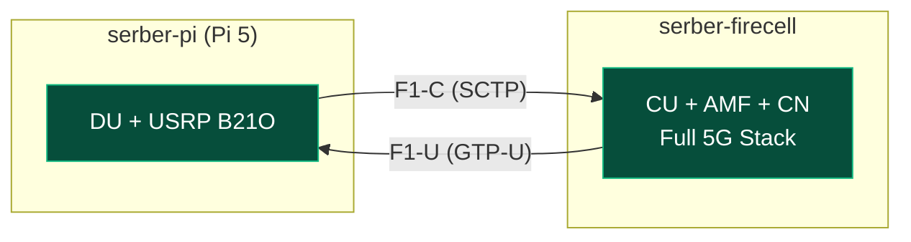

*Current status: Week 6 (out of 16 weeks total)*

## What changed since last update
1. Throughput performance optimized: achieved 23 MB/s on `serber-minipc` through the CU/DU split (eth).
2. Wireless backhaul integrated: successfully routed F1 traffic over wifi using a GRE tunnel on `serber-minipc` with 14 MB/s throughput.
3. Repository published: uploaded all configurations and scripts to a reproducible gh repo.

## Network infrastructure and hardware introduction
To introduce the deployment, the physical testbed is composed of four primary hardware nodes configured to represent the Core Network, CU, DU, and UE.

| Host              | Role                  | IP Address      | Operating System          |
| ----------------- | --------------------- | --------------- | ------------------------- |
| `serber-firecell` | Core Network and CU   | `10.76.170.38`  | Ubuntu 22.04 LTS          |
| `serber-minipc`   | Distributed Unit (DU) | `10.76.170.100` | Ubuntu 22.04 LTS          |
| `serber-pi`       | Lightweight DU        | `10.76.170.94`  | Ubuntu 22.04 (pi version) |
| Nothing Phone     | User Equipment (UE)   | Dynamic (12.1.1.2) | Android 14                |

![[picture-of-setup.png]]

## Schematics of what we are trying to achieve

## Phase 1: Simulation setup
* Deployed containerized OpenAirInterface 5G Core Network on `serber-firecell`.
* Validated simulated UE connectivity using the built-in RF simulator, confirming successful network attach and user data plane routing.

## Phase 2: Hardware block and migration
* Blocked by NVIDIA's custom Tegra Linux kernel on the Jetson Orin Nano, which disabled `CONFIG_IP_SCTP` required for gNB N2 and F1-C signaling.
* Attempted recompilation of SCTP module from NVIDIA source trees but failed due to proprietary toolchain mismatches.
* Migrated from Jetson to an x86 `serber-minipc` with native SCTP support to bypass kernel limits.
* Compiled the DU (`nr-softmodem`) from source to avoid containerization crashes, successfully establishing F1/N2 SCTP connections in simulation.

## Phase 3: minipc/Pi 5 and real UE integration
* Deployed monolithic on both `serber-minipc` and `serber-firecell`
* Benchmarked the Raspberry Pi 5 as a lightweight DU alternative, resolving CPU overflows. Fix: tuning down to a stable 24 PRB (10 MHz) profile.
* Integrated a real 5G UE (Nothing Phone) .
* Applied Abdallah's patch to add PWS capabilities.

## Phase 4: Split architecture and optimization
* Deployed the full CU/DU split over direct Ethernet between `serber-firecell` (CU) and `serber-minipc` (DU) with the USRP B210.
* Resolved several deep bugs inside OAI's F1AP and MAC layers to support SIB8 alerts, fixing DU paging allocation crashes, CU shallow copy double-frees, silent decode failures, and incorrect initial BWP frequency mappings.
* Resolved a 74% downlink BLER causing a "no internet" state on the real UE by profile-tuning to 106 PRB and applying RF attenuation (`att_tx=3`, `att_rx=12`).

## Phase 5: Backhauling (wifi/5G)

* Achieved **23 MB/s** throughput over Ethernet using the optimized CU/DU split on `serber-minipc`.
* Routed the F1 interface over a GRE tunnel via WiFi, replacing physical cabling.
* Achieved **14 MB/s** throughput over the WiFi GRE tunnel (~60% of the physical Ethernet baseline).

## Next steps
1. Full internet connection validation: test and verify end-to-end internet access on a computer running the OpenAirInterface User Equipment software stack.
2. 5G Backhauling integration analysis and latency benchmarking.