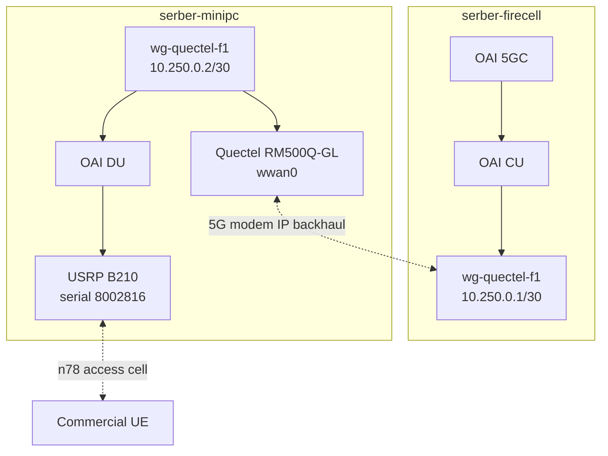

	 # Quectel modem backhaul for CU and DU split

**Date:** May 29, 2026
# Quectel 5G/WireGuard F1 backhaul bring-up

**Timeline:** April 7 to July 31, 2026 (16 weeks)

---

## What changed since last update

1. Backhaul direction changed: stopped using the USRP B210 for backhaul and dedicated it to the access cell only
2. Quectel modem detected: identified RM500Q-GL on `serber-minipc` with QMI control and `wwan0` data interface
3. WireGuard overlay prepared: created `wg-quectel-f1` with firecell `10.250.0.1/30` and minipc `10.250.0.2/30`
4. OAI configs protected: original CU and DU configs were backed up and generated Quectel-specific copies were created
5. Subscriber database expanded: sysmocom IMSIs from the old OAI PC were added to the firecell core database
6. Quectel RF blocker narrowed: the modem initially camped on public `42001` NR instead of private `00101`
7. Quectel NR lock succeeded: modem camped on OAI PCI `0`, ARFCN `641280`, SCS `30`, band `78`
8. Quectel packet data succeeded: QMI started APN `oai` and assigned `wwan0` IP `10.0.0.3`
9. WireGuard path proved: `wg-quectel-f1` reached firecell over the Quectel PDU session with about 30 ms RTT
10. Full F1 attempt tested: DU sent F1 SCTP INIT over WireGuard and `wwan0`, but the return path failed after the access DU restarted

---

## Problem: replace shared wireless experiments with a modem IP backhaul

The previous backhaul attempt tried to use the same USRP B210 for both the access radio and a wireless backhaul experiment. That design was not realistic because one B210 could not safely provide two independent NR systems at the same time.

The new design is simpler. The USRP B210 on `serber-minipc` remains dedicated to the access cell serving commercial UEs. The Quectel modem becomes the IP backhaul interface for F1-C and F1-U between the DU and CU.



---

## Current architecture

| Component | Host | Role | Interface |
|-----------|------|------|-----------|
| OAI core | `serber-firecell` | 5GC | Docker network |
| OAI CU | `serber-firecell` | F1 endpoint | `wg-quectel-f1` planned |
| OAI DU | `serber-minipc` | Access DU | `wg-quectel-f1` planned |
| USRP B210 | `serber-minipc` | Access RF only | serial `8002816` |
| Quectel RM500Q-GL | `serber-minipc` | IP backhaul modem | `wwan0` |
| Ethernet and WiFi | both hosts | SSH, diagnostics, rollback | not F1 target |

WireGuard target parameters:

```yaml
tunnel_name: wg-quectel-f1
firecell_wg_ip: 10.250.0.1/30
minipc_wg_ip: 10.250.0.2/30
firecell_udp_port: 51821
firecell_reachable_endpoint: 192.168.71.129
quectel_ue_ip: 10.0.0.3
quectel_gateway: 10.0.0.4
upf_container_ip: 192.168.71.134
f1_port: 2153
preferred_mode: WireGuard over Quectel
```

---

## Quectel modem discovery

| Field | Value |
|-------|-------|
| Model | Quectel RM500Q-GL |
| USB ID | `2c7c:0800` |
| Firmware | `RM500QGLABR13A03M4G` |
| USB mode | QMI |
| Management device | `/dev/cdc-wdm2` |
| AT ports | `/dev/ttyUSB3`, `/dev/ttyUSB4` |
| Data interface | `wwan0` |
| Driver | `qmi_wwan` |
| Current IP | `10.0.0.3/29` |
| Packet service | connected with direct QMI |

Current SIM evidence:

| Field | Value |
|-------|-------|
| IMSI | `001010000059451` |
| ICCID | `8949440000001316312` |
| Home operator | `00101 / Firecell` |
| APN | `oai` |
| Core subscriber row | added on firecell |
| Observed UE IP | `10.0.0.3` |

---

## Access cell status

The access cell is live. This corrected an earlier broad diagnosis that sounded like the OAI cell itself was unavailable.

| Evidence | Result |
|----------|--------|
| DU process | running with `gnb-minipc.conf` and `-E` |
| CU process | running with `gnb-cu-minipc.conf` |
| F1 baseline | associated over the existing Ethernet or WiFi path |
| UE state in DU log | UE `RNTI e5a5` in sync |
| UE RSRP in DU log | about `-108 dBm` |
| User observation | phone receives PWS and shows 5G |

The issue was specific to the Quectel modem. Before the fix, the modem saw a public NR cell instead of the private Firecell PLMN.

```yaml
quectel_serving_state: LIMSRV
radio: NR5G-SA
observed_plmn: "420/01"
observed_pci: 82
observed_arfcn: 643296
observed_band: 78
observed_rsrp: -104
oai_plmn: "001/01"
oai_pci: 0
oai_arfcn: 641280
oai_band: 78
```

After applying the NR lock, the modem selected the OAI cell:

```yaml
quectel_serving_state: NOCONN
radio: NR5G-SA
selected_plmn: "001/01"
selected_pci: 0
selected_arfcn: 641280
selected_band: 78
selected_rsrp: -94
qmi_packet_service: connected
qmi_ipv4_address: 10.0.0.3
qmi_ipv4_gateway: 10.0.0.4
```

---

## OAI radio configuration

The active DU access cell remains configured for the B210 and private PLMN:

```yaml
host: serber-minipc
config: /home/serber/cu-du/source/openairinterface5g/targets/PROJECTS/GENERIC-NR-5GC/CONF/gnb-minipc.conf
usrp_serial: "8002816"
plmn: "001/01"
nr_band: 78
absoluteFrequencySSB: 641280
dl_absoluteFrequencyPointA: 640008
physCellId: 0
dl_carrierBandwidth: 106
ul_carrierBandwidth: 106
att_tx: 12
att_rx: 12
max_rxgain: 114
```

---

## Work completed

| Area | Work | Status |
|------|------|--------|
| Repository branch | Created `feature/quectel-f1-backhaul` | done |
| Production config safety | Created before-change backups | done |
| Generated OAI configs | Created Quectel-specific CU and DU copies | done |
| WireGuard firecell | Installed and configured listener | done |
| WireGuard minipc | Installed config with `wwan0` guard | working |
| Core database | Added sysmocom IMSI range from old OAI PC | done |
| Access cell verification | Confirmed active CU, DU, F1, and attached UE | done |
| Quectel packet attach | Started with QMI APN `oai` | working |
| F1 over Quectel validation | Attempted with generated CU and DU configs | failed due circular radio dependency |

---

## Generated F1 configuration

The generated F1 configs bind to the WireGuard tunnel addresses, not to Ethernet or WiFi addresses.

```yaml
cu_config: /home/serber/cu-du-minipc-backhaul/source/openairinterface5g/targets/PROJECTS/GENERIC-NR-5GC/CONF/gnb-cu-minipc-quectel-backhaul.conf
du_config: /home/serber/cu-du/source/openairinterface5g/targets/PROJECTS/GENERIC-NR-5GC/CONF/gnb-minipc-quectel-backhaul.conf
cu_f1_local: 10.250.0.1
cu_f1_remote_du: 10.250.0.2
du_f1_local: 10.250.0.2
du_f1_remote_cu: 10.250.0.1
wireguard_endpoint_used_by_minipc: 192.168.71.129:51821
f1_port: 2153
du_mode: "-E"
```

The minipc WireGuard config intentionally includes a startup guard. It will not start unless `wwan0` has an IPv4 address. This prevents accidental fallback to Ethernet or WiFi.

---

## Validation status

| Check | Result |
|-------|--------|
| Quectel detected | pass |
| QMI management path | pass |
| `wwan0` detected | pass |
| SIM recognized | pass |
| Subscriber provisioned in core | pass |
| Access cell on air | pass |
| Phone sees 5G and receives PWS | pass |
| Quectel sees private `00101` cell | pass after NR lock |
| Quectel packet service | pass with QMI |
| Quectel IPv4 address | pass: `10.0.0.3` |
| WireGuard over Quectel | pass |
| F1 over Quectel | fail |
| tcpdump proof of WireGuard over Quectel | pass |
| tcpdump proof of F1 over Quectel | partial: DU SCTP INIT observed on `wg-quectel-f1` and encrypted on `wwan0` |

---

## Interpretation

The SIM and core database are no longer the blocker. The current Quectel SIM belongs to the private `00101` network and the firecell core now has the matching subscriber row.

The RF selection blocker was fixed by locking the modem to the OAI NR cell. The modem now attaches to packet service and the WireGuard control path works over the Quectel PDU session.

The remaining blocker is architectural. The Quectel is currently using the same OAI access cell provided by the DU whose F1 backhaul we want to move. Restarting the DU or CU with F1 over this same modem path would remove the radio path that the modem depends on. This is a circular dependency, similar to an IAB design without a separate donor path.

Speculation: a full F1-over-Quectel run will require either a separate private backhaul cell, a public carrier SIM/APN, or a second independent OAI RAN that keeps the Quectel packet session alive while the minipc DU restarts.

## Full F1 attempt result

The full F1 sequence was attempted after WireGuard over Quectel was proven. The CU started with the generated config and bound F1 to `10.250.0.1`. The DU started with the generated config and bound F1 to `10.250.0.2`.

```yaml
cu_config: gnb-cu-minipc-quectel-backhaul.conf
du_config: gnb-minipc-quectel-backhaul.conf
cu_f1_bind: 10.250.0.1
du_f1_bind: 10.250.0.2
du_log_state: waiting for F1 Setup Response
wireguard_state_after_du_restart: stale handshake
```

Observed packet evidence:

| Interface | Evidence | Result |
|-----------|----------|--------|
| `wg-quectel-f1` on minipc | SCTP INIT from `10.250.0.2` to `10.250.0.1` | F1 attempted over tunnel |
| `wwan0` on minipc | WireGuard UDP from `10.0.0.3` to `192.168.71.129:51821` | tunnel packets left over Quectel |
| firecell route to `10.0.0.3` | ping failed after DU restart | return path lost |
| CU log | CU waited on `10.250.0.1`, no F1 setup from DU completed | F1 failed |

Conclusion: the implementation correctly forced F1 toward the Quectel WireGuard tunnel, but the modem path could not survive the restart of the same DU radio that provides its access link.

---

## Next Steps

1. Keep the Quectel NR lock and QMI attach sequence documented in the repo scripts
2. Make the firecell return route persistent: `10.0.0.3/32` via `192.168.71.134` on `oai-cn5g-minipc`
3. Keep WireGuard endpoint `192.168.71.129:51821`, not campus IP `10.76.170.38`
4. Add an independent Quectel backhaul source: public carrier SIM/APN, separate private donor cell, or second OAI RAN
5. Repeat full F1 with generated Quectel configs only after the Quectel modem remains online while the minipc DU is stopped
