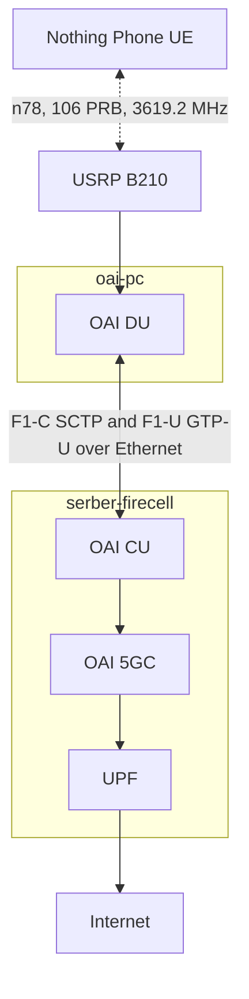
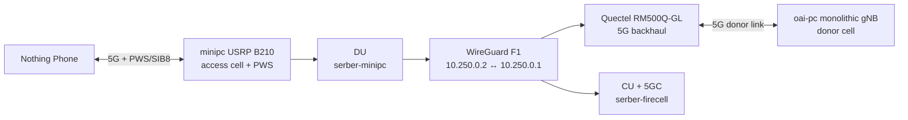

# OAI CU/DU Split Progress: Bottleneck, Wireless Backhaul, and Pi DU

**Date:** June 1, 2026
**Timeline:** April 7 to July 31, 2025 (16 weeks)

---

## What changed since last update

1. OAI PC split deployment completed: moved the DU and USRP B210 to `oai-pc` while keeping CU and 5GC on `serber-firecell`
2. Ethernet F1 path validated: measured about 940 Mbps in both directions between firecell and oai-pc
3. User-plane restored: Nothing Phone attached, established PDU sessions, and reached internet through the split setup
4. Bottleneck narrowed: oai-pc still measured about 23 Mbps, matching serber-minipc and pointing away from weak DU hardware
5. Quectel backhaul pivot validated: `serber-minipc` now keeps the USRP B210 as the access radio while Quectel provides the wireless F1 transport
6. Independent donor added: `oai-pc` now runs a monolithic OAI donor cell for the Quectel modem
7. F1 over 5G backhaul confirmed: WireGuard over Quectel carries F1-C/F1-U between `serber-minipc` and `serber-firecell`
8. PWS still works: Nothing Phone received the 5G access cell and PWS/SIB8 message through the CU/DU split
9. Raspberry Pi 5 16 GB has been benchmarked
10. Isolated 5G throughput measured: with Raspberry Pi Ethernet and Wi-Fi disabled, the speed test measured `8.6 Mbps` over the 5G path
11. Single-core pivot started: `serber-firecell` now runs the only 5GC and the donor cell for Quectel, so `oai-pc` is no longer required in the target architecture


---

## Problem: oai-pc did not improve CU and DU split throughput

The experiment moved the DU from `serber-minipc` to the stronger `oai-pc` server. The goal was to determine whether the old split-mode bottleneck came from minipc hardware.

The result was clear. After matching the old minipc DU configuration, the Nothing Phone measured about `23 Mbps`, the same as the previous serber-minipc split result.

| Setup                    | DU host           | F1 path  | Result   |
| ------------------------ | ----------------- | -------- | -------- |
| Monolithic gNB reference | `serber-firecell` | none     | 150 Mbps |
| Previous split           | `serber-minipc`   | Ethernet | 23 Mbps  |
| New split                | `oai-pc`          | Ethernet |  23 Mbps |

Current interpretation: the bottleneck is not primarily the old DU machine. It appears systematic to the split-mode configuration, OAI scheduler behavior, or CU to DU interaction.

---

## Previous oai-pc Ethernet split architecture




---

## Network hygiene and F1 validation


The active route from CU to DU uses the physical Ethernet interface:

```yaml
route_to_oai_pc: 10.76.170.90 dev enp6s0 src 10.76.170.38
firecell_interface: enp6s0
oai_pc_interface: enp3s0
gre_used_for_f1: false
wireguard_used_for_f1: false
```

Ethernet capacity was not the bottleneck:

---

## Active radio profile

The active oai-pc DU was aligned with the known split-mode radio profile:

```yaml
plmn: "001/01"
band: 78
absoluteFrequencySSB: 641280
frequency: 3619.2 MHz
dl_absoluteFrequencyPointA: 640008
dl_carrierBandwidth: 106
ul_carrierBandwidth: 106
subcarrier_spacing: 30 kHz
ssPBCH_BlockPower: -25
max_pdschReferenceSignalPower: -27
max_rxgain: 114
att_tx: 12
att_rx: 12
clock_src: internal
usrp_serial: "35F8ABA"
```

Validation after fixes

| Check           | Result                                      |
| --------------- | ------------------------------------------- |
| CU process      | running                                     |
| DU process      | running                                     |
| NG setup        | AMF accepted CU                             |
| F1 setup        | DU accepted by CU                           |
| F1-U socket     | `10.76.170.38:2153` and `10.76.170.90:2153` |
| UE attach       | successful                                  |
| PDU session     | established                                 |
| Internet access | working                                     |
| Fast.com result | about 23 Mbps                               |
The final throughput remained close to the previous split-mode baseline.

---

## Main finding: oai-pc does not remove the split bottleneck

The oai-pc server is much stronger than serber-minipc, but throughput stayed near the old split result after the configs were made equivalent.

This changes the bottleneck hypothesis:

| Candidate bottleneck        | Current status | Evidence                                                                                      |
| --------------------------- | -------------- | --------------------------------------------------------------------------------------------- |
| Weak minipc CPU or RAM      | unlikely       | oai-pc produced the same throughput                                                           |
| Physical Ethernet F1        | unlikely       | iperf3 showed about 940 Mbps                                                                  |
| GRE or WireGuard path       | unlikely       | F1 route uses physical Ethernet                                                               |
| UPF shaping                 | unlikely       | `tun0` qdisc is `fq_codel`, not `tbf`                                                         |
| CU CPU                      | unlikely       | CU load was low                                                                               |
| DU host CPU                 | unlikely       | oai-pc has sufficient CPU headroom                                                            |
| Radio or scheduler behavior | likely         | DL MCS stayed at `0` during throughput test                                                   |
| OAI code weakness           | likely         | CU and DU splits have way lower performance compared to monolithic mode which is very unusual |
-  MCS 0 is the **lowest, slowest, and most robust** configuration (using QPSK modulation with a very low code rate). It is designed to ensure connection survival under extremely poor radio conditions.
- **Higher MCS values (up to 28)** use advanced modulations (like 64-QAM or 256-QAM) to pack many more bits per symbol, allowing speeds of 150+ Mbps.
---

## Scheduler evidence

During the 23 Mbps test, the active UE had stable traffic but downlink MCS stayed at `0`.

Representative DU evidence:

```yaml
active_rnti: 1a68
downlink_rounds: "38309/5083/17/1"
downlink_errors: 0
pucch0_dtx: 50
reported_dl_mcs: 0
downlink_mac_tx_bytes: 92918221
downlink_lcid5_tx_bytes: 92373880
uplink_lcid5_rx_bytes: 8194842
average_rsrp: -100
```

The first retransmission ratio was about 13 percent:

```yaml
first_transmissions: 38309
first_retransmissions: 5083
approx_first_retx_ratio: 0.133
```

OAI uses a BLER-driven MCS ramp. The default target range is:

```yaml
dl_bler_target_lower: 0.05
dl_bler_target_upper: 0.15
dl_min_mcs: 0
dl_max_mcs: 28
dl_harq_round_max: 4
```

If the scheduler sees roughly 13 percent DL retransmissions at MCS `0`, it considers the link within the default 5 percent to 15 percent target band and does not increase MCS. This explains why the link can be clean enough to pass data but still capped near the previous split throughput.

Speculation: the split setup may be losing or delaying enough HARQ feedback, CSI feedback to keep the BLER estimator from allowing MCS growth. The symptom is scheduler-level, not raw Ethernet capacity.

1. **DL BLER estimator behavior**: OAI estimates how many downlink transmissions are failing on the first try. If it thinks BLER is already high, around 13%, it will avoid increasing MCS. So the scheduler may be saying: “the link is barely good enough, stay conservative.”
    
2. **HARQ feedback quality**: HARQ feedback is the phone saying ACK or NACK after each downlink block. If the DU receives too many NACKs, or misses feedback, OAI assumes the link is risky and keeps MCS low.
    
3. **CSI reporting**: CSI is the phone’s channel quality report. It helps OAI choose a good MCS. If CSI is missing, poor, delayed, or misconfigured, OAI may not know the channel can support higher MCS.


---

## Conclusion

The experiment answered the main hardware question. Moving the DU from serber-minipc to oai-pc did not improve throughput. After configuration equivalence was restored, the result stayed near `23 Mbps`.

The strongest current explanation is that the CU and DU split path is limited by OAI scheduler or feedback behavior. The DU is scheduling downlink data at MCS `0` even though the UE is attached, the user-plane is active, Ethernet is healthy, and the UPF is not shaped. It can also still be a weakness from the code since we have already discovered several previously.

Bottleneck unknown: the exact reason MCS stays at `0` is not yet proven. The leading candidates is DL BLER estimator behavior, HARQ feedback quality, PUCCH or CSI reporting, and OAI CU/DU build mismatch.


---

## Wireless F1 backhaul pivot: Quectel + oai-pc donor

The original wireless-backhaul idea was to let the USRP B210 on `serber-minipc` support both access/fronthaul and backhaul. We pivoted away from that because it creates a circular dependency: the DU needs a working backhaul before it can serve the access cell, but the same radio would also be needed to create that path. It also risks RF self-interference and makes the rollback baseline harder to protect.

The revised design separates the two jobs:

| Function          | Host/device                          | Purpose                                               |
| ----------------- | ------------------------------------ | ----------------------------------------------------- |
| Access/fronthaul  | `serber-minipc` + USRP B210          | Serves the Nothing Phone and broadcasts PWS/SIB8      |
| Wireless backhaul | Quectel RM500Q-GL on `serber-minipc` | Provides IP transport for F1                          |
| Donor cell        | `oai-pc` + USRP B210                 | Provides an independent 5G cell for the Quectel modem |
| CU/Core           | `serber-firecell`                    | Runs CU and 5GC                                       |

`oai-pc` was added because the Quectel modem needs a real 5G donor before F1 can move off Ethernet. Using the minipc access cell as the donor would be circular; using `oai-pc` makes the backhaul independent.



Validated state:

| Check | Result |
|-------|--------|
| Quectel donor attach | PASS: NR5G-SA on donor PCI `1`, TAC `2` |
| Quectel IP path | PASS: `wwan0` reaches `serber-firecell` |
| WireGuard over Quectel | PASS: `10.250.0.2` to `10.250.0.1` |
| F1-C | PASS: SCTP established over WireGuard |
| F1-U | PASS: DRBs and PDU sessions created on the CU/DU path |
| PWS/SIB8 | PASS: Nothing Phone received the warning message |
| Fast.com over CU/DU + Quectel backhaul | about `3.1 Mbps` |

Important correction: the phone initially camped on the stronger `oai-pc` donor and measured about `140 Mbps`, which was not the CU/DU experiment. The donor was then restricted to the Quectel SIM and its RF power was reduced. After that, the phone attached through the minipc CU/DU access cell, received PWS, and measured about `3.1 Mbps`.

Interpretation: wireless F1 backhaul is now functional, but the throughput is lower than Ethernet split. This is expected for the first end-to-end wireless F1 run because traffic now crosses two radio links: phone-to-access and Quectel-to-donor.

---

## Single-core firecell pivot

The oai-pc donor proved the Quectel backhaul idea, but it required a second core network. That is not the industrial target. The cleaner design is one central core on `serber-firecell`.

New target:

| Function | Host/device | Status |
|---|---|---|
| Core network | `serber-firecell` | PASS: only active 5GC |
| Quectel donor cell | `serber-firecell` monolithic OAI gNB, gNB ID `0xe10`, PCI `1`, TAC `2` | PASS: Quectel attaches |
| Wireless F1 backhaul | Quectel `wwan0` + WireGuard | PASS: firecell reachable at about 20 ms |
| CU | `serber-firecell` | PASS: AMF and F1 setup accepted |
| Access DU | `serber-minipc` + USRP B210, TAC `1` | BLOCKED: B210 is currently on USB 2 and UHD aborts during radio control |

Why this pivot matters: it removes the artificial second core from `oai-pc` and makes `serber-firecell` the real central site. The Quectel modem still gives wireless backhaul, while the minipc B210 remains dedicated to the phone-facing access cell.

Current evidence: Quectel receives `10.0.0.2/30`, pings `serber-firecell` through `wwan0`, and WireGuard `10.250.0.2` to `10.250.0.1` works over the modem. CU logs show F1 setup, cell in service, and SIB8/PWS sent to the DU. The remaining issue is local to the access B210: it enumerates as 480M USB 2 and UHD fails with a B200 radio-control timeout. Move the B210 to a true USB 3 port/cable or powered USB 3 path, then restart the DU.

---
### Comparison Table: Old Raspberry Pi vs New Raspberry Pi 16 GB

| Metric / Parameter            | Old Pi 5 DU (4 GB Baseline)          | New Pi 5 DU (16 GB Migration - Active)                         |
| :---------------------------- | :----------------------------------- | :------------------------------------------------------------- |
| **Memory Capacity**           | 4.0 GiB (4 GB)                       | **16.0 GiB (16 GB)**                                           |
| **Memory Free (Idle / Exec)** | ~3.9 GB / N/A                        | **~14.1 GB / ~13.6 GB** (massive headroom)                     |
| **Ethernet IP / MAC**         | `10.76.170.94` / `d8:3a:dd:c9:b9:06` | **`10.76.170.18`** / **`88:a2:9e:35:be:44`**                   |
| **CPU Gov / Max Freq**        | `performance` / 2400 MHz             | `performance` / 2400 MHz                                       |
| **Temperature (Idle / Exec)** | 57.6°C / 57.6°C                      | **49.4°C / 64.8°C** (well within safe thermal envelope)        |
| **Active CPU Load**           | N/A                                  | **181.8%** (~1.8 cores utilized out of 4)                      |


### Key Discoveries

1. **Real-time Thread Pinning** : Timing overflows and late packets (`L` and `O` events) under USB 3 streaming on the Pi 5 originally corrupted the Msg3 uplink subcarrier decoding, causing connection failures. Isolating `ru_thread` on Core 0, `L1_tx_thread` on Core 1, and `L1_rx_thread` on Core 2 stabilized the processing loop completely, eliminating all late packets and overflows.
2. **Commercial UE Connection & PWS** : Immediately after thread pinning, the commercial Nothing Phone successfully connected (RNTI `bfa2`) and successfully received the SIB8/PWS warning alerts broadcasted over the F1 split interface.
3. **Hardware headroom** : Under active radio streaming, the DU consumes only **1.4 GB RAM** (leaving 11.0 GB free) and **1.67 cores** of CPU, confirming the Pi 5 16GB is a robust and stable DU candidate.

### Remaining Blocker & Next Action
- **Blocker** : None. Migration, thread-pinning, high-speed user-plane routing, and F1 split SIB8 PWS warnings are fully validated and complete.
- **Next Action** : Proceed with wide-area field coverage benchmarks and proceed with backhauling experiments using the WireGuard Quectel path on the newly validated Pi 5 DU.


---

## Isolated UE on minipc (USRP <-> USRP connection)

With the wired and Wi-Fi paths removed, the measured 5G throughput was `8.6 Mbps`.

---

## Next Steps

1. Capture a clean 60 second evidence window for the Quectel F1 run, including `wwan0`, WireGuard, F1-C/F1-U, CU/core logs, DU stats, phone throughput, and PWS reception.
2. Fix the minipc B210 USB path so it enumerates as USB 3, then restart the access DU and repeat the Nothing Phone PWS/Fast.com test.
3. Keep donor TAC `2` and access TAC `1` separated, then confirm the phone attaches to the access DU rather than the donor.
4. Resolve the split throughput bottleneck with one controlled test at a time: first align CU/DU OAI builds, then test scheduler settings such as `dl_min_mcs` and DL BLER targets while collecting DU logs.
5. Move the USRP B210 to the Raspberry Pi 5 16 GB DU and benchmark coverage, throughput, CPU, temperature, and PWS behavior against the Ethernet rollback baseline.
