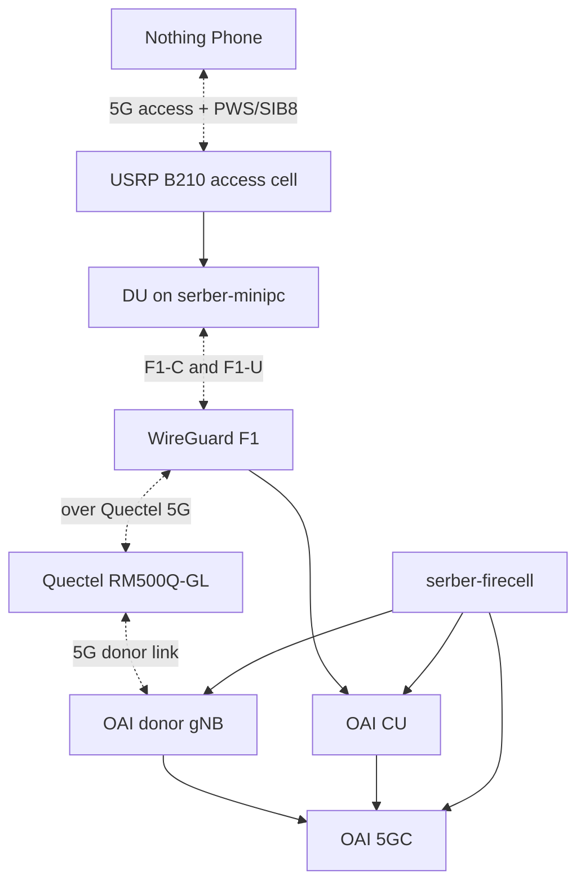

**Date:** June 7, 2026
**Timeline:** April 7 to July 31, 2025 (16 weeks)

---

## What changed since last update

1. Single-core target selected: `serber-firecell` now runs the only active 5GC for the target setup
2. oai-pc removed from active architecture: its donor core and donor gNB are no longer required
3. Firecell donor cell added: `serber-firecell` now provides the 5G donor cell for the Quectel modem
4. F1 setup reached the access DU: the CU accepted the DU and sent SIB8/PWS over F1
5. Faraday cage validation completed: the minipc, its B210, and the Nothing Phone were isolated from the firecell donor radio
6. The TUI has been improved and the new config have been added.
7. Investigation on MCS proved that the hardware was not the issue.

---
## MCS discoveries

We realized that the MCS stayed betweed 18-21 consistantly with a peak at 23 for the monolithic config, while it stays stucked at 0 for the CU/DU split configuration.

Thus the hardware is not the issue.

---

## TUI modifications

I started reworking on the TUI to implement every configuration in it. Everything is hard coded in the first time to be able to perform every demo

![[Pasted image 20260607105147.png]]

---

## Problem: two core networks were not realistic

The previous working Quectel backhaul used `oai-pc` as an independent donor. That proved the wireless F1 concept, but it also created two core networks: one on `oai-pc` for the Quectel donor and one on `serber-firecell` for the CU/DU split.

The new target was:

The important change is that both the Quectel donor and the CU use the same firecell core. The access DU stays on `serber-minipc`.

---

## Faraday cage validation

![[Diagramme sans nom.drawio.png]]

Packet captures confirmed that F1-C was on the Quectel backhaul path
The phone then reached about `15 Mbps`.

---
## Jetson kernel update

I've got an answer to my msg on the Nvidia's forum

---
## Next Steps

1. Transfer all the setups on Rpi 5
2. Finalize the TUI with all configurations
3. Find the MCS issue root cause
4. Write a proper documentation
5. Try to run one CU with multiple DUs
6. Try setting up the new kernel for Jetson and eventually deploy our config on it
7. Make an adaptableTUI 