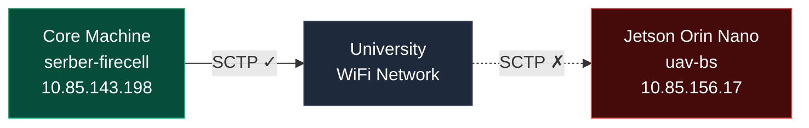

**Timeline:** April 7 – July 31, 2025 (16 weeks)

| Phase                | Weeks | Description                  |
| -------------------- | ----- | ---------------------------- |
| Planning/Setup       | 1–2   | SOTA + Emulation             |
| Implementation       | 3–8   | OAI deployment, CU/DU        |
| Testing & Validation | 9–12  | Benchmarking/troubleshooting |
| Documentation        | 13–16 | Results analysis             |

---

## **What I Accomplished**

### 1. OAI-CN 5G Core Network Deployment

I deployed the full OAI 5G Core Network on serber-firecell (10.85.143.198) using Docker Compose. All network functions are running in containers on the `rfsim5g-oai-public-net` subnet (192.168.71.128/26):

| Container             | IP Address       | Function                               |
| --------------------- | ---------------- | -------------------------------------- |
| `rfsim5g-mysql`       | 192.168.71.131   | Database                               |
| `rfsim5g-oai-amf`     | 192.168.71.132   | Access & Mobility Management Function  |
| `rfsim5g-oai-smf`     | 192.168.71.133   | Session Management Function            |
| `rfsim5g-oai-upf`     | 192.168.71.134   | User Plane Function                    |
| `rfsim5g-oai-nrf`     | 192.168.71.135   | Network Repository Function            |
| `rfsim5g-oai-gnb`     | 192.168.71.140   | gNB (running on core machine for now)  |
| `rfsim5g-oai-nr-ue`   | 192.168.71.150   | Simulated UE                           |
| `rfsim5g-oai-ext-dn`  | 192.168.72.135   | External Data Network                  |

**Status:** All containers healthy. UE attached and able t o ping the data network (`12.1.1.1`, RTT ~59 ms).

---

### 2. SCTP/HTTP Proxy Implementation

The AMF listens only on the Docker internal network (`192.168.71.132`), not on the host interface. To allow external machines (like the Jetson) to reach the AMF, I wrote two Python relay proxies on the core machine:

| Proxy      | Listens on       | Forwards to              |
| ---------- | ---------------- | ------------------------ |
| SCTP Proxy | `0.0.0.0:38412`  | `192.168.71.132:38412`   |
| HTTP Proxy | `0.0.0.0:8080`   | `192.168.71.132:80`      |

This allows any machine on the university network to reach the AMF via the core machine's wireless IP (`10.85.143.198`).

---

### 3. Network Connectivity Verification

I verified that the university wifi network successfully carries SCTP traffic to the AMF through the proxy:


```
AMF Logs (Core Machine):
[sctp] [info] IPv4 Addr: 10.85.143.198
[ngap] [debug] Ready to handle new NGAP SCTP association request
```

**Result:** The SCTP proxy on serber-firecell correctly bridges external N2 connections to the AMF.

---

### 4. Jetson gNB Configuration

I prepared a gNB YAML configuration on the Jetson Orin Nano for CU/DU Option 8:
The configuration is ready, but the gNB **cannot start** due to the SCTP issue described below.

---

## **Issue: Jetson Kernel Missing SCTP Support**

The Jetson Orin Nano runs NVIDIA's custom kernel `5.15.148-tegra`, which does not include the SCTP protocol module. OAI 5G requires SCTP (Stream Control Transmission Protocol) for both the N2 interface (gNB ↔ AMF, NGAP signaling) and the F1-C interface (CU ↔ DU, F1-AP signaling).

```
Jetson Orin Nano Kernel: 5.15.148-tegra
/proc/net/sctp: No such file or directory
modprobe sctp: FATAL: Module sctp not found
socat SCTP-LISTEN: Protocol not supported
```

| Interface         | Protocol | Status  |
| ----------------- | -------- | ------- |
| N2 (gNB → AMF)   | SCTP     | BLOCKED |
| F1-C (CU ↔ DU)   | SCTP     | BLOCKED |

**Root Cause:** NVIDIA built the kernel with `CONFIG_IP_SCTP` disabled, using a proprietary Buildroot 2022.08 toolchain.

---

## **What I Tried to Fix the Jetson SCTP Issue**

| #   | Attempt                        | What I did                                                                       | Result                                                                               |
| --- | ------------------------------ | -------------------------------------------------------------------------------- | ------------------------------------------------------------------------------------ |
| 1   | Check kernel SCTP support      | `cat /proc/net/sctp`                                                             | "No such file or directory"                                                          |
| 2   | Test SCTP socket directly      | `socat SCTP-LISTEN:38412,reuseaddr /dev/null`                                    | "Protocol not supported"                                                             |
| 3   | Load SCTP as kernel module     | `sudo modprobe sctp`                                                             | "FATAL: Module sctp not found in /lib/modules/5.15.148-tegra"                        |
| 4   | Download NVIDIA kernel sources | Downloaded `public_sources.tbz2` (216 MB, Jetson Linux R36.4.4)                  | Extracted to `/home/serber/Downloads/Linux_for_Tegra/`                               |
| 5   | Cross-compile SCTP module      | Built `sctp.ko` from the NVIDIA kernel source tree using `aarch64-linux-gnu-gcc` | Module compiled but won't load — toolchain mismatch                                  |
| 6   | Install the rebuilt module     | Placed `sctp.ko` in `/lib/modules/5.15.148-tegra/updates/`                       | Module is broken — kernel rejects it at load time                                    |
| 7   | Investigate the toolchain      | Checked kernel build metadata                                                    | Kernel was built with Buildroot `aarch64--glibc--stable-2022.08-1`, not standard GCC |

**Conclusion:** Rebuilding the SCTP module requires the exact NVIDIA/Bootlin Buildroot 2022.08 cross-compilation toolchain (proprietary), which I do not have access to.


---

## **Network Overview**



---

## **Short Time Progress Timeline**

| Phase                       | Status   | Next Step                 |
| --------------------------- | -------- | ------------------------- |
| Phase 1: Simulation Network | COMPLETE | Use core machine for demo |
| Phase 2: Direct Ethernet    | PENDING  | Cable connection          |
| Phase 3: USRP B210          | PENDING  | Hardware integration      |

---

## **Summary**

| What Works                               | Blocked                                    |
| ---------------------------------------- | ------------------------------------------ |
| 5G Core Network - all containers healthy | Jetson Orin Nano - no SCTP in kernel       |
| SCTP Proxy - relays :38412 to AMF        | N2 interface (gNB → AMF) - blocked         |
| HTTP Proxy - relays :8080 to AMF         | F1-C interface (CU ↔ DU) - blocked         |
| University network path verified         | Toolchain mismatch - cannot rebuild module |
| Core machine gNB running (rfsim)         |                                            |
| UE connected - pings 12.1.1.1            |                                            |

---

### **Proposed Solutions**

#### 1. Replace Jetson with x86 Mini PC (Recommended)

- **Native Compatibility**: Standard x86 Ubuntu kernels include `CONFIG_IP_SCTP` by default, eliminating the protocol error.

#### 2. Obtain Specific NVIDIA/Bootlin Toolchain

- **The Problem**: Standard ARM compilers (GCC) create a "DNA mismatch". The kernel rejects modules not built with its exact original "factory tools".
- **The Required Tool**: Must locate and configure the specific **Bootlin `aarch64--glibc--stable-2022.08-1`** environment.
- **Complexity**: Requires matching exact kernel headers and configuration flags from the NVIDIA source tree to prevent the "broken module" error.
- **Risk**: This is a time-consuming "technical rabbit hole" that shifts the project from 5G research to kernel debugging.