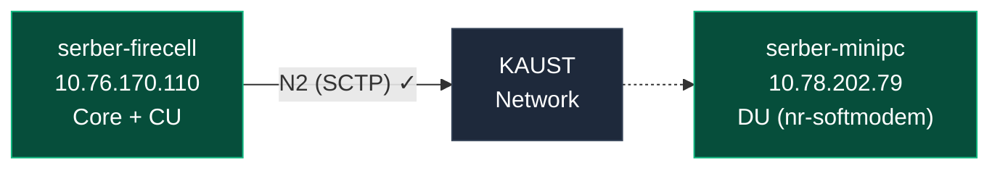

**Timeline:** April 7 – July 31, 2025 (16 weeks)

| Phase                | Weeks | Description                  |
| -------------------- | ----- | ---------------------------- |
| Planning/Setup       | 1–2   | SOTA + Emulation             |
| Implementation       | 3–8   | OAI deployment, CU/DU        |
| Testing & Validation | 9–12  | Benchmarking/troubleshooting |
| Documentation        | 13–16 | Results analysis             |

---

## **What Changed Since Last Update**

The Jetson Orin Nano was replaced with an x86 Mini PC (serber-minipc) to solve the SCTP kernel issue. The new architecture uses:

| Machine           | IP Address    | Role                  |
| ----------------- | ------------- | --------------------- |
| `serber-firecell` | 10.76.170.110 | Core Network + CU     |
| `serber-minipc`   | 10.78.202.79  | DU (Distributed Unit) |

---

## **What I Accomplished**

### 1. OAI-CN 5G Core Network (Already Working)

On serber-firecell, all 5G core functions are running (native processes, not Docker):

**AMF Configuration:**
- PLMN: MCC=208, MNC=95, TAC=0xa000
- Listening on: `0.0.0.0:38412` (SCTP/N2)
- gNB registration: accepted

---

### 2. DU (nr-softmodem) Built from Source

On serber-minipc, I built OAI nr-softmodem from source:

**Why from source?**
- Avoids Docker image crash issue (SIGSEGV after NGSetupResponse)
- Proper compilation for x86_64 target
- Debugging capabilities

---

### 3. DU Successfully Connected to AMF

The DU (nr-softmodem) is running and connected to the core:

```
[NGAP]   Send NGSetupRequest to AMF
[NGAP]   Received NG setup failure for AMF... please check your parameters
[GNB_APP] [gNB 0] Received NGAP_REGISTER_GNB_CNF: associated AMF 0

[NR_RRC] cell PLMN 208.95 Cell ID 12345678 is in service
```

**Current Status:**
- gNB ID: 0xe00 (3584)
- Cell ID: 12345678
- PLMN: 208.95
- TAC: 0xa000
- Band: 78 (n78, 3.5 GHz, 106 PRB, 30 kHz SCS)
- Mode: rfsim (RF simulator - generates artificial signal)

---

## **Current Architecture**



---

## **Testing Progress**

| Scenario            | Status   | Notes                                  |
| ------------------- | -------- | -------------------------------------- |
| **rfsim mode**      | COMPLETE | DU connects to AMF, cell in service    |
| **Ethernet direct** | TOMORROW | Will test with direct cable connection |
| **USRP B210**       | PENDING  | Hardware not yet received              |
| **WiFi backhaul**   | PENDING  | hostapd needs to be installed          |
| **5G NR backhaul**  | PENDING  | Requires 5G UE (phone/CPE) as modem    |

---

## **Near future Plan (Ethernet Direct)**

Will test direct Ethernet connection between machines:

1. Connect cable between serber-firecell and serber-minipc
2. Configure interfaces with static IPs on dedicated interface
3. Run DU with Ethernet-specific config
4. Verify AMF connection and cell registration

---

## **Prepared Configurations**

I have created the scenario configs file on serber-minipc for each scenario:

| Config File                                    | Purpose                    |
| ---------------------------------------------- | -------------------------- |
| `gnb-sa.band78.fr1.106prb.rfsim.modified.conf` | Current rfsim (working)    |
| `gnb-usrp-b210.conf`                           | USRP B210 (when connected) |
| `gnb-ethernet.conf`                            | Ethernet direct connection |
| `gnb-wifi.conf`                                | WiFi backhaul              |
| `gnb-5g-backhaul.conf`                         | 5G NR backhaul             |


---
### **Summary**

The CU/DU separation is now working. The DU on serber-minipc successfully registers with the Core Network on serber-firecell. Tomorrow's Ethernet test will validate the direct link performance before moving to real hardware (USRP B210) and wireless backhaul scenarios.![[Pasted image 20260421141536.png]]