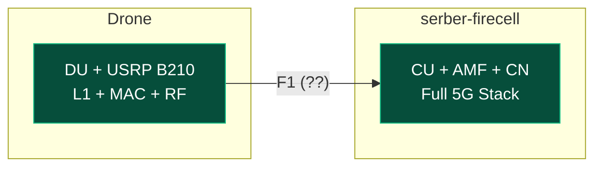
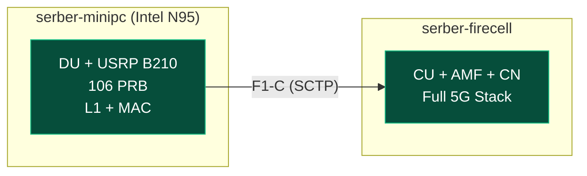
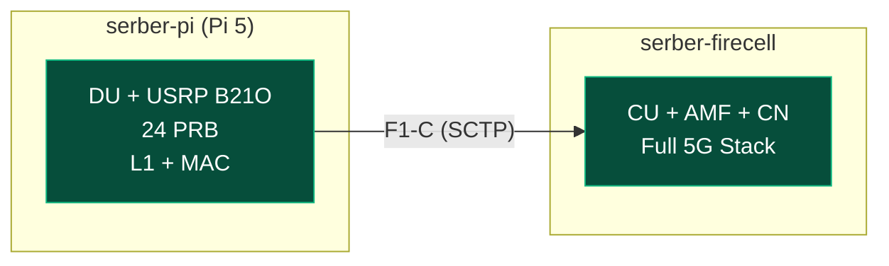

**Timeline:** April 7 – July 31, 2025 (16 weeks)

| Phase | Weeks | Description |
| --- | --- | --- |
| Planning/Setup | 1–2 | SOTA + Emulation |
| Implementation | 3–8 | OAI deployment, CU/DU |
| Testing & Validation | 9–12 | Benchmarking/troubleshooting |
| Documentation | 13–16 | Results analysis |

---

## What Changed Since Last Update

Major breakthrough: The USRP B210 is now built and working perfectly. I have successfully performed the full CU/DU split between serber-minipc and serber-firecell (eth), and then through serber-pi. I may have found a solution for Jetson Orin Nano alternative. Raspberry Pi 5 can now sustain real-time 5G NR L1 processing at 24 PRB (10 MHz) without crashing. This discovery makes the Pi 5 a viable DU candidate for demonstrating CU/DU split functionality.

---
## USRP B210 — Hardware Validated

The USRP B210 is now fully operational. OAI's `usrp_lib.cpp` was modified to support 61.44 MHz master clock for B210.

![[Pasted image 20260426083150.png|300]]

![[Pasted image 20260426083216.png|300]]

---
## Recap: Previous Architecture

**Drone Vision (Goal):**



**Full stack on serber-minipc (previously validated):**



**Architecture: CU/DU Split with Pi 5**




---
## Alternative OS for Jetson Orin Nano

###### **The Problem**

The Jetson Orin Nano runs NVIDIA's custom kernel (`5.15.148-tegra`), which does not include SCTP. OAI 5G requires SCTP for:

* **N2 interface:** gNB ↔ AMF (NGAP signaling)
* **F1-C interface:** CU ↔ DU (F1-AP signaling)

###### **Available Options**

| OS                        | Status             | SCTP Support | Notes                                |
| :------------------------ | :----------------- | :----------- | :----------------------------------- |
| Stock Jetson OS       | Current            | Missing      | Custom kernel lacks SCTP.            |
| Avocado Linux         | Supported          | Unknown      | ML-focused, provisioning incomplete. |
| NixOS + jetpack-nixos | Active (385 stars) | Potential    | Declarative kernel config control.   |

###### **Why NixOS Could Solve This**

NixOS provides full declarative control over kernel configuration, allowing us to:

* Use NVIDIA's JetPack kernel as a base.
* Add the SCTP module via kernel configuration.
* Reproducibly rebuild the kernel with SCTP enabled.

**`jetpack-nixos` Overview**

Anduril's `jetpack-nixos` provides:
* NixOS modules for Jetson devices (Orin AGX/NX/Nano, Xavier AGX/NX).
* JetPack 5, 6, and 7 support.
* CUDA, CuDNN, and TensorRT packages.
* Hardware-accelerated graphics (Wayland, X11).
* OCI container support (Docker/Podman with GPU passthrough).
* UEFI firmware with Capsule update support.

--- 

# PI 5

## The Problem: Pi 5 L1 Processing at Full Bandwidth

From previous testing, the Pi 5 crashed at 106 PRB:

```
ERROR_CODE_OVERFLOW (Overflow)
[PHY] rx_rf: Asked for 30720 samples, got 23547 from USRP
```

**Root cause:** Pi 5's Cortex-A76 cores cannot keep up with 5G NR baseband processing (FFT, channel estimation, equalization) at 106 PRB + 61.44 MHz sample rate.

---

## The Solution: Lower PRB Configuration

By reducing the bandwidth to 24 PRB (~10 MHz), we achieve:

| Metric         | 106 PRB (40 MHz) | 24 PRB (10 MHz) |
| -------------- | ---------------- | --------------- |
| Pi 5 L1 Status | CRASH after 2-3s | STABLE          |
| CPU Load       | 100%+ (overflow) | ~40-60%         |
| PRB Count      | 106              | 24              |
| Bandwidth      | 40 MHz           | 10 MHz          |
| Sample Rate    | 61.44 MHz        | ~15 MHz         |

---

## Testing: Pi 5 as DU with 24 PRB

I created a custom 24 PRB configuration for band n78 and tested on serber-pi (Pi 5).

### Configuration Created

```
gnb-du.sa.band78.24prb.usrpb210.conf
- Band: n78 (3.5 GHz)
- PRB: 24 (~10 MHz)
- SCS: 30 kHz
- DL frequency: 3604.8 MHz
- CORESET index: 2
```

### Test Results

```
CMDLINE: ./nr-softmodem -O ~/gnb-du.sa.band78.24prb.usrpb210.conf --rfsim

[GNB_APP] F1AP: gNB idx 0 gNB_DU_id 1, gNB_DU_name gNB-Pi5-24PRB-DU
[GNB_APP] Configured DU: cell ID 12345678, PCI 0
[F1AP] Starting F1AP at DU
[F1AP] F1-C DU IPaddr 10.85.42.8, connect to F1-C CU 10.76.170.45
```

Pi 5 DU ran stably for 15+ min without any ERROR_CODE_OVERFLOW or crash.

---

## CU Status on serber-firecell

The serber-firecell AMF is running correctly:

| Component  | IP Address         | Status     |
| ---------- | ------------------ | ---------- |
| AMF (SCTP) | 10.76.170.45:38412 | Listening  |
| MySQL      | 10.76.170.45:3306  | Running    |
| SMF        | 10.76.170.45       | Running    |
| UPF        | 10.76.170.45       | Running    |


---

## Bandwidth vs Stability

| Bandwidth | PRB | Pi 5 CPU Load | Status |
| --------- | --- | ------------- | ------ |
| 40 MHz    | 106 | 100%+         | CRASH  |
| 20 MHz    | 51  | 100%+         | CRASH  |
| 10 MHz    | 24  | ~40-60%       | STABLE |

For the Pi 5 to act as a DU, we simply reduce the bandwidth.

---

## Testing Progress

| Scenario                  | Status   | Notes                       |
| ------------------------- | -------- | --------------------------- |
| Pi 5 as DU at 106 PRB     | CRASH    | Overflow after 2-3s         |
| Pi 5 as DU at 24 PRB      | SUCCESS  | L1 stable, no crash         |
| USRP B210 hardware        | COMPLETE | 61.44 MHz validated         |
| Pi 5 as DU (rfsim)        | COMPLETE | NGAP connection works       |
| serber-minipc full stack  | COMPLETE | 3+ hours stable             |
| PWS/SIB8 code             | COMPLETE | Abdullah patch, compiles ok |
| CU/DU split (F1-C)        | COMPLETE | DU ok, CU ok                |
| UE registration at 24 PRB | PENDING  | Not yet tested              |


---

## serber-minipc Benchmark

For reference — serber-minipc can run the full 5G stack on its own:

| Component | Value                         |
| --------- | ----------------------------- |
| CPU       | Intel N95 (4 cores @ 3.1 GHz) |
| RAM       | 15GB DDR5                     |

| Component         | CPU Usage   | Memory Usage    |
| ----------------- | ----------- | --------------- |
| DU                | 18–30%      | 850 MB          |
| CN (7 containers) | ~5–8% total | ~450 MB total   |
| TOTAL             | ~25–35%     | ~1.3 GB         |
| System Idle       | ~92–97%     | 12 GB available |

**Conclusion:** serber-minipc (Intel N95) is more than capable of running the full 5G stack with significant headroom.

---
## serber-pi (Pi 5) Benchmark

| Component | Value                         |
| --------- | ----------------------------- |
| CPU       | Cortex-A76 (4 cores @ 2.4GHz) |
| RAM       | 4GB DDR4                      |

| Component   | CPU Usage      | Memory Usage |
| ----------- | -------------- | ------------ |
| DU          | 35–40%         | ~780 MB      |
| System Idle | ~60% available | 2.4GB free   |

**Note:** 4GB Pi 5 is sufficient for DU-only operation. For DU + AI malware detection, 8-16GB would be more comfortable.

---

## Device Comparison: Weight & Power Consumption


| Device | Weight | Power Consumption (Typical) |
| --- | --- | --- |
| Raspberry Pi 5 | 46g | ~6W |
| Jetson Orin Nano | 174g | ~10W |
| Acemagic S1 Mini PC | 391.2g | ~25W |

---

## Summary

| What Works                   | Status                      |
| ---------------------------- | --------------------------- |
| Pi 5 at 106 PRB              | CRASH (2-3s)                |
| Pi 5 at 24 PRB               | STABLE                      |
| USRP B210 hardware           | Working                     |
| Pi 5 DU initialization       | Working                     |
| CU/DU split concept          | Viable at lower bandwidth   |
| Pi 5 real-time L1 processing | Solvable with 10 MHz config |
| serber-minipc full stack     | Working                     |
| PWS/SIB8 code                | Working                     |

**Possible next step**: We could set up the serber-minipc to replace the serber-firecell for better portability (conventions, etc.)