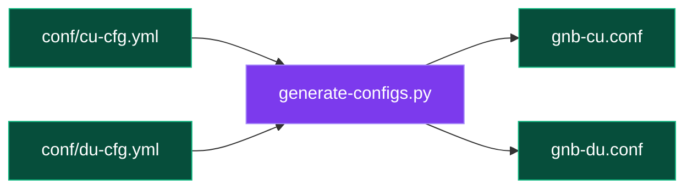
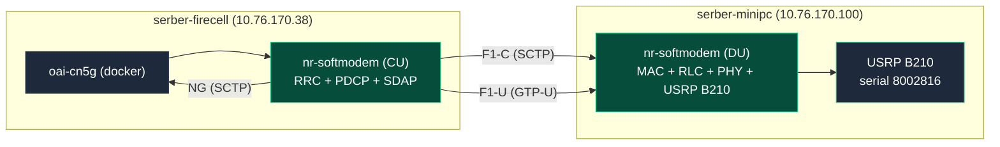
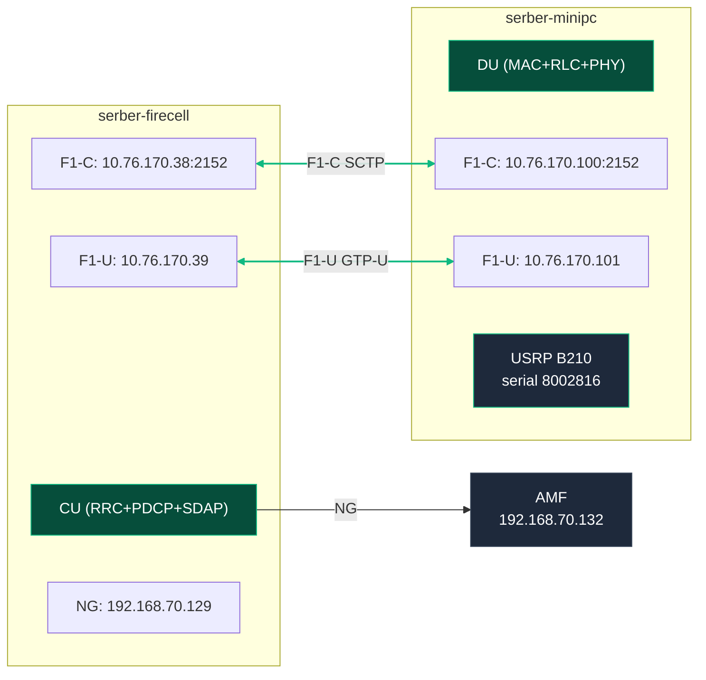
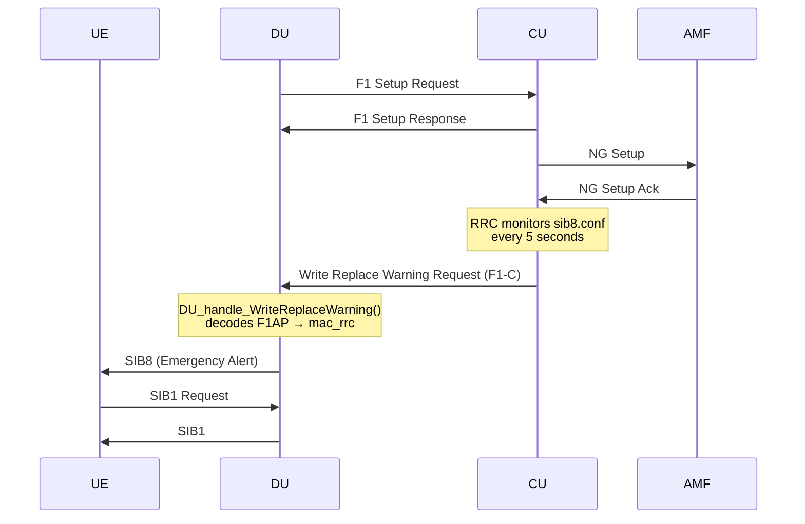
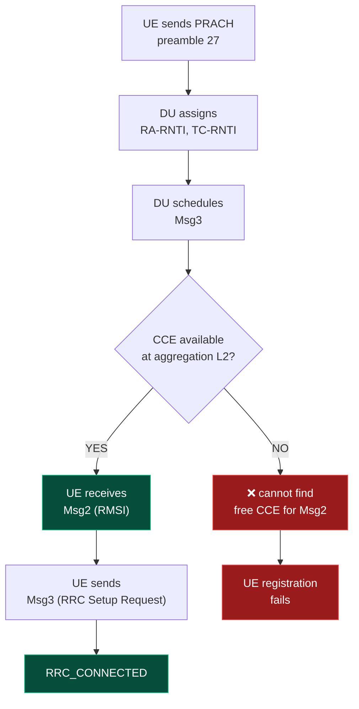

# Research Progress Report 7: CU/DU Split Deployment & PWS Debugging

**Date:** May 10, 2026
**Timeline:** April 7 – July 31, 2025 (16 weeks)

---

## What Changed Since Last Update

1. Major progress achieved this week: The monolithic config has been entirely cleaned up and rethought to make it very easy to reproduce and deploy it on a new pc (self-contained). 
2. The TUI has been updated to work with the new config and to be used in broader use cases.
3. The full CU/DU split architecture is now operational between `serber-firecell` (CU + CN) and `serber-minipc` (DU + USRP B210)
4. USRP B210 throughput validation confirms both units perform within expected ranges with the new antennas. Current focus is resolving UE connection issues.

---


### Self-contained repositories

Both the `cu-du` and `monolithic` repo are now fully reproducible, any outside person can clone and deploy with minimal effort:

```bash
serber@serber-firecell:~$ ls
cu-du  Desktop  docker  Documents  Downloads  monolithic  Music  Pictures  Public  snap  Templates  Videos
```

No build artifacts, no scattered OAI source trees, no hardcoded paths.

### Config Generation Pipeline



Key substitutions: `dl_carrierBandwidth`, `ul_carrierBandwidth`, `sdr_addrs`, `clock_src`, `initialDLBWP`, `initialULBWP`

---


### 2.1 Host Topology



### 2.2 Network Configuration & Interfaces



| Parameter | Value |
|---|---|
| PLMN | MCC 001, MNC 01 |
| Band | n78 (3300–3800 MHz) |
| BW | 51 PRB @ 30 kHz SCS (10 MHz) |
| AbsoluteFrequencySSB | 3619.2 MHz |
| TAC | 1 |

---

## 3. F1 Interface — Now Operational

The F1 interface between CU and DU was successfully established after resolving several configuration issues:

| Fix | File | Detail |
|---|---|---|
| PLMN strings with leading zeros | `cu-cfg.yml`, `du-cfg.yml` | `"001"`, `"01"` (strings, not integers) |
| DU gNB name matching CU | `du-cfg.yml` | `gNB-CU-FIRECELL` (must match CU) |
| Active_gNBs replacement | `generate-configs.py` | CU config now replaces gNB name correctly |
| USRP serial | `du-cfg.yml` | B210 serial `8002816` |
| PRB reduction | `du-cfg.yml` | 106 → 51 (B210-compatible) |
| B210 clock source | `du-cfg.yml` | `clock_src: "internal"` |
| B210 sampling rate | — | B210 cannot support 61.44 MSps (106 PRB), must use 51 PRB (30.72 MSps) |

**CU Log (F1 Setup Success):**
```
[NR_RRC] Accepting DU 3584 (gNB-CU-FIRECELL), sending F1 Setup Response
cell PLMN 001.01 Cell ID 12345678 is in service
```

**DU Log:**
```
[NR_MAC] Frame.Slot 0.0
[F1AP] DU_send_F1_SETUP_REQUEST
[MAC] received F1 Setup Response from CU gNB-CU-FIRECELL
```

---

## 4. USRP B210 Throughput Validation

Both USRP B210 units were tested with the 5G antennas:

| USRP B210 | Throughput | Notes |
|---|---|---|
| Old unit | **123 MB/s** | Baseline performance |
| New unit | **130 MB/s** | Improved performance |

**Note:** Previous concerning results with the new unit (80 MB/s) were traced to the antennas, not hardware. With proper antenna configuration, both units perform well within expected ranges.

---

## 5. PWS Over F1 — Implementation & Debugging

### 5.1 Architecture

PWS (Public Warning System) / SIB8 is constructed in the CU's RRC layer, sent over F1 via `WRITE_REPLACE_WARNING_REQUEST`, and transmitted by the DU's USRP:



### 5.2 Implementation Path

| File | Function | Purpose |
|---|---|---|
| `rrc_gNB_du.c:496` | `write_replace_warning_req_trigger()` | Monitors sib8.conf, triggers PWS |
| `f1ap_cu.c` | `write_replace_warning_req_f1ap()` | Encodes and sends F1AP message |
| `f1ap_du_paging.c` | `DU_handle_WriteReplaceWarning()` | Decodes F1AP message on DU side |
| `f1ap_handlers.c` | Handler matrix entry | Wired WriteReplaceWarning handler to DU function |
| `nr_mac_configure_pws_si()` | SIB8 decode + scheduling | MAC layer decodes and schedules SIB8 |

### 5.3 Bugs Fixed During Debugging

| Bug | File | Symptom | Fix |
|---|---|---|---|
| Missing DU handler | `f1ap_handlers.c` | `[SCTP 410] No handler for procedureCode 20` | Created `DU_handle_WriteReplaceWarning()` in `f1ap_du_paging.c`, wired into handler matrix at line 271 |
| memcpy without allocation | `f1ap_du_paging.c` | DU crash on PWS message receive | Added `malloc()` before memcpy in `DU_handle_WriteReplaceWarning()` |
| Shallow copy / double-free | `f1ap_cu.c` | Memory corruption, crash | Implemented deep copy with proper `malloc()` per buffer in `write_replace_warning_req_f1ap()` |
| Silent decode failure | `nr_mac_configure_pws_si()` (config.c) | SIB8 decode fails silently, garbage scheduled | Changed to `AssertFatal(false, "cannot decode SIB8 from CU\n")` |
| Forward declaration order | `mac_rrc_dl_f1ap.c` | Build error — `write_replace_warning_req_f1ap()` used before defined | Reordered function definitions so forward declaration is resolved before `mac_rrc_dl_f1ap_init()` |
| Duplicate `clock_src` key | `conf/du-cfg.yml` | Config generation could overwrite value | Removed duplicate `clock_src` entry |
| Hardcoded PRB value | `generate-configs.py` | Always wrote 51 PRB regardless of `du-cfg.yml` | Fixed to read actual `prb` value from YAML |
| Wrong BWP frequency location | `generate-configs.py` | Initial BWP set to PRB value (e.g. 51) instead of proper freq location | Fixed: 13053 for 51 PRB, 28875 for 106 PRB |

### 5.4 B210 Sampling Rate Limitation

The USRP B210 (serial `8002816`) on serber-minipc **cannot support 106 PRB (61.44 MSps)**. It crashes with:

```
[HW] Error: unknown sampling rate 61440000.000000
```

This is why serber-minipc DU must use **51 PRB (30.72 MSps)** = 10 MHz bandwidth. The monolithic config on serber-firecell uses B210 serial `35F8ABA` (different hardware) and works with 106 PRB.

---

## 6. OAI Code Errors Found & Fixed

The following bugs were discovered in the original OAI codebase during CU/DU split debugging:

### 6.1 F1AP DU Handler — Missing WriteReplaceWarning

**File:** `openair2/F1AP/f1ap_handlers.c:68`

**Problem:** The F1AP handler matrix had no handler for `WriteReplaceWarning`:
```c
{0, 0, 0}, /* WriteReplaceWarning */
```
When CU sent the F1AP message, DU logged:
```
[SCTP 410] No handler for procedureCode 20 in Initiating message
```

**Fix:** Created `DU_handle_WriteReplaceWarning()` in `f1ap_du_paging.c` and wired it into the handler matrix:
```c
{DU_handle_WriteReplaceWarning, 0, 0}, /* WriteReplaceWarning */
```

---

### 6.2 F1AP DU Paging — memcpy Without Allocation

**File:** `openair2/F1AP/f1ap_du_paging.c`

**Problem:** `memcpy()` was called on unallocated memory in `DU_handle_WriteReplaceWarning()`:
```c
// before: crash — buf not allocated
memcpy(dest, source, len);
```

**Fix:** Added `malloc()` before memcpy:
```c
buffer = malloc(length);
memcpy(buffer, source, length);
```

---

### 6.3 F1AP CU — Shallow Copy Causing Double-Free

**File:** `openair2/F1AP/f1ap_cu.c`

**Problem:** `write_replace_warning_req_f1ap()` used shallow copy — same buffer pointer reused across layers, causing double-free when each layer tried to free it.

**Fix:** Implemented proper deep copy with individual `malloc()` for each buffer:
```c
for (int i = 0; i < num_buffers; i++) {
    buffers[i] = malloc(len_i);
    memcpy(buffers[i], original[i], len_i);
}
```

---

### 6.4 NR_MAC — Silent SIB8 Decode Failure

**File:** `openair2/LAYER2/NR_MAC_gNB/config.c`

**Problem:** `nr_mac_configure_pws_si()` silently continued when SIB8 decode failed, causing garbage to be scheduled as valid SIB8 data:
```c
if (dec_rval.code != RC_OK) {
    // before: silently continued
}
```

**Fix:** Changed to `AssertFatal` to catch decode errors immediately:
```c
if (dec_rval.code != RC_OK) {
    AssertFatal(false, "cannot decode SIB8 from CU\n");
}
```

---

### 6.5 mac_rrc_dl_f1ap — Forward Declaration Order

**File:** `openair2/F1AP/mac_rrc_dl_f1ap.c`

**Problem:** `write_replace_warning_req_f1ap()` was called from `mac_rrc_dl_f1ap_init()` but defined after it, causing build failure.

**Fix:** Reordered function definitions so `write_replace_warning_req_f1ap()` is declared/defined before `mac_rrc_dl_f1ap_init()` is called.

---

### 6.6 Config Generation — Hardcoded PRB Value

**File:** `scripts/generate-configs.py`

**Problem:** The script always wrote `51` PRB regardless of the `prb` value in `du-cfg.yml`:
```python
# before: always wrote 51
dl_carrierBandwidth = 51
```

**Fix:** Read actual `prb` value from YAML:
```python
dl_carrierBandwidth = int(config['usrp']['prb'])
```

---

### 6.7 Config Generation — Wrong BWP Frequency Location

**File:** `scripts/generate-configs.py`

**Problem:** Initial BWP `controlResourceSetZero` / `searchSpaceZero` was set to the PRB number (e.g. 51) instead of the proper frequency location value:
- For 51 PRB: should be `13053`, not `51`
- For 106 PRB: should be `28875`, not `106`

**Fix:** Added correct mapping:
```python
bwp_map = {51: 13053, 106: 28875}
initial_dl_bwp_location = bwp_map[prb]
```

---

## 7. Current System Status

| Component | Status |
|---|---|
| F1 interface | Established |
| Cell (PLMN 001.01) | In service |
| PWS trigger in CU | Working |
| PWS over F1 (WriteReplaceWarning) | Implemented |
| DU PWS handler | Wired |
| NR_MAC frames | Active (0.0, 128.0, 256.0...) |
| USRP B210 on DU | Initialized, 51 PRB |
| Nothing Phone connection | Not yet working |

---

## 8. Open Issue: UE (Nothing Phone) Not Connecting

### 8.1 What's Working
- DU detects PRACH preambles from UEs (preamble 27, etc.)
- RA-RNTI and TC-RNTI are assigned
- Msg3 is scheduled for some UEs

### 8.2 What's Broken
- Msg2 (RMSI, RA Response) fails: `cannot find free CCE for Msg2`
- CCE allocation starved: only 2 CCEs at aggregation level 2
- 3rd UE fails with CCE allocation failure

### 8.3 Root Cause Hypothesis



Hypothesis: CORESET/SearchSpace config in split DU limits PDCCH candidates. Aggregation L2 needs 4 CCEs minimum, but only 2 are available. Need to compare `initialDLBWPcontrolResourceSetZero` and `initialDLBWPsearchSpaceZero` with monolithic config.

### 8.4 Next Steps
1. Compare CORESET configuration: monolithic vs split DU
2. Verify `initialDLBWPcontrolResourceSetZero` and `initialDLBWPsearchSpaceZero` values
3. Check PDCCH candidate availability per aggregation level
4. **Need SIM parameters from Nothing Phone owner** to verify/insert into database

---

## 9. Testing Progress

| Scenario | Status | Notes |
|---|---|---|
| F1 Setup (CU↔DU) | COMPLETE | Works |
| PLMN match | COMPLETE | 001.01 confirmed |
| PWS trigger (CU) | COMPLETE | Working |
| F1AP PWS forwarding | COMPLETE | Implemented |
| DU PWS handler | COMPLETE | Wired |
| B210 51 PRB (DU) | COMPLETE | 30.72 MSps |
| B210 106 PRB (DU) | FAILED | B210 cannot support 61.44 MSps |
| B210 throughput (old) | COMPLETE | 123 MB/s |
| B210 throughput (new) | COMPLETE | 130 MB/s |
| UE registration | IN PROGRESS | CCE allocation issue |
| SIM in database | PENDING | Need parameters from owner |

---

## 10. Deployment Commands

```bash
# Rsync to both hosts
export SSHPASS='root4SERBER'
rsync -avz --exclude='.git' -e "sshpass -e ssh -o StrictHostKeyChecking=no" /Users/promaa/Documents/cu-du/ serber@serber-minipc:cu-du/
rsync -avz --exclude='.git' -e "sshpass -e ssh -o StrictHostKeyChecking=no" /Users/promaa/Documents/cu-du/ serber@serber-firecell:cu-du/

# On serber-minipc (DU)
sshpass -e ssh serber@serber-minipc
sudo killall nr-softmodem; sleep 2
cd ~/cu-du && python3 scripts/generate-configs.py du
cd ~/monolithic/openairinterface5g/cmake_targets/ran_build/build && nohup sudo ./nr-softmodem -O /home/serber/monolithic/openairinterface5g/targets/PROJECTS/GENERIC-NR-5GC/CONF/gnb-du.conf --log_config.global_log_level info > /tmp/du.log 2>&1 &

# On serber-firecell (CU + CN)
sshpass -e ssh serber@serber-firecell
sudo killall nr-softmodem; sleep 2
cd ~/cu-du && python3 scripts/generate-configs.py cu
cd ~/monolithic/openairinterface5g/cmake_targets/ran_build/build && nohup sudo ./nr-softmodem -O /home/serber/monolithic/openairinterface5g/targets/PROJECTS/GENERIC-NR-5GC/CONF/gnb-cu.conf --log_config.global_log_level info > /tmp/cu.log 2>&1 &
```

---

## 11. Summary

| What Works | Status |
|---|---|
| F1 interface (CU↔DU) | OPERATIONAL |
| CU/DU split with B210 | DEPLOYED |
| PWS over F1 (WriteReplaceWarning) | IMPLEMENTED |
| B210 51 PRB (10 MHz) on serber-minipc | STABLE |
| B210 throughput (old: 123 MB/s, new: 130 MB/s) | VALIDATED |
| 51 PRB hardcoded due to B210 limitation | ACKNOWLEDGED |
| UE PRACH detection | WORKING |
| UE Msg2 scheduling | BLOCKED (CCE allocation) |

| What's Blocked | Status |
|---|---|
| UE full registration | CCE / CORESET config issue |
| SIM in database for Nothing Phone | NEEDED (waiting for owner parameters) |
| Monolithic 106 PRB vs split 51 PRB frequency delta | INVESTIGATING |

