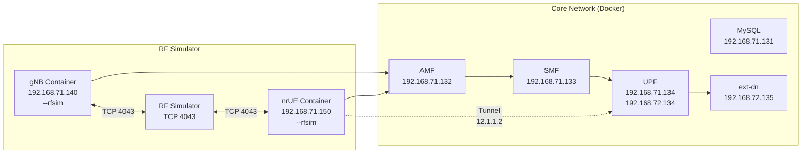

# OpenAirInterface 5G - Emulated Mode Setup Guide

## Overview

This guide covers setting up **OAI 5G Standalone (SA)** in **emulated mode**, where the gNB and nrUE run as containers on the same machine, communicating through simulated RF channels via TCP instead of real radio hardware.

> **Emulated Mode vs Over-the-Air**: Emulated mode bypasses physical radio hardware, enabling development and testing without SDR equipment.

---

## Architecture



### Network Addressing

| Component | IP Address |
|-----------|------------|
| MySQL | 192.168.71.131 |
| AMF | 192.168.71.132 |
| SMF | 192.168.71.133 |
| UPF (N3) | 192.168.71.134 |
| UPF (N6) | 192.168.72.134 |
| ext-dn | 192.168.72.135 |
| gNB | 192.168.71.140 |
| nrUE | 192.168.71.150 |
| UE Tunnel | 12.1.1.2 |

### Key Parameters

| Parameter | Value |
|-----------|-------|
| PLMN | 208.99 |
| DNN | oai |
| NSSAI SST | 1 |
| UE IMSI | 208990100001100 |
| gNB PRB | 106 |
| Numerology | 1 (15 kHz subcarrier spacing) |
| Center Frequency | 3319680000 Hz (3.32 GHz) |

---

## Prerequisites

### Hardware Requirements

- **CPU**: 8 cores x86_64 @ 3.5 GHz
- **RAM**: 32 GB
- **Storage**: 50+ GB free space

### Software Requirements

- **OS**: Ubuntu 24.04 LTS (recommended)
- **Docker**: Version 20.10+ with docker-compose plugin
- **Git**: For cloning repositories

### Verify Docker Installation

```bash
docker --version
docker compose version
```

Expected output:
```
Docker version 29.3.1
Docker Compose version v2.1.1
```

---

## Setup

### Step 1: Create Working Directory

```bash
mkdir -p ~/oai
cd ~/oai
```

### Step 2: Clone OAI Repository

```bash
git clone https://gitlab.eurecom.fr/oai/openairinterface5g.git ~/openairinterface5g
cd ~/openairinterface5g
git checkout develop
```

### Step 3: Pull Docker Images

Navigate to the RF Simulator configuration directory:

```bash
cd ~/openairinterface5g/ci-scripts/yaml_files/5g_rfsimulator
```

Pull all required images:

```bash
docker compose pull
```

> **Note**: This downloads ~2GB of data and may take 10-20 minutes depending on your connection.

Verify images are present:

```bash
docker images | grep oai
```

Expected output:
```
oaisoftwarealliance/oai-amf      develop
oaisoftwarealliance/oai-smf      develop
oaisoftwarealliance/oai-upf      develop
oaisoftwarealliance/oai-gnb      develop
oaisoftwarealliance/oai-nr-ue    develop
oaisoftwarealliance/oai-nrf      develop
oaisoftwarealliance/oai-ausf     develop
oaisoftwarealliance/oai-udm      develop
oaisoftwarealliance/oai-udr      develop
```

---

## Running Emulated Mode

### Start Core Network

```bash
cd ~/openairinterface5g/ci-scripts/yaml_files/5g_rfsimulator
docker compose up -d mysql oai-amf oai-smf oai-upf oai-ext-dn
```

Wait for containers to become healthy:

```bash
sleep 20
```

### Start gNB

```bash
docker compose up -d oai-gnb
```

Wait for gNB to initialize:

```bash
sleep 10
```

### Start nrUE

```bash
docker compose up -d oai-nr-ue
```

---

## Verification

### Check Container Status

```bash
docker compose ps
```

All containers should show status `healthy`:

```
NAME                 STATUS
rfsim5g-mysql        healthy
rfsim5g-oai-amf      healthy
rfsim5g-oai-smf      healthy
rfsim5g-oai-upf      healthy
rfsim5g-oai-ext-dn   healthy
rfsim5g-oai-gnb      healthy
rfsim5g-oai-nr-ue    healthy
```

### Check gNB Connection

```bash
docker logs rfsim5g-oai-gnb 2>&1 | grep -i "connected\|rfsim"
```

Expected: Look for `RFSIMULATOR` device loaded and UE connections.

### Check nrUE Registration

```bash
docker logs rfsim5g-oai-nr-ue 2>&1 | grep -i "NR_RRC_CONNECTED\|registered"
```

Expected: `NR_RRC_CONNECTED` state reached.

### Test Connectivity

Ping from nrUE to external data network:

```bash
docker exec rfsim5g-oai-nr-ue ping -I oaitun_ue1 -c 5 192.168.72.135
```

Expected output:
```
5 packets transmitted, 5 received, 0% packet loss
rtt min/avg/max = X/Y/Z ms
```

---

## Understanding the Components

### What is RFSIM?

The **RF Simulator (RFSIM)** is a software component that simulates the radio frequency channel between gNB and nrUE using TCP sockets instead of actual RF hardware.

Key characteristics:
- Runs gNB and nrUE on the **same machine** (or different machines via network)
- Simulates channel effects via configurable models
- Enables testing without SDR hardware
- Supports multiple UEs with multiple simulator instances

### How It Works

1. **gNB** starts with `--rfsim` flag, acting as an RFSIM server
2. **nrUE** starts with `--rfsim` flag and `--rfsimulator.[0].serveraddr <gnb-ip>`, acting as RFSIM client
3. Both connect via **TCP port 4043**
4. The RFSIM channel simulator can apply:
   - Propagation delay
   - Noise
   - Fading models
   - Packet dropping

### Container Startup Sequence

```
mysql → oai-amf → oai-smf → oai-upf → oai-ext-dn
                                        ↓
                                     oai-gnb
                                        ↓
                                     oai-nr-ue
```

Each component depends on the previous ones being healthy.

### Configuration Files

| File | Purpose |
|------|---------|
| `docker-compose.yaml` | Main container orchestration |
| `mini_nonrf_config.yaml` | Alternative config without RF |
| `local-override.yaml` | Local modifications |
| `oai_db.sql` | SIM card/USIM database |

---

## Common Commands Reference

### Container Management

```bash
# Start everything
docker compose up -d

# Stop everything
docker compose down

# Restart a specific container
docker compose restart oai-gnb

# View logs
docker logs -f rfsim5g-oai-gnb
docker logs -f rfsim5g-oai-nr-ue
```

### Debugging

```bash
# Check gNB process
docker exec rfsim5g-oai-gnb ps aux | grep nr-softmodem

# View gNB RFSIM logs
docker logs rfsim5g-oai-gnb 2>&1 | grep -i rfsim

# View all container logs
docker compose logs

# Check AMF for UE registration
docker logs rfsim5g-oai-amf 2>&1 | grep -i REGISTER
```

### Network Inspection

```bash
# Enter nrUE container shell
docker exec -it rfsim5g-oai-nr-ue /bin/bash

# Check UE tunnel interface
docker exec rfsim5g-oai-nr-ue ifconfig oaitun_ue1

# View routing from UE
docker exec rfsim5g-oai-nr-ue route -n
```

---

## Troubleshooting

### Containers Not Starting

**Problem**: Containers fail to start or show `unhealthy` status.

**Solution**:
```bash
docker compose down
docker compose up -d
sleep 30
docker compose ps
```

### UE Not Connecting

**Problem**: nrUE fails to reach `NR_RRC_CONNECTED` state.

**Checks**:
1. Verify gNB is running: `docker logs rfsim5g-oai-gnb | grep RFSIM`
2. Check AMF logs: `docker logs rfsim5g-oai-amf | grep -i error`
3. Verify network connectivity between containers

### Ping Fails

**Problem**: Ping returns `100% packet loss`.

**Solution**:
```bash
# From inside nrUE container
docker exec rfsim5g-oai-nr-ue ping -I oaitun_ue1 8.8.8.8

# Check UPF is routing
docker exec rfsim5g-oai-upf route -n
```

### Port Conflicts

**Problem**: TCP port 4043 already in use.

**Solution**:
```bash
# Find what's using port 4043
lsof -i :4043

# Kill if needed
kill <pid>
```

---

## Cleanup

### Stop All Containers

```bash
cd ~/openairinterface5g/ci-scripts/yaml_files/5g_rfsimulator
docker compose down
```

### Remove All Data (Optional)

```bash
# Remove containers and volumes (deletes UE state, databases)
docker compose down -v
```

### Remove Docker Images (Optional)

```bash
docker rmi $(docker images | grep oaisoftwarealliance | awk '{print $3}')
```

---

## Alternative Emulated Modes

OAI supports three emulated modes:

| Mode | Command | Multi-UE | Description |
|------|---------|----------|-------------|
| **RF Emulator** | `nr-softmodem --device.name rf_emulator --phy-test` | No | Drops TX, generates noise RX |
| **RF Simulator** | Docker RFSIM containers | Yes | Simulates RF channel via TCP |
| **L2 nFAPI** | External proxy + nFAPI | Yes | Bypasses PHY entirely |

For **L2 nFAPI mode**, see: [oai-lte-multi-ue-proxy](https://github.com/EpiSci/oai-lte-multi-ue-proxy)

---

## Further Reading

- [Official OAI NR SA Tutorial](https://gitlab.eurecom.fr/oai/openairinterface5g/-/blob/develop/doc/NR_SA_Tutorial_OAI_nrUE.md)
- [OAI Documentation](../openairinterface/index.md)
- [Baseline Setup](../openairinterface/setup.md)
- [L2 Emulator Architecture](https://gitlab.eurecom.fr/oai/openairinterface5g/-/blob/develop/doc/episys/nsa_mode_l2_emulator/README.md)

---

## Quick Reference

```bash
# Full startup sequence
cd ~/openairinterface5g/ci-scripts/yaml_files/5g_rfsimulator
docker compose up -d mysql oai-amf oai-smf oai-upf oai-ext-dn
sleep 20 && docker compose up -d oai-gnb
sleep 10 && docker compose up -d oai-nr-ue

# Verify
docker exec rfsim5g-oai-nr-ue ping -I oaitun_ue1 -c 3 192.168.72.135

# Cleanup
docker compose down
```
