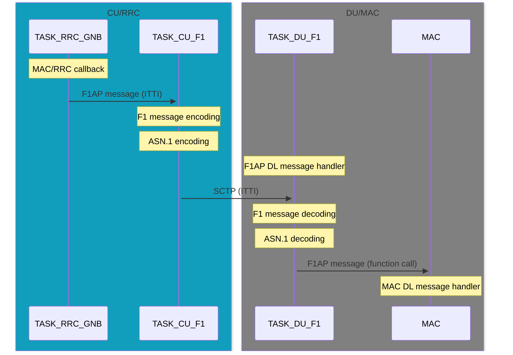
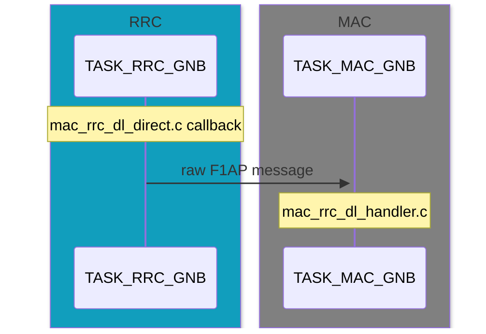

The implementation of F1AP messages is seamlessly integrated into OAI, supporting both Monolithic SA and CU/DU functional split modes. The F1 code is therefore always compiled with nr-softmodem.
This architecture ensures that even *when operating a monolithic gNB, internal information exchange always utilizes F1AP messages*.
The major difference lies in the CU/DU split scenario, where ASN.1-encoded F1AP messages (F1-C) are exchanges over SCTP, via a socket interface.

#### High-level F1-C code structure

The F1 interface is used internally between CU (mostly RRC) and DU (mostly MAC)
to exchange information. In DL, the CU sends messages as defined in files
`mac_rrc_dl_direct.c` (monolithic) and `mac_rrc_dl_f1ap.c` (for F1AP). In the
monolithic case, the RRC calls directly into the message handler on the DU side
(`mac_rrc_dl_handler.c`). In the F1 case, an ITTI message is sent to the CU
task, sending an ASN.1-encoded F1AP message. The DU side's DU task decodes the
message, and then calls the corresponding handler in `mac_rrc_dl_handler.c`.
Thus, the message flow is the same in both F1 and monolithic cases, with the
difference that F1AP encodes the messages using ASN.1 and sends over a socket.

A sequence diagram for downlink F1AP messages over the OAI CU/DU functional split:

Alternative sequence handling (e.g. Monolithic), for downlink:

