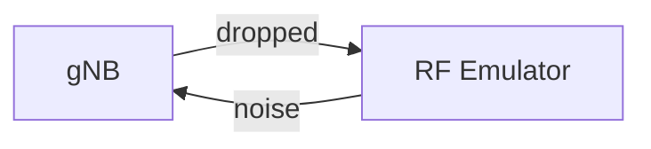
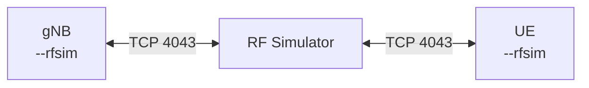
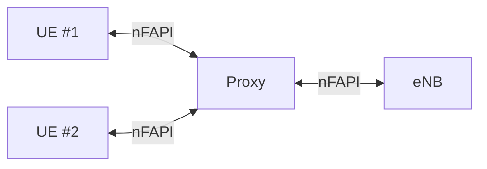

## Overview

| Mode | Name | Multi-UE | Use Case |
|------|------|----------|----------|
| **RFEMP** | RF Emulator | No | Benchmarking |
| **RFSIM** | RF Simulator | Yes | Development |
| **L2SIM** | L2 nFAPI Simulator | Yes | Mass testing |

## Mode 1: RF Emulator

Network stack terminator - drops TX, generates noise RX.



Usage: `nr-softmodem --device.name rf_emulator --phy-test`

| Option | Description |
|--------|-------------|
| `--rf_emulator.enable_noise 1` | Enable noise |
| `--rf_emulator.noise_level_dBFS -30` | Noise level |

## Mode 2: RF Simulator (RFSIM)

Simulates RF channel via TCP between gNB and UE.



Location: `ci-scripts/yaml_files/5g_rfsimulator/`

Files: `docker-compose.yaml`, `mini_nonrf_config.yaml`, `oai_db.sql`

### Deployment

```bash
cd ci-scripts/yaml_files/5g_rfsimulator
docker compose up -d mysql oai-amf oai-smf oai-upf oai-ext-dn
sleep 20 && docker compose up -d oai-gnb
sleep 10 && docker compose up -d oai-nr-ue
docker exec rfsim5g-oai-nr-ue ping -I oaitun_ue1 -c 5 192.168.72.135
```

### Network

| Component | IP |
|-----------|----|
| MySQL | 192.168.71.131 |
| AMF | 192.168.71.132 |
| SMF | 192.168.71.133 |
| UPF | 192.168.71.134 / 192.168.72.134 |
| ext-dn | 192.168.72.135 |
| gNB | 192.168.71.140 |
| nrUE | 192.168.71.150 |
| UE Tunnel | 12.1.1.2 |

PLMN: 208.99 | DNN: oai | NSSAI SST: 1

### RFSIM Options

| Option | Description |
|--------|-------------|
| `--rfsim` | Enable RF Simulator |
| `--rfsimulator.[0].serveraddr` | gNB IP (`server` for gNB) |
| `--rfsimulator.[0].options chanmod` | Enable channel model |
| `--rfsimulator.[0].options saviq` | Save IQ samples |
| `--rfsimulator.[0].prop_delay` | Propagation delay (ms) |

### Debug

```bash
docker exec rfsim5g-oai-gnb ps aux | grep nr-softmodem
docker logs rfsim5g-oai-gnb 2>&1 | grep -i rfsim
docker compose ps
```

## Mode 3: L2 nFAPI Simulator

Bypasses PHY via nFAPI. Multiple UEs with proxy.



Setup: `git clone https://github.com/EpiSci/oai-lte-multi-ue-proxy.git`

## Parameters

gNB: `-E --rfsim`

nrUE: `-E --rfsim -r 106 --numerology 1 --uicc0.imsi 208990100001100 -C 3319680000 --rfsimulator.[0].serveraddr 192.168.71.140`

| Param | Meaning |
|-------|---------|
| `-E` | 5G SA mode |
| `-r 106` | 106 PRB |
| `--numerology 1` | 15 kHz subcarrier |
| `--uicc0.imsi` | UE IMSI |
| `-C` | Center frequency |

## Verify

| Check | Command |
|-------|---------|
| gNB connected | `docker logs rfsim5g-oai-amf \| grep Connected` |
| UE registered | `docker logs rfsim5g-oai-amf \| grep REGISTERED` |
| Ping | `docker exec rfsim5g-oai-nr-ue ping -I oaitun_ue1 -c 3 192.168.72.135` |

## Cleanup

```bash
docker compose down
```
