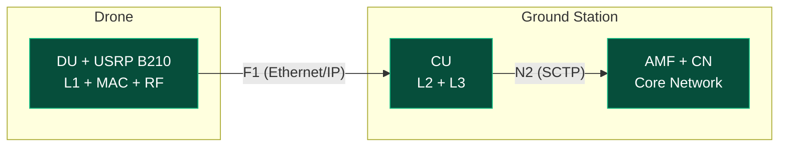
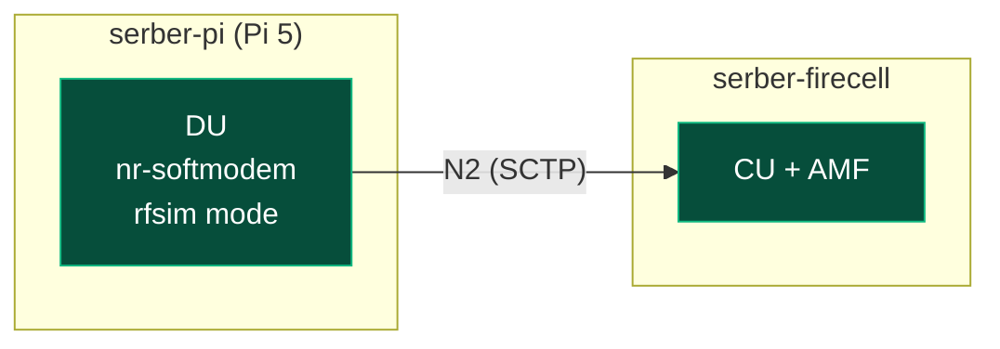
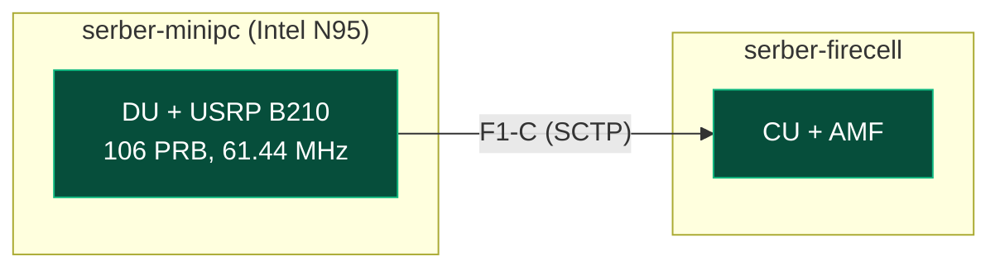
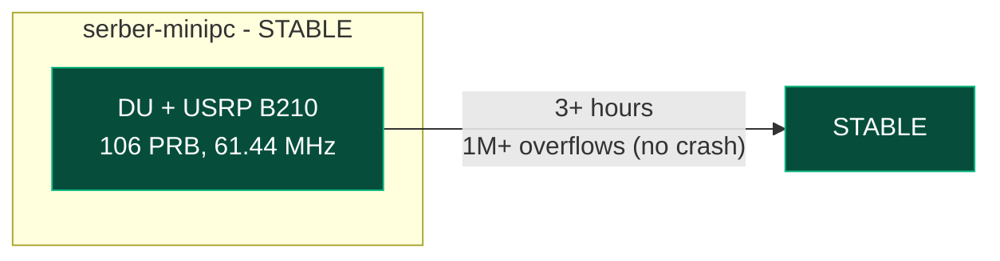

**Timeline:** April 7 – July 31, 2025 (16 weeks)

| Phase | Weeks | Description |
| --- | --- | --- |
| Planning/Setup | 1–2 | SOTA + Emulation |
| Implementation | 3–8 | OAI deployment, CU/DU |
| Testing & Validation | 9–12 | Benchmarking/troubleshooting |
| Documentation | 13–16 | Results analysis |

---

## What Changed Since Last Update

Major breakthroughs: USRP B210 hardware validated, PWS emergency broadcast working, and critical finding: Pi 5 CPU cannot sustain real-time 5G NR L1 processing at 106 PRB (crashes after 2-3s). The full 5G stack can run on a single mini PC (serber-minipc).

---

## USRP B210 — Hardware Validated

The USRP B210 is now fully operational. OAI's `usrp_lib.cpp` was modified to support 61.44 MHz master clock for B210.

![[Pasted image 20260426083150.png|300]]

![[Pasted image 20260426083216.png|300]]

---

## Architecture

**Future Drone Vision:**



**serber-pi as DU (RFsim mode):**



**serber-minipc as full stack + DU:**



**Pi 5 Limitation:**


**serber-minipc Stability (3+ hours):**



---

## Testing Progress

| Scenario | Status | Notes |
| --- | --- | --- |
| rfsim mode | COMPLETE | Original test |
| Ethernet direct | COMPLETE | CU/DU via direct Ethernet |
| serber-pi as DU | COMPLETE | NGAP connection + F1AP successful |
| serber-minipc full stack | COMPLETE | CN+CU+DU on one machine verified |
| USRP B210 | COMPLETE | Real RF transmission verified |
| USRP B210 + nr-softmodem | COMPLETE | 61.44MHz fix applied, B210 works |
| PWS/SIB8 code on Pi | COMPLETE | 17 files patched, compiles OK |
| Pi 5 as DU (RF mode) | PARTIAL | CU/DU split works, L1 crashes |
| 5G NR backhaul | PENDING | Architecture study ongoing |

---

## Machines

| Machine | IPs | Role | Status |
| --- | --- | --- | --- |
| serber-firecell | 10.76.170.45 | Core Network + CU (AMF) | Working |
| serber-minipc | 10.85.168.144, 10.0.0.2 | DU (full stack capable) | Working |
| serber-pi | 10.76.170.117, 10.85.42.8 (WiFi) | DU (Pi 5, 4GB) | Working (signaling only) |
| oai | 10.76.170.90 | PWS testing | Working |
| Jetson Orin Nano | TBD | Edge compute (drone option) | SCTP missing in stock kernel |

---

## serber-minipc Full Stack Benchmark

**Answer: YES** — serber-minipc can run everything (CN + CU + DU) on its own.

| Component | Value |
| --- | --- |
| CPU | Intel N95 (4 cores @ 3.1 GHz) |
| RAM | 15 GB DDR5 |
| Storage | 468 GB NVMe |
| OS | Ubuntu 24.04 |

| Component | CPU Usage | Memory Usage |
| --- | --- | --- |
| DU (nr-softmodem) | 18–30% | 850 MB |
| CN (7 containers) | ~5–8% total | ~450 MB total |
| **TOTAL** | **~25–35%** | **~1.3 GB** |
| System Idle | ~92–97% | 12 GB available |
	 
**Conclusion:** serber-minipc (Intel N95) is **more than capable** of running the full 5G stack with significant headroom.

---

## Pi 5 Limitation

**Critical Finding:** Raspberry Pi 5 crashes after ~2-3 seconds of real-time 5G NR L1 processing at 106 PRB:

```
ERROR_CODE_OVERFLOW (Overflow)
[PHY] rx_rf: Asked for 30720 samples, got 23547 from USRP
```

**Root cause:** Pi 5's Cortex-A76 cores cannot keep up with 5G NR baseband processing (FFT, channel estimation, equalization) at 106 PRB + 61.44 MHz sample rate.

**Recommendation: Purchase 16GB model ($140).** The 4GB model is insufficient for DU + AI malware detection. 8GB is minimum but tight. 16GB provides adequate buffer.

---

## PWS (Public Warning System) Code — SUCCESS ✅

Applied all 17 PWS code changes from `oai-alert.patch`. Build successful — `nr-softmodem` compiles and links with all PWS code.

**Confirmed PWS code flow:**
```
PWS Timer (5s periodic)
    └─► handle_pws_timer_expiry()         [rrc_gNB.c]
            └─► write_replace_warning_req_trigger(-1)  [rrc_gNB_du.c]
                    ├─ build_sib8_segments()      [asn1_msg.c]
                    │      ├─ reads sib8.conf
                    │      ├─ GSM-7/UCS-2 encoding
                    │      └─ ASN.1 encode as NR_SIB8_t
                    └─► nr_mac_configure_pws_si()  [config.c]
```

**Log output confirmed:**
```
[NR_RRC] [SIB8] segments numer:0 and number of segments:1
[MAC]    received Write Replace Warning Request from CU
[NR_MAC] Configured PWS SI with 1 segments
```

---

## Alternative OS for Jetson Orin Nano

The Jetson Orin Nano runs NVIDIA's custom kernel (`5.15.148-tegra`) which does **not include SCTP**. OAI 5G requires SCTP for N2 and F1-C interfaces.

**NixOS + jetpack-nixos** provides full declarative control over kernel configuration, allowing us to:
1. Use NVIDIA's JetPack kernel as base
2. Add SCTP module via kernel configuration
3. Reproducibly rebuild the kernel with SCTP enabled

---

## Next Steps

1. ~~Purchase Pi 5 16GB for serber-pi~~ — 4GB sufficient for signaling-only DU
2. ~~Test DU + USRP B210 on serber-pi~~ — **Blocked**: Pi 5 CPU insufficient for real-time L1 at 106 PRB
3. **Option A:** Demonstrate CU/DU split with Pi 5 signaling-only (no RF) — viable for proof-of-concept
4. **Option B:** Create 25 PRB (10 MHz) band-78 config for Pi 5 — reduces L1 load enough to run
5. **Option C:** Use more powerful edge compute on drone (Jetson Orin, x86 Mini-ITX)
6. Implement AI malware detection on DU (when compute platform resolved)
7. Explore wireless bridge for drone backhaul

---

## Summary

| What Works                     | Status                                              |
| ------------------------------ | --------------------------------------------------- |
| USRP B210 hardware             | Working ✅                                           |
| USRP B210 with nr-softmodem    | **Working (61.44 MHz fix applied)** ✅               |
| 5G NR RFsim mode               | Working                                             |
| PWS/SIB8 code on serber-minipc | Working (17 files, compiles successfully)           |
| serber-pi as DU (signaling)    | Working (CU/DU split demonstrated)                  |
| serber-minipc full stack       | Working (3+ hours stable, 1M+ overflows no crash) |
| NGAP connection to AMF         | Working                                             |
| Pi 5 real-time L1 processing   | **⚠️ Insufficient CPU for 106 PRB at 61.44 MHz**    |
| Pi 5 suitability verdict       | **SUITABLE (signaling only)**                       |