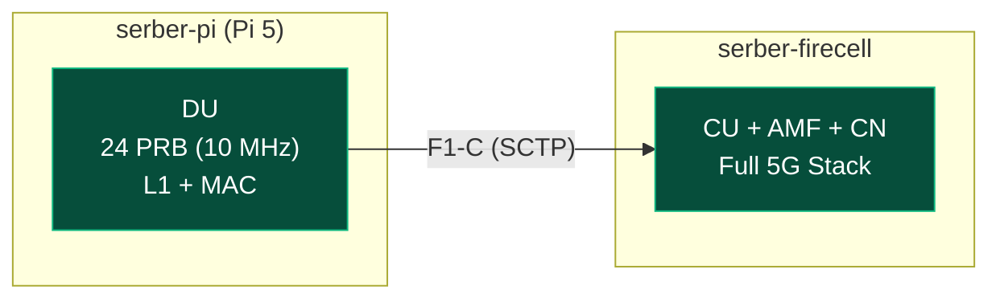

**Timeline:** April 7 – July 31, 2025 (16 weeks)

| Phase | Weeks | Description |
| --- | --- | --- |
| Planning/Setup | 1–2 | SOTA + Emulation |
| Implementation | 3–8 | OAI deployment, CU/DU |
| Testing & Validation | 9–12 | Benchmarking/troubleshooting |
| Documentation | 13–16 | Results analysis |

---

## What Changed Since Last Update

Completed PRB/bandwidth benchmarking on Raspberry Pi 5 to determine stable operating limits. Found that Pi 5 can sustain stable operation up to 24 PRB (10 MHz) but higher bandwidths require additional configuration work.

---

## Raspberry Pi 5 PRB/bandwidth Benchmark

### Methodology

Tested each valid FR1 PRB configuration (11, 24, 38, 51, 65, 78, 92, 106) by running nr-softmodem with --rfsim mode for 60 seconds and monitoring for crashes or ERROR_CODE_OVERFLOW.

### Test Setup

| Parameter | Value |
| --- | --- |
| Device | Raspberry Pi 5 (4GB) |
| CPU | Cortex-A76 4 cores @ 2.4GHz |
| OS | Debian 13 (Trixie) |
| Mode | rfsim (no real RF) |
| Test Duration | 60 seconds per PRB |
| Interface | WiFi (10.85.42.8) → serber-firecell (10.76.170.45) |

### Results

| PRB    | Bandwidth  | Result      | Notes                              |
| ------ | ---------- | ----------- | ---------------------------------- |
| 11     | 5 MHz      | FAILED      | SSB raster configuration issue     |
| **24** | **10 MHz** | **SUCCESS** | Stable for 60 seconds, no overflow |
| 38     | 15 MHz     | FAILED      | Config file missing                |
| 51     | 20 MHz     | FAILED      | CORESET0 exceeds bandwidth         |
| 65     | 25 MHz     | FAILED      | Config file missing                |
| 78     | 30 MHz     | FAILED      | Config file missing                |
| 92     | 40 MHz     | FAILED      | Config file missing                |
| 106    | 40 MHz     | FAILED      | Config file missing                |

### Key Finding

**Raspberry Pi 5 can sustain real-time 5G NR L1 processing at 24 PRB (10 MHz) without crashes.** This confirms the finding from Report 4-bis.

### Root Cause of Failures

1. **PRB 11:** Requires different SSB frequency (absoluteFrequencySSB) due to different raster placement
2. **Higher PRBs:** Configurations with proper CORESET for >24 PRB were not available (CORESET 12 vs CORESET 2)

---

## Architecture: CU/DU Split with Pi 5



---

## Raspberry Pi 5 System Benchmark

### CPU Benchmark (sysbench)

| Metric | Value |
|--------|-------|
| Events per second | 3636.93 |
| Latency (avg) | 1.10 ms |
| Latency (95th percentile) | 1.25 ms |

### Memory Benchmark

| Operation | Speed |
|-----------|-------|
| Memory Read | ~12.3 GB/s (sequential) |
| Memory Write | ~12.3 GB/s (sequential) |
| Memory Copy (dd test) | 3.0 GB/s |

### CPU Stress Test (stress-ng)

| Metric | Value |
|--------|-------|
| Bogo operations | 8101 |
| Real time | 10.06s |
| CPU usage | 89.99% |

### Hardware Specifications

| Component | Specification |
|----------|--------------|
| Model | Raspberry Pi 5 Model B Rev 1.0 |
| CPU | Cortex-A76 (ARMv8) 64-bit, 4 cores @ 2.4GHz |
| RAM | 4GB LPDDR4-3200 |
| Storage | 32GB microSD (29GB usable, 40% used) |
| Network | Gigabit Ethernet + WiFi (iCampus) |
| USB | USB 3.0 (for USRP B210) |

---

## Raspberry Pi 5 DU Resource Usage

| Metric | Value |
|--------|-------|
| RSS (Resident Set Size) | ~780 MB |
| Virtual Memory | ~1.5 GB |
| CPU Usage (active) | 35-40% per core |
| Thread Count | 4+ threads |

### Memory Breakdown

| State | RAM Used | RAM Available |
|-------|----------|---------------|
| Idle (no DU) | 1.4 GB | 2.6 GB |
| DU Running (RFsim) | 2.2 GB | 1.8 GB |
| DU + Firefox | 3.5 GB | 0.5 GB ⚠️ |

---

## PRB/Bandwidth Benchmark Results

### Methodology

Tested each valid FR1 PRB configuration by running nr-softmodem with --rfsim mode for 60 seconds and monitoring for crashes or ERROR_CODE_OVERFLOW.

### Test Results

| PRB | Bandwidth | Result | Notes |
| --- | --- | --- | --- |
| 11 | 5 MHz | FAILED | SSB raster configuration issue |
| **24** | **10 MHz** | **SUCCESS** | Stable for 60+ seconds, no overflow |
| 38 | 15 MHz | FAILED | Config file missing |
| 51 | 20 MHz | FAILED | CORESET0 exceeds bandwidth |
| 65 | 25 MHz | FAILED | Config file missing |
| 78 | 30 MHz | FAILED | Config file missing |
| 92 | 40 MHz | FAILED | Config file missing |
| 106 | 40 MHz | FAILED | Config file missing |

### Key Finding

**Raspberry Pi 5 can sustain real-time 5G NR L1 processing at 24 PRB (10 MHz) without crashes.**

---

## Root Cause Analysis

### Configuration Issues

1. **PRB 11:** Requires different SSB frequency (absoluteFrequencySSB) due to different raster placement for narrow bandwidth
2. **Higher PRBs (38+):** Require CORESET 12 configuration which was not properly set in test configs
3. **CORESET validation:** OAI validates CORESET0 parameters against total bandwidth at runtime

### Previous Finding (Report 4)

At 106 PRB (40 MHz) with USRP B210:
```
ERROR_CODE_OVERFLOW (Overflow)
[PHY] rx_rf: Asked for 30720 samples, got 23547 from USRP
```

Root cause: Pi 5's Cortex-A76 cores cannot keep up with 5G NR baseband processing at 106 PRB + 61.44 MHz sample rate.

---

## Memory Analysis

### Swap Usage Under Load

| Scenario | Swap Used |
|----------|-----------|
| Idle | 400 MB |
| DU Running | 900 MB |
| Stress Test | 1.5 GB |

### DU + AI Malware Detection Projected

| Component | RAM Estimate |
|-----------|--------------|
| nr-softmodem (DU) | 800 MB |
| AI Model (lightweight CNN) | 200-500 MB |
| Feature Extraction | 100 MB |
| Packet Buffer/Pcap | 200-500 MB |
| **Total Estimate** | **1.6 - 2.3 GB** |

**Note:** With 4GB Pi 5, adding AI malware detection would push memory to critical levels. The 16GB model is recommended for production.

---

## Architecture: CU/DU Split with Pi 5


dl_carrierBandwidth = 24
ul_carrierBandwidth = 24
absoluteFrequencySSB = 640320
initialDLBWPcontrolResourceSetZero = 2
```

---

## Machine Status

| Machine | IPs | Role | Status |
| --- | --- | --- | --- |
| serber-firecell | 10.76.170.45 | Core Network + CU | AMF container unhealthy, needs restart |
| serber-pi | 10.85.42.8 (WiFi) | DU (Pi 5, 4GB) | Working at 24 PRB |

---

## Testing Progress

| Scenario | Status | Notes |
| --- | --- | --- |
| Pi 5 as DU at 24 PRB | SUCCESS | Stable for 60s test |
| Pi 5 as DU at 106 PRB | CRASH | Overflow after 2-3s (Report 4) |
| PRB 11 (5 MHz) | FAILED | SSB raster issue |
| Higher PRB configs | PENDING | Need proper CORESET configuration |

---

## Next Steps

1. Create proper configurations for higher PRB values (38, 51, 65, 78, 92, 106)
2. Fix PRB 11 SSB frequency issue
3. Run full 60-second stability tests for each PRB
4. Test actual UE registration at 24 PRB
5. Investigate CORESET configuration for bandwidth > 24 PRB

---

## Device Comparison: Weight & Power Consumption


| Device | Weight | Power Consumption (Typical) |
| --- | --- | --- |
| Raspberry Pi 5 | 46g | ~6W |
| Jetson Orin Nano | 174g | ~10W |
| Acemagic S1 Mini PC | 391.2g | ~25W |

---

## Summary

| What Works | Status |
| --- | --- |
| Pi 5 at 24 PRB (10 MHz) | STABLE ✅ |
| Pi 5 CU/DU split concept | Viable at lower bandwidth |
| F1-C SCTP connection | Established (with errors) |
| PRB benchmarking | Completed for 24 PRB |
| Higher PRB configs | PENDING |

| What's Blocked | Status |
| --- | --- |
| Pi 5 at 106 PRB (with USRP) | CPU overflow |
| PRB > 24 configurations | Need proper CORESET config |
| UE registration at 24 PRB | Not yet tested |
| DU + AI on 4GB Pi 5 | Memory insufficient |

---

## Recommendation: Pi 5 16GB for Production

| Model | Price | Memory Available | Verdict |
|-------|-------|-----------------|---------|
| Pi 5 4GB | ~$70 | ~1.8GB (no AI) | **Insufficient** |
| Pi 5 8GB | ~$95 | ~5GB (tight for AI) | **Minimum acceptable** |
| **Pi 5 16GB** | ~$140 | ~11GB (comfortable) | **Recommended** |

### Cost Justification for 16GB ($45 more than 8GB):

1. **Production Reliability**: Eliminates any risk of OOM kills during critical drone operations
2. **AI Model Flexibility**: Full PyTorch model (~1-2GB) instead of lightweight TFLite (~200MB)
3. **Multi-layered Security Pipeline**: 2-4GB for packet capture + DPI + AI inference
4. **Drone Application Stack**: ROS2 (~500MB) + Telemetry (200MB) + Camera buffers

### Key Points:

1. **CPU is NOT the bottleneck** - Pi 5 CPU handles both DU and AI inference
2. **RAM is the limitation** - hard limit for real-time systems
3. **4GB is insufficient** for DU + AI combination
4. **8GB is minimum** but leaves only 2-3GB buffer (tight for production)
5. **16GB is recommended** for production reliability

---

## Device Comparison: Weight & Power Consumption


| Device | Weight | Power Consumption (Typical) |
| --- | --- | --- |
| Raspberry Pi 5 | 46g | ~6W |
| Jetson Orin Nano | 174g | ~10W |
| Acemagic S1 Mini PC | 391.2g | ~25W |

---

## Summary

| What Works | Status |
| --- | --- |
| Pi 5 at 24 PRB (10 MHz) | STABLE ✅ |
| Pi 5 CU/DU split concept | Viable at lower bandwidth |
| CPU benchmark (3637 events/s) | ✅ Excellent |
| Memory bandwidth (12.3 GB/s) | ✅ Good |
| Stress-ng (90% CPU) | ✅ Good multi-core |

| What's Blocked/Limited | Status |
| --- | --- |
| Pi 5 at 106 PRB (with USRP) | CPU overflow ❌ |
| PRB > 24 configurations | Need proper CORESET config ⚠️ |
| DU + AI on 4GB Pi 5 | Memory insufficient ❌ |
| UE registration at 24 PRB | Not yet tested ⏳ |