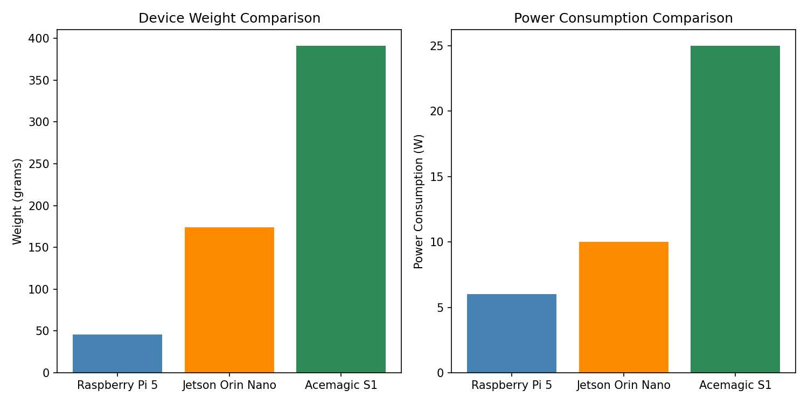

**Timeline:** April 7 – July 31, 2025 (16 weeks)

| Phase | Weeks | Description |
| --- | --- | --- |
| Planning/Setup | 1–2 | SOTA + Emulation |
| Implementation | 3–8 | OAI deployment, CU/DU |
| Testing & Validation | 9–12 | Benchmarking/troubleshooting |
| Documentation | 13–16 | Results analysis |

---

## What Changed Since Last Update

Completed PRB/bandwidth benchmarking on Raspberry Pi 5 to determine stable operating limits. Found that Pi 5 can sustain stable operation up to 24 PRB (10 MHz).

---

## serber-pi (Pi 5) Benchmark

| Component | Value |
| --- | --- |
| CPU | Cortex-A76, 4 cores @ 2.4GHz |
| RAM | 4GB LPDDR4-3200 |

| Component | CPU Usage | Memory Usage |
| --- | --- | --- |
| DU (nr-softmodem) | 35–40% | ~780 MB |
| System Idle | ~60% available | 2.4GB free |

| Metric | Value |
| --- | --- |
| CPU (sysbench) | 3637 events/s |
| Memory bandwidth | 12.3 GB/s |
| Stress-ng (4 cores) | 90% utilization |

---

## Pi 5 PRB/Bandwidth Test Results

| PRB | Bandwidth | Result |
| --- | --- | --- |
| 11 | 5 MHz | FAILED (SSB raster issue) |
| **24** | **10 MHz** | **STABLE** |
| 38–106 | 15–40 MHz | FAILED (CORESET config) |

**Key finding:** Pi 5 is stable at 24 PRB (10 MHz) but fails at higher bandwidths without proper CORESET configuration.

---

## Machine Status

| Machine | IPs | Role | Status |
| --- | --- | --- | --- |
| serber-firecell | 10.76.170.45 | Core Network + CU | AMF unhealthy, needs restart |
| serber-pi | 10.85.42.8 (WiFi) | DU (Pi 5, 4GB) | Working at 24 PRB |

---

## Testing Progress

| Scenario | Status | Notes |
| --- | --- | --- |
| Pi 5 at 24 PRB | SUCCESS | Stable for 60s test |
| Pi 5 at 106 PRB | CRASH | Overflow after 2–3s (Report 4) |
| Higher PRB configs | PENDING | Need CORESET 12 configuration |

---

## Next Steps

1. Create proper configurations for PRB > 24
2. Fix PRB 11 SSB frequency issue
3. Test UE registration at 24 PRB

---

## Device Comparison

| Device | Weight | Power Consumption |
| --- | --- | --- |
| Raspberry Pi 5 | 46g | ~6W |
| Jetson Orin Nano | 174g | ~10W |
| Acemagic S1 Mini PC | 391.2g | ~25W |

---

## Summary

| What Works | Status |
| --- | --- |
| Pi 5 at 24 PRB (10 MHz) | STABLE ✅ |
| Pi 5 CPU benchmark | 3637 events/s ✅ |
| Memory bandwidth | 12.3 GB/s ✅ |

| What's Blocked | Status |
| --- | --- |
| Pi 5 at 106 PRB | CPU overflow ❌ |
| PRB > 24 configurations | Need CORESET config ⚠️ |
| DU + AI on 4GB Pi 5 | Memory insufficient ❌ |