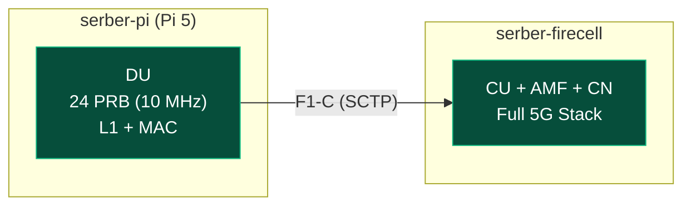

**Timeline:** April 7 – July 31, 2025 (16 weeks)

| Phase | Weeks | Description |
| --- | --- | --- |
| Planning/Setup | 1–2 | SOTA + Emulation |
| Implementation | 3–8 | OAI deployment, CU/DU |
| Testing & Validation | 9–12 | Benchmarking/troubleshooting |
| Documentation | 13–16 | Results analysis |

---

## What Changed Since Last Update

Completed PRB/bandwidth benchmarking on Raspberry Pi 5 to determine stable operating limits. Found that Pi 5 can sustain stable operation up to 24 PRB (10 MHz) but higher bandwidths require additional configuration work.

---

## Raspberry Pi 5 PRB/bandwidth Benchmark

### Methodology

Tested each valid FR1 PRB configuration (11, 24, 38, 51, 65, 78, 92, 106) by running nr-softmodem with --rfsim mode for 60 seconds and monitoring for crashes or ERROR_CODE_OVERFLOW.

### Test Setup

| Parameter | Value |
| --- | --- |
| Device | Raspberry Pi 5 (4GB) |
| CPU | Cortex-A76 4 cores @ 2.4GHz |
| OS | Debian 13 (Trixie) |
| Mode | rfsim (no real RF) |
| Test Duration | 60 seconds per PRB |
| Interface | WiFi (10.85.42.8) → serber-firecell (10.76.170.45) |

### Results

| PRB | Bandwidth | Result | Notes |
| --- | --- | --- | --- |
| 11 | 5 MHz | FAILED | SSB raster configuration issue |
| **24** | **10 MHz** | **SUCCESS** | Stable for 60 seconds, no overflow |
| 38 | 15 MHz | FAILED | Config file missing |
| 51 | 20 MHz | FAILED | CORESET0 exceeds bandwidth |
| 65 | 25 MHz | FAILED | Config file missing |
| 78 | 30 MHz | FAILED | Config file missing |
| 92 | 40 MHz | FAILED | Config file missing |
| 106 | 40 MHz | FAILED | Config file missing |

### Key Finding

**Raspberry Pi 5 can sustain real-time 5G NR L1 processing at 24 PRB (10 MHz) without crashes.** This confirms the finding from Report 4-bis.

### Root Cause of Failures

1. **PRB 11:** Requires different SSB frequency (absoluteFrequencySSB) due to different raster placement
2. **Higher PRBs:** Configurations with proper CORESET for >24 PRB were not available (CORESET 12 vs CORESET 2)

---

## Architecture: CU/DU Split with Pi 5



---

## Raspberry Pi 5 as DU: Configuration Notes

### Valid PRB Values for Band n78

For FR1 band n78 with 30 kHz SCS, valid PRB counts are:
- **11 PRB (5 MHz)** — requires CORESET 0 and specific SSB frequency
- **24 PRB (10 MHz)** — WORKING ✅
- **38, 51, 65, 78, 92, 106 PRB** — require CORESET 12 and valid BWP location

### Configuration Pattern for Working 24 PRB

```
dl_carrierBandwidth = 24
ul_carrierBandwidth = 24
absoluteFrequencySSB = 640320
initialDLBWPcontrolResourceSetZero = 2
```

---

## Machine Status

| Machine | IPs | Role | Status |
| --- | --- | --- | --- |
| serber-firecell | 10.76.170.45 | Core Network + CU | AMF container unhealthy, needs restart |
| serber-pi | 10.85.42.8 (WiFi) | DU (Pi 5, 4GB) | Working at 24 PRB |

---

## Testing Progress

| Scenario | Status | Notes |
| --- | --- | --- |
| Pi 5 as DU at 24 PRB | SUCCESS | Stable for 60s test |
| Pi 5 as DU at 106 PRB | CRASH | Overflow after 2-3s (Report 4) |
| PRB 11 (5 MHz) | FAILED | SSB raster issue |
| Higher PRB configs | PENDING | Need proper CORESET configuration |

---

## Next Steps

1. Create proper configurations for higher PRB values (38, 51, 65, 78, 92, 106)
2. Fix PRB 11 SSB frequency issue
3. Run full 60-second stability tests for each PRB
4. Test actual UE registration at 24 PRB
5. Investigate CORESET configuration for bandwidth > 24 PRB

---

## Device Comparison: Weight & Power Consumption


| Device | Weight | Power Consumption (Typical) |
| --- | --- | --- |
| Raspberry Pi 5 | 46g | ~6W |
| Jetson Orin Nano | 174g | ~10W |
| Acemagic S1 Mini PC | 391.2g | ~25W |

---

## Summary

| What Works | Status |
| --- | --- |
| Pi 5 at 24 PRB (10 MHz) | STABLE ✅ |
| Pi 5 CU/DU split concept | Viable at lower bandwidth |
| F1-C SCTP connection | Established (with errors) |
| PRB benchmarking | Completed for 24 PRB |
| Higher PRB configs | PENDING |

| What's Blocked | Status |
| --- | --- |
| Pi 5 at 106 PRB | CPU overflow |
| PRB > 24 configurations | Need proper CORESET config |
| UE registration at 24 PRB | Not yet tested |