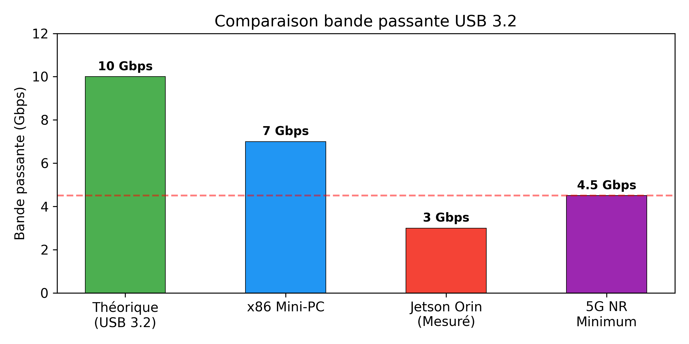
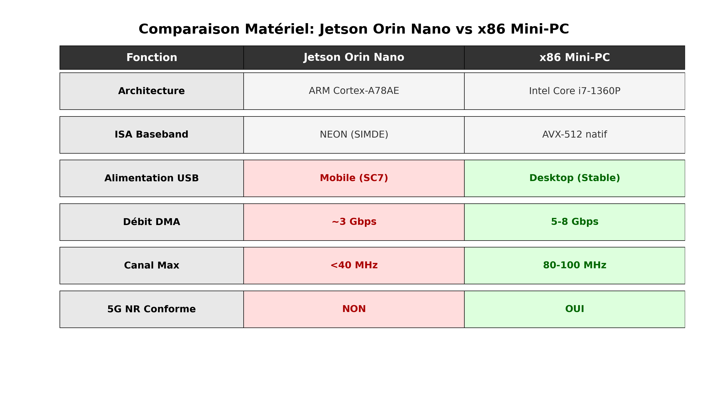

# 5G OAI CU/DU Split Architecture
## Hardware Bottleneck Analysis & Migration Strategy

**Research Progress Report**  
Presented to: Senior Research Supervisor  
Date: April 2026

---

# Progress Report: Project Timeline

**Timeline:** April 7 - July 31, 2025 (16 weeks)

| Phase | Weeks | Description |
|-------|-------|-------------|
| Planning & Setup | 1-4 | Hardware procurement, environment setup |
| Implementation | 5-8 | OAI deployment, CU/DU split configuration |
| Testing & Validation | 9-12 | Performance benchmarking, troubleshooting |
| Documentation | 13-16 | Results analysis, presentation preparation |

**Current Status:** Week 1. Software groundwork completed; hardware limitations now critical path.

---

# The Three Fundamental Hardware Limitations

| Issue | Root Cause | Project Impact |
|-------|-----------|----------------|
| **Instruction Set Mismatch** | AVX-512 → ARM NEON via SIMDE | 40-60% overhead, deadline misses |
| **USB Power Management** | tegra-xusb SC7 autosuspend | Fatal UHD rx8 status: 5 disconnect |
| **DMA Bandwidth Saturation** | ~3 Gbps ceiling (30% of USB 3.2) | <40 MHz max channel width |

**These are hardware-level constraints. No software optimization can fix them.**

---

# Issue 1: Instruction Set Architecture Mismatch

**The Problem:**

- OAI PHY layer uses x86 AVX-512 vector instructions for LDPC/Polar decoding
- Jetson Orin Nano has ARM Cortex-A78AE with NEON (128-bit) — cannot natively execute AVX-512
- SIMDE library translates AVX-512 → ARM NEON at runtime
- Translation overhead: 40-60% performance loss

**Result:** x86 i7 is ~4-5x faster per core for 5G PHY workloads. Operations requiring 10ms on x86 require 14-16ms on ARM.

---

# Issue 2: USB Power Management Catastrophe

The Jetson's tegra-xusb controller enters SC7 low-power state on 2-5ms throughput variations, causing VBUS droop that starves the USRP B210's FX3 controller. Result: `UHD rx8 transfer status: 5` — unrecoverable fatal error.

---

# Issue 3: DMA Bandwidth Saturation

| Platform | Measured Throughput | Max Channel Width |
|----------|---------------------|------------------|
| Theoretical (USB 3.2 Gen 2) | 10 Gbps | 100 MHz |
| x86 Mini-PC (typical) | 5-8 Gbps | 80-100 MHz |
| Jetson Orin Nano | ~3 Gbps | <40 MHz |
| 5G NR Minimum (n78/n79) | ~4.5 Gbps | 50 MHz required |

**Jetson achieves only 30% of USB 3.2 theoretical bandwidth — non-compliant with 5G NR.**

---

# Hardware Comparison: Jetson vs. x86 Mini-PC

**Summary:** Jetson fails on every critical requirement. x86 Mini-PC meets all 5G NR specifications.

---

# Summary: Evidence-Based Architectural Correction

**Three Fundamental Limitations (Not Software-Correctable):**

1. **ISA Mismatch:** AVX-512 cannot run natively on ARM. SIMDE translation costs 40-60% overhead.
2. **USB Power:** SC7 autosuspend triggers fatal UHD disconnects. Mobile-class power management incompatible with USRP B210.
3. **DMA Bandwidth:** ~3 Gbps ceiling limits to <40 MHz channel width. Below 5G NR minimum.

**Literature Validation:** All successful UABS prototypes (SkyCell, SkyRAN) use x86 Mini-PC.

---

# Call to Action: Immediate x86 Migration

**Recommendation:** Pivot to x86/x64 Mini-PC (Intel NUC 13 or equivalent)

| Action | Timeline |
|--------|----------|
| Halt Jetson development | Immediate |
| Procure x86 Mini-PC | Week 2-4 |
| Migrate OAI stack | Week 5-8 |
| Validate 80 MHz operation | Week 9-12 |

**Why this is not a failure:** The Jetson limitations are silicon-level constraints. This is an evidence-based architectural correction, not a setback.

---

# Image Reference

| Graph | Filename | Description |
|-------|----------|-------------|
| 1 | graph1_bandwidth_comparison.png | USB DMA bandwidth bar chart |
| 2 | graph2_usb_power_comparison.png | x86 vs Jetson power comparison |
| 5 | graph5_hardware_comparison.png | Feature comparison table |
| 6 | graph6_benchmark_comparison.png | Performance benchmarks: Jetson vs i7 |