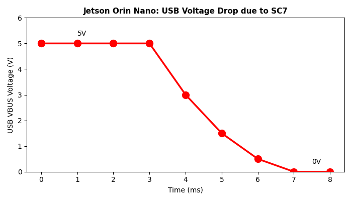
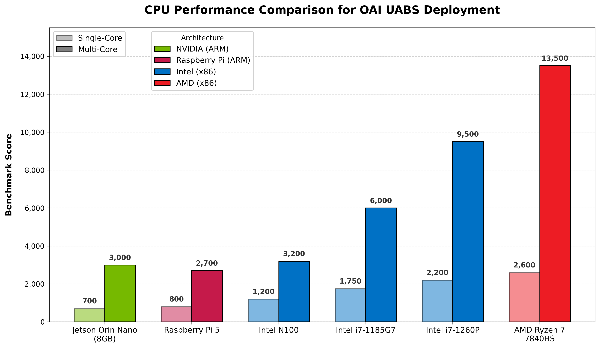

## **Research Progress Report**  1

**Timeline:** April 7 - July 31, 2025 (16 weeks)

| Phase                | Weeks | Description                  |
| -------------------- | ----- | ---------------------------- |
| Planning/setup       | 1-2   | SOTA + Emulation             |
| Implementation       | 3-8   | OAI deployment, CU/DU        |
| Testing & Validation | 9-12  | Benchmarking/troubleshooting |
| Documentation        | 13-16 | Results analysis             |

---

#### Issue 1: Instruction Set Architecture Mismatch

- OAI PHY layer uses x86 AVX-512 vector instructions for LDPC/Polar decoding
- Translation overhead: 40-60% performance loss

**Result:** x86 is ~4-5x faster per core for 5G PHY workloads

---

#### Issue 2: USB Power management problem

tegra-xusb controller enters SC7 low-power state on 2-5ms throughput variations

---

#### Issue 3: DMA Bandwidth Saturation

| Platform                    | Measured Throughput | Max Channel Width |
| --------------------------- | ------------------- | ----------------- |
| Theoretical (USB 3.2 Gen 2) | 10 Gbps             | 100 MHz           |
| x86 Mini-PC                 | 5-8 Gbps            | 80-100 MHz        |
| Jetson Orin Nano            | ~3 Gbps             | <40 MHz           |
| 5G NR Minimum               | ~4.5 Gbps           | 50 MHz required   |

$D=BW×S×C$

---

#### CPU Comparison: Jetson vs. x86 Mini-PC

![[graph6_power_efficiency.png]]
---

#### Summary: **Three Fundamental Limitations (Not Software-Correctable):**

| Issue           | Root Cause                      | Project Impact                               |
| --------------- | ------------------------------- | -------------------------------------------- |
| CPU Processing  | AVX-512 (x86) vs. ARM Mismatch  | 40-60% Overhead                              |
| USB Stability   | Aggressive power management     | Fatal disconnection: USRP crashes            |
| Data Throughput | DMA bandwidth ceiling (~3 Gbps) | Throttled Performance: BW limited to <40 MHz |
