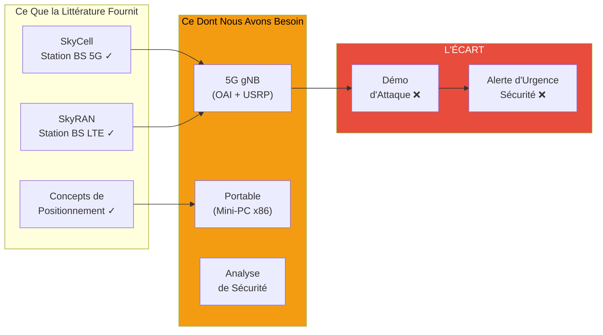

# État de l'Art : Revue de Littérature sur les Stations de Base Aériennes (UAV-BS)

---

## 1. Carte de Littérature : Articles par Matériel et Impact

| Article | Matériel | Testé en Vol | Notes |
|---------|----------|--------------|-------|
| **SkyCell** | NUC + USRP B210 | ✅ | Première station BS 5G aérienne |
| **SkyRAN** | NUC + USRP B210 | ✅ | Étude de positionnement LTE |
| **Flying Rebots** | x86 | ❌ | Conceptuel uniquement |
| **Jetson Nano OAI** | Jetson Nano | ❌ | Échec (limites ISA/BW) |
| **5G Edge Vision** | Jetson Nano | ❌ | IA de bord uniquement |

**Résultat Clé :** Les prototypes UAV-BS prouvés utilisent tous **NUC + USRP B210**

---

## 2. Ce Dont Nous Avons Besoin vs. Ce Que la Littérature Fournit

**Notre Contribution :** Combler l'écart — analyse de sécurité de la broadcast 5G d'urgence via une station BS aérienne frauduleuse
