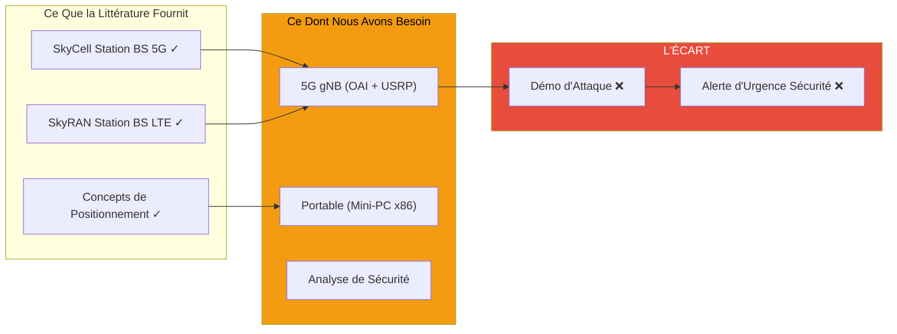

# État de l'Art : Revue de Littérature sur les Stations de Base Aériennes (UAV-BS)

---

## 1. Carte de Littérature : Articles par Matériel et Impact

| Article             | Matériel        | Testé en Vol | Notes                           |
| ------------------- | --------------- | ------------ | ------------------------------- |
| **SkyCell**         | NUC + USRP B210 | oui          | Première station BS 5G aérienne |
| **SkyRAN**          | NUC + USRP B210 | oui          | Étude de positionnement LTE     |
| **Flying Rebots**   | x86             | non          | Conceptuel uniquement           |
| **Jetson Nano OAI** | Jetson Nano     | non          | Échec (limites ISA/BW)          |
| **5G Edge Vision**  | Jetson Nano     | non          | IA de bord uniquement           |

**Résultat Clé :** Les prototypes UAV-BS prouvés utilisent tous **NUC + USRP B210**

---

## 2. Ce Dont Nous Avons Besoin vs. Ce Que la Littérature Fournit

**Notre Contribution :** Combler l'écart — analyse de sécurité de la broadcast 5G d'urgence via une station BS aérienne frauduleuse
