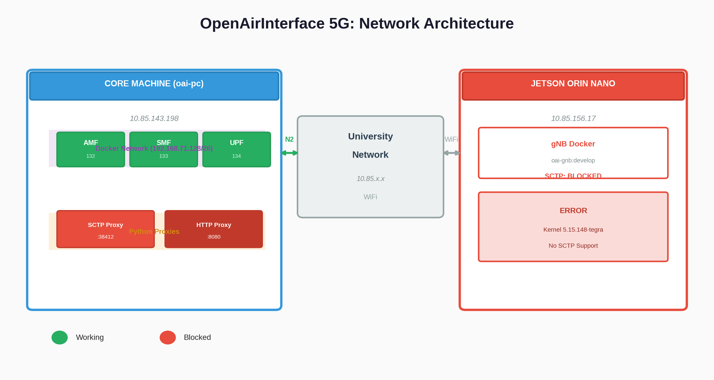
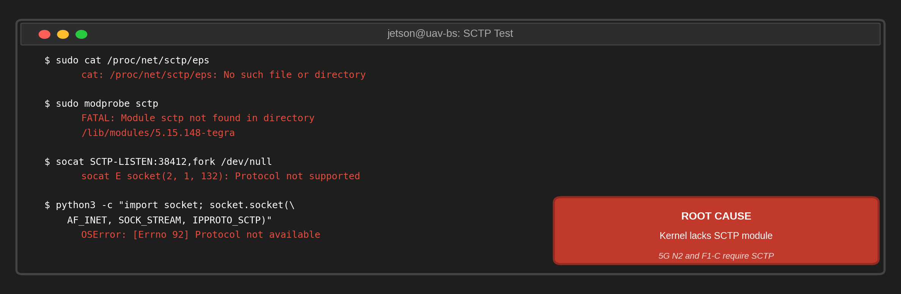
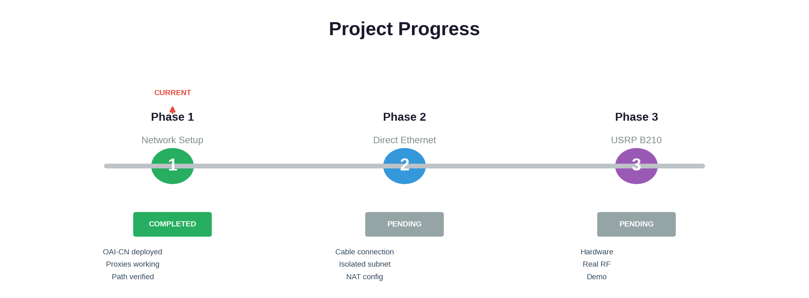
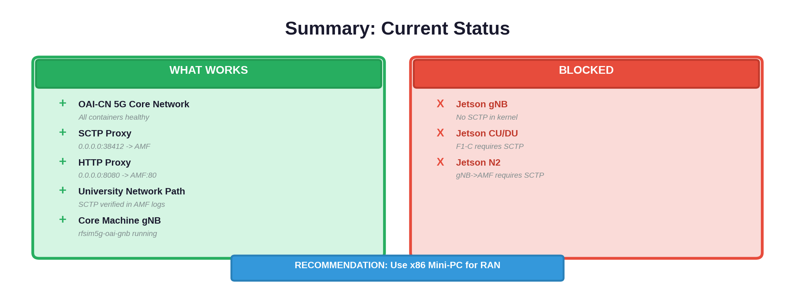

## **Research Progress Report** - OAI 5G Setup Update

---

**Timeline:** April 7 - July 31, 2025 (16 weeks)

| Phase | Weeks | Description |
| -------------------- | ----- | ---------------------------- |
| Planning/setup | 1-2 | SOTA + Emulation |
| Implementation | 3-8 | OAI deployment, CU/DU |
| Testing & Validation | 9-12 | Benchmarking/troubleshooting |
| Documentation | 13-16 | Results analysis |

---

## **What We Accomplished**

### 1. OAI-CN 5G Core Network Deployment

| Container | IP Address | Function |
| --------- | ------------| ---------- |
| `rfsim5g-oai-amf` | 192.168.71.132 | Access & Mobility Management Function |
| `rfsim5g-oai-smf` | 192.168.71.133 | Session Management Function |
| `rfsim5g-oai-upf` | 192.168.71.134 | User Plane Function |
| `rfsim5g-mysql` | 192.168.71.131 | Database |
| `rfsim5g-oai-nr-ue` | 192.168.71.181 | Simulated UE (connected) |

**Status:** All containers healthy, UE attached and running

---

### 2. SCTP/HTTP Proxy Implementation

```python
# SCTP Proxy: /tmp/sctp_proxy.py
# Creates relay: 0.0.0.0:38412 -> 192.168.71.132:38412

# HTTP Proxy: /tmp/http_proxy.py
# Creates relay: 0.0.0.0:8080 -> 192.168.71.132:80
```

**Problem Solved:** AMF listens on Docker internal network, not on host interface. Proxies bridge external connections.

---

### 3. Network Connectivity Verification



```
AMF Logs (Core Machine):
[2026-04-16 12:11:26.159] [sctp] [info] IPv4 Addr: 10.85.143.198
[2026-04-16 12:11:26.159] [ngap] [debug] Ready to handle new NGAP SCTP association request
```

**Result:** University network successfully relays SCTP to AMF through proxy

---

### 4. Jetson gNB Configuration

Created proper gNB YAML configuration for **CU/DU Option 8**:

| Parameter | Value |
| --------- | ------- |
| PLMN | MCC=208, MNC=99 |
| TAC | 1 |
| Band | n78 (3.5 GHz) |
| AMF IP | 10.85.143.198 (core wireless) |
| gNB N2 IP | 10.85.156.17 (Jetson) |
| RF Mode | Simulator (rfsim) |

---

## **Issue: Jetson Kernel Missing SCTP Support**

```
Jetson Orin Nano Kernel: 5.15.148-tegra
/proc/net/sctp: No such file or directory
modprobe sctp: FATAL: Module sctp not found
socat SCTP-LISTEN: Protocol not supported
```



| Interface | Protocol | Status |
| --------- | -------- | ------ |
| N2 (gNB -> AMF) | SCTP | BLOCKED |
| F1-C (CU <-> DU) | SCTP | BLOCKED |

**Root Cause:** NVIDIA's custom kernel does not include SCTP module

---

## **Progress Timeline**



| Phase | Status | Next Step |
| ----- | ------ | --------- |
| Phase 1: University Network | COMPLETE | Use core machine for demo |
| Phase 2: Direct Ethernet | PENDING | Cable connection |
| Phase 3: USRP B210 | PENDING | Hardware integration |

---

## **Summary**



---

## **For Sunday Demo:**

- Use **core machine gNB** (`rfsim5g-oai-gnb`) for live demonstration
- Network path verified through proxy
- Jetson needs custom kernel build for full gNB operation