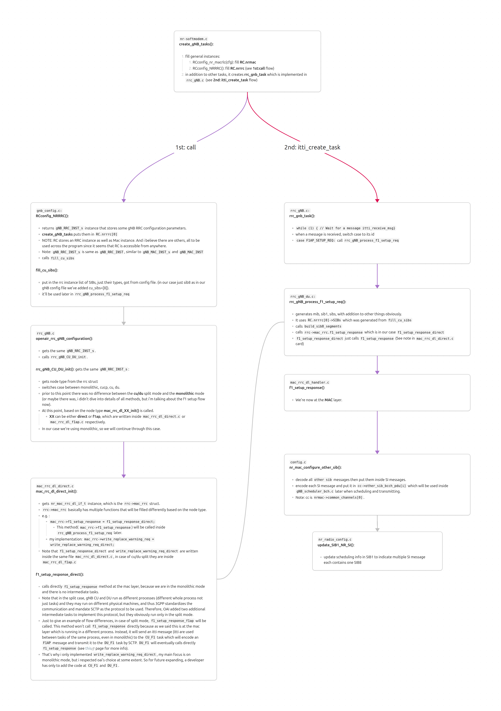

[OpenAirInterface](https://gitlab.eurecom.fr/oai/openairinterface5g) (OAI) is an open-source software platform that provides a full implementation of 3GPP cellular standards for both 4G LTE and 5G NR networks.
It can run in two ways:
- **Emulated mode:** The UE and gNB run as software on the same machine and
communicate through virtual interfaces
- **Over-the-air mode:** real radio signals are transmitted using SDR (Software Defined Radio). The gNB and UE can run on different machines, each connected to its own SDR, or we can use a real smartphone.
In both cases, the core network functions are deployed as containers.

