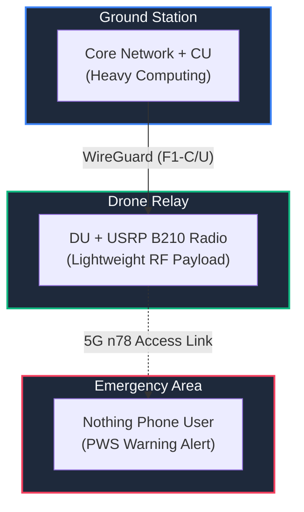
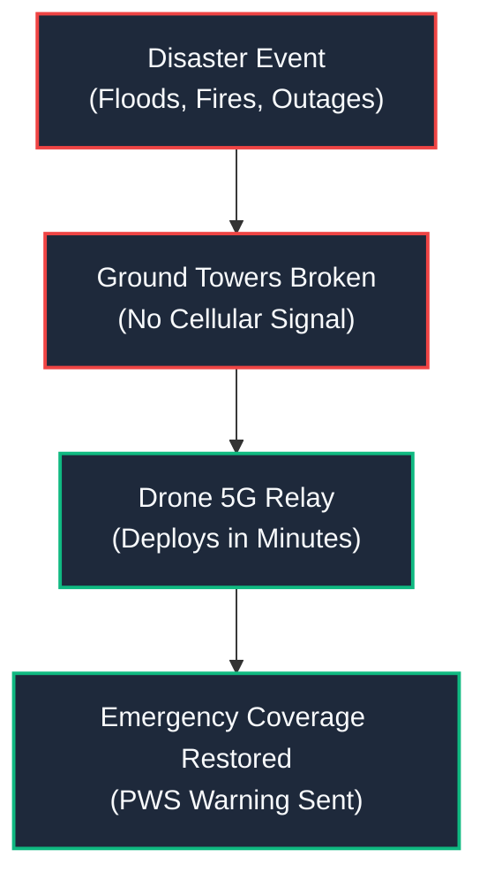
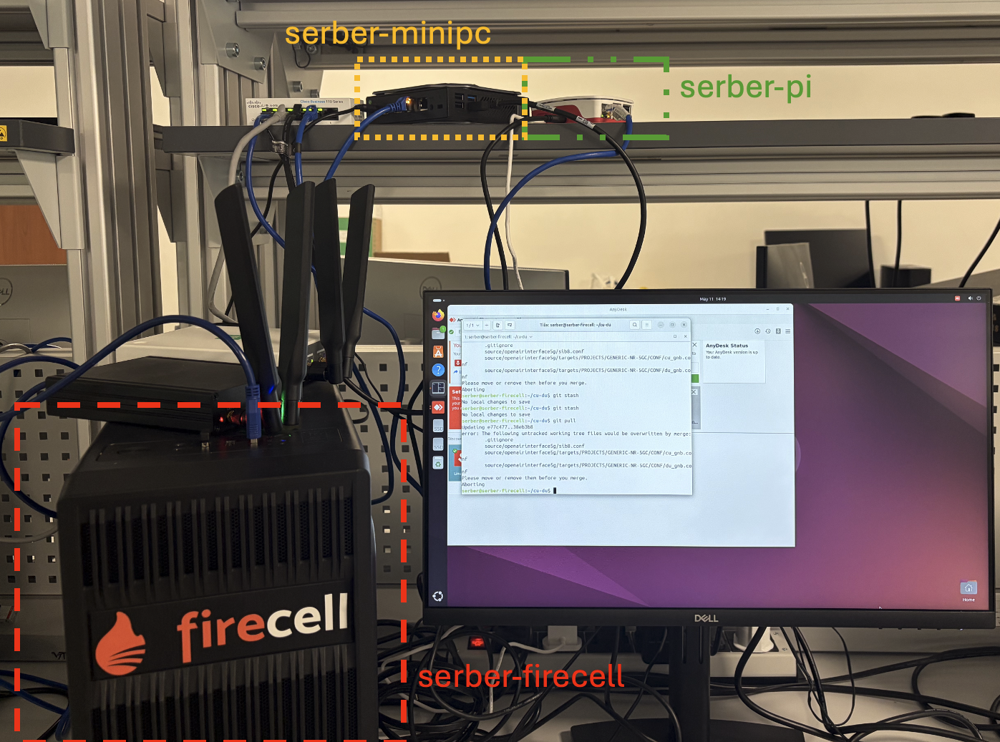
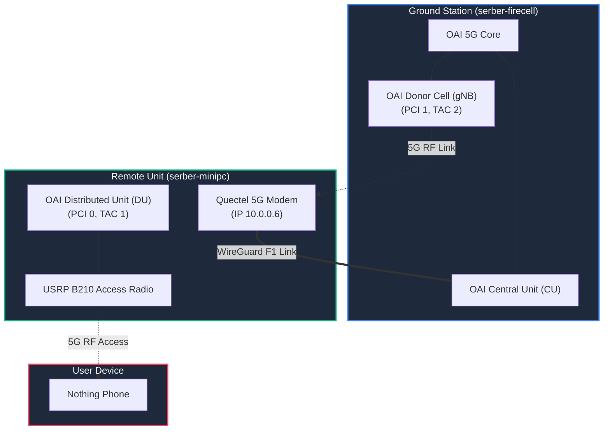
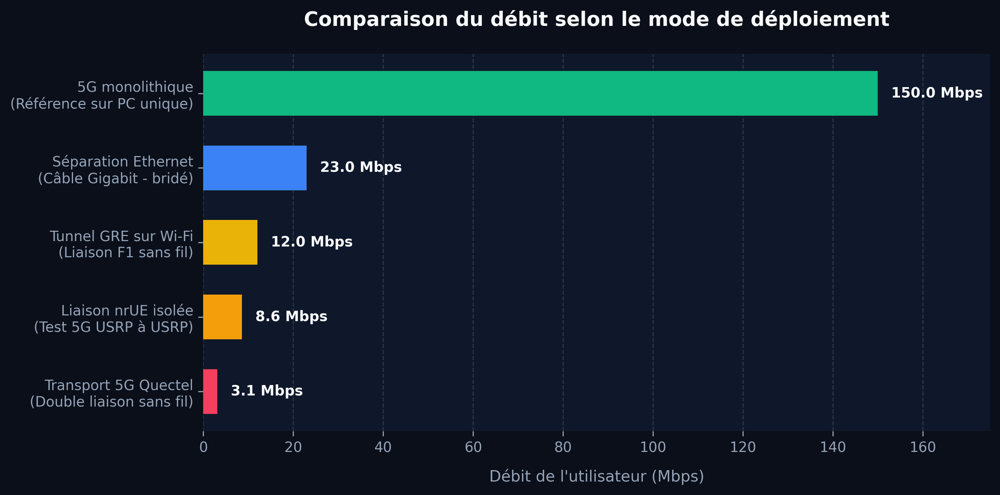

# From Ground Station to Flying 5G Relay
### Progress on a Drone-Oriented 5G Testbed

Research Progress Recap
Presenter: Research Team

---

## Slide 1 — The idea in one picture

**Project Concept**

Instead of carrying an entire heavy 5G base station on a drone, we **separate the lightweight radio** parts from the heavy computing intelligence on the ground.

The core network brain stays safe on the ground, while the drone serves as a lightweight flying relay.

---

## Slide 2 — Why this project matters

**Disaster & Emergency Coverage**

Temporary coverage is vital after **floods, forest fires, or critical outages** where ground infrastructure is destroyed.

A drone can **restore emergency coverage within minutes**. The challenge is keeping airborne equipment light and power-efficient.

---

## Slide 3 — What CU/DU split means

**Architecture Concept**

We divide a 5G base station into two parts:

* **Core Network & CU**: The ground-based "brain" managing user sessions, security, and protocols.
* **DU & Radio antenna**: The drone-carried "relay" transmitting actual high-speed radio waves.
* **Backhaul Link (F1)**: Wireless connection linking them.

---

## Slide 4 — The physical testbed

**Hardware Setup**

We validated a real-world benchtop setup using accessible hardware:

* **serber-firecell**: Ground Core & CU.
* **serber-minipc**: Remote DU unit.
* **Raspberry Pi 5**: Portable DU candidate.
* **USRP B210**: Software-programmable antenna.
* **Quectel Modem**: Wireless backhaul link.

---

## Slide 5 — Progress timeline

**Milestones Timeline**

The system progressed systematically from software simulations to real-world wireless hardware loops.

Key achievements include connecting a **commercial phone**, broadcasting **emergency warnings (PWS)**, and implementing **5G WireGuard backhauling**.

---

## Slide 6 — The main engineering pivots

**Hurdles & Adaptations**

Faced with real-world hardware limits, the project shifted direction to find viable solutions:

We resolved **protocol blocks, hardware overloading, and signal saturation** to reach a stable prototype.

1. Tegra Kernel Roadblock

Jetson Orin Nano lacked SCTP protocol support. Pivoted to x86 and Pi 5 for native kernel support.

2. Single-Radio Overload

One radio could not serve both access and backhaul. Dedicated B210 to phone, and Quectel modem to backhaul.

3. Throughput Bottleneck

Upgrading DU strength did not remove split-mode speed limits. Shifted focus to OAI scheduler tuning.

---

## Slide 7 — What works today

**Current Status**

Our current system has successfully validated all key features of the split 5G architecture.

Performance optimization and final user-traffic validation over the wireless backhaul link are currently under active testing.

* **Commercial phone attached** Done
* **Public Warning System SIB8** Done
* **CU/DU split F1 separation** Done
* **Wireless F1 tunnel over WiFi/5G** Done
* **Raspberry Pi 5 DU timing fix** Done
* **End-to-end backhaul speed** Testing
* **Split scheduler bottleneck fix** Testing

---

## Slide 8 — Current target architecture

**System Layout**

Our unified architecture runs on a single central server:

* **serber-firecell (Ground)**: Runs 5G Core, CU, and donor base station.
* **serber-minipc (Remote)**: Runs DU, access B210, and Quectel modem.
* **WireGuard Tunnel**: Over the Quectel 5G link, carrying F1-C &amp; F1-U.

---

## Slide 9 — Results and remaining bottleneck

**Throughput Benchmarks**

While monolithic 5G achieves 150 Mbps, split mode drops to **23 Mbps**. Moving the DU to stronger hardware did not increase speed.

The scheduler pins transmission rates to the lowest setting (**MCS 0**) due to delayed channel reports.

---

## Slide 10 — What is next

**Roadmap to Flight**

We have moved from simulation to a real, separated 5G network with wireless backhaul.

**Our next challenge is making this setup fast, reproducible, and ready for drone flights.**

1. **Prove Backhaul Path**: Confirm phone traffic runs strictly over Quectel counters.
2. **Tune Scheduler**: Break the 23 Mbps limit.
3. **Package Code**: Secure configurations.
4. **Validate Pi 5 DU**: Re-test Pi DU on backhaul.
5. **Airborne Flight**: Transition to flight.

