# From Ground Station to Flying 5G Relay
### Progress on a Drone-Oriented 5G Testbed

Research Progress Recap
Presenter: Research Team

---

## The idea in one picture

**Project Concept**

Instead of carrying an entire heavy 5G base station on a drone, we **separate the lightweight radio** parts from the heavy computing intelligence on the ground.

The core network brain stays safe on the ground, while the drone serves as a lightweight flying relay.

---

## Why this project matters

**Disaster & Emergency Coverage**

Temporary coverage is vital after **floods, forest fires, or critical outages** where ground infrastructure is destroyed.

A drone can **restore emergency coverage within minutes**. The challenge is keeping airborne equipment light and power-efficient.

---

## What CU/DU split means

**Architecture Concept**

We divide a 5G base station into two parts:

* **Core Network & CU**: The ground-based "brain" managing user sessions, security, and protocols.
* **DU & Radio antenna**: The drone-carried "relay" transmitting actual high-speed radio waves.
* **Backhaul Link (F1)**: Wireless connection linking them.

---

## The physical testbed

**Hardware Setup**

We validated a real-world benchtop setup using accessible hardware:

* **serber-firecell**: Ground Core & CU.
* **serber-minipc**: Remote DU unit.
* **Raspberry Pi 5**: Portable DU candidate.
* **USRP B210**: Software-programmable antenna.
* **Quectel Modem**: Wireless backhaul link.

---

## Progress timeline

**Milestones Timeline**

The system progressed systematically from software simulations to real-world wireless hardware loops.

Key achievements include connecting a **commercial phone**, broadcasting **emergency warnings (PWS)**, and implementing **5G WireGuard backhauling**.

---

## The main engineering pivots

**Hurdles & Adaptations**

Faced with real-world hardware limits, the project shifted direction to find viable solutions:

We resolved **protocol blocks, hardware overloading, and signal saturation** to reach a stable prototype.

1. Jetson Kernel and I/O

A custom SCTP kernel plus CPU, IRQ, and USB tuning made the embedded DU viable.

2. Single-Radio Overload

One radio could not serve both access and backhaul. Dedicated B210 to phone, and Quectel modem to backhaul.

3. Transport and Scheduler

MTU/MSS and BLER-threshold tuning removed the early 23 Mbps split ceiling.

---

## What works today

**Current Status**

Our current system has successfully validated all key features of the split 5G architecture.

The remaining work is to turn best-observed runs into a controlled, publishable
measurement campaign and complete the flight integration.

* **Commercial phone attached** Done
* **Public Warning System SIB8** Done
* **CU/DU split F1 separation** Done
* **Wireless F1 tunnel over WiFi/5G** Done
* **Raspberry Pi 5 DU timing fix** Done
* **End-to-end backhaul speed** Done
* **Split scheduler bottleneck fix** Done
* **Repeated benchmark campaign** Pending
* **Flight integration** Pending

---

## Current target architecture

**System Layout**

* **Ground**: 5G core, CU, and donor cell.
* **Payload**: Embedded DU, access SDR, and Quectel modem.
* **Transport**: WireGuard carries F1-C and F1-U over the donor 5G link.

---

## Tuning removed the early 23 Mbps ceiling

**Best-observed throughput**

Later tests overturned the early split ceiling:

* **100 Mbps** tuned Ethernet
* **52 Mbps** Wi-Fi/GRE
* **78 Mbps** Quectel/WireGuard
* **190 Mbps** monolithic peak

**Interpretation:** MTU/MSS behavior and BLER thresholds—not the split
alone—were the recoverable constraints. Values are best observations.

---

## What is next

**Roadmap to a defensible flight artifact**

The separated 5G network and wireless F1 paths now work. The next phase turns
best-observed demonstrations into a repeatable, flight-safe research artifact.

1. **Freeze the stack**: Publish the exact OAI revision, patches, and configs.
2. **Repeat the campaign**: Run controlled trials with synchronized metrics.
3. **Publish evidence**: Release sanitized samples and packet-path proof.
4. **Validate the light radio**: Qualify B205mini-i before choosing the small-drone path.
5. **Engineer the flight**: Bench-test power, cooling, RF isolation, mounting, and failsafes.

